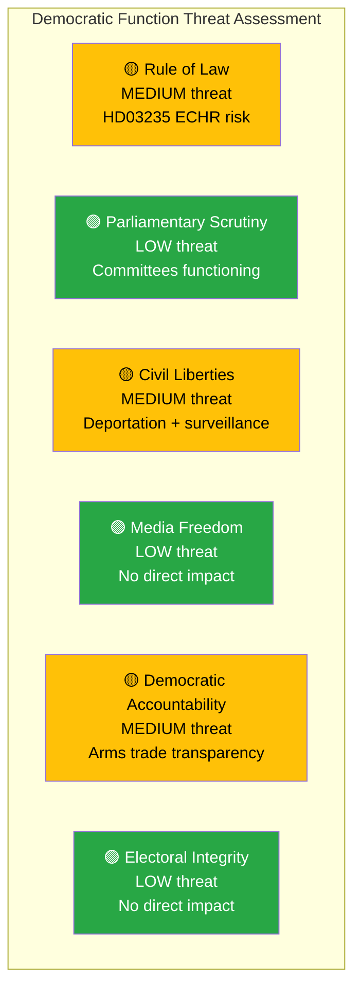

# Threat Analysis — Government Propositions — 2026-04-10

| **Field** | **Value** |
|-----------|-----------|
| **Threat ID** | THREAT-2026-04-10-PROP-001 |
| **Analysis Date** | 2026-04-10 17:15 UTC |
| **Documents Analyzed** | 5 |
| **Produced By** | news-propositions workflow (AI-enriched) |
| **Overall Threat Level** | MEDIUM |
| **Confidence** | MEDIUM |

---

## Democratic Health Dashboard

## Threat Assessment by Democratic Function

| Function | Threat Level | Primary Source | Assessment |
|----------|-------------|---------------|-----------|
| Rule of Law | 🟡 MEDIUM | HD03235 | Deportation threshold changes risk ECHR non-compliance |
| Parliamentary Scrutiny | 🟢 LOW | All | Committees properly engaged; cross-party debate robust |
| Civil Liberties | 🟡 MEDIUM | HD03235, HD03214 | Deportation impacts personal rights; cyber centre may expand surveillance |
| Media Freedom | 🟢 LOW | None | No propositions directly affect press freedom |
| Democratic Accountability | 🟡 MEDIUM | HD03228, HD03114 | Arms trade decisions require transparent oversight |
| Electoral Integrity | 🟢 LOW | None | No propositions affect electoral process |

## Key Threat: ECHR Compatibility (HD03235)

The deportation proposition represents the most significant threat to democratic standards in this batch. If Lagrådet identifies proportionality deficiencies or if the ECHR subsequently rules against Sweden, it would damage both the specific policy and Sweden's international human rights reputation.

**Mitigation**: Robust Lagrådet review, judicial oversight provisions, proportionality safeguards built into the legislation.
