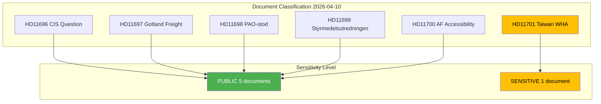

# Document Classification Results - 2026-04-10

## Classification Context

| Field | Value |
|-------|-------|
| **Classification ID** | CLS-2026-04-10-1026 |
| **Analysis Date** | 2026-04-10 10:26 UTC |
| **Documents Classified** | 6 |
| **Produced By** | news-realtime-monitor (realtime-1026) |

---

## Classification Summary

## Detailed Classification

| dok_id | Title | Type | Domain | Sensitivity | Urgency | Significance |
|--------|-------|------|--------|:-----------:|:-------:|:-----------:|
| HD11696 | Oberoende staters samvalde | Written Question | FOR | PUBLIC | ROUTINE | 2/10 |
| HD11697 | Fraktkostnader gotlandskt lantbruk | Written Question | AGR | PUBLIC | ROUTINE | 2/10 |
| HD11698 | Ansvaret for PAO-stod | Written Question | FOR/DEM | PUBLIC | ROUTINE | 2/10 |
| HD11699 | Styrmedelsutredningens betankande | Written Question | ENV | PUBLIC | ELEVATED | 3/10 |
| HD11700 | AF tillganglighet och service | Written Question | LAB | PUBLIC | ROUTINE | 2/10 |
| HD11701 | Taiwans deltagande i WHA | Written Question | FOR/HEA | SENSITIVE | ELEVATED | 3/10 |

### Classification Distribution

| Category | Count | Notes |
|----------|:-----:|-------|
| Written Questions (fr) | 6 | All documents are skriftliga fragor |
| PUBLIC sensitivity | 5 | Standard parliamentary questions |
| SENSITIVE sensitivity | 1 | HD11701 - Taiwan/China dimension |
| ROUTINE urgency | 4 | Standard processing timeline |
| ELEVATED urgency | 2 | HD11699 (climate), HD11701 (WHA approaching) |

---

## Domain Analysis

| Domain | Count | Key Documents |
|--------|:-----:|---------------|
| Foreign Affairs (FOR) | 3 | HD11696, HD11698, HD11701 |
| Climate/Environment (ENV) | 1 | HD11699 |
| Labour Market (LAB) | 1 | HD11700 |
| Agriculture/Rural (AGR) | 1 | HD11697 |

---

## MCP Data Files Used

| # | Data Source | File / Tool Path | Retrieved |
|:-:|-----------|-----------------|-----------|
| 1 | riksdag-regering-mcp | search_dokument(from_date=2026-04-10) | 2026-04-10 10:27 UTC |

---

## Cross-References

| Related Analysis File | Relationship | Key Finding |
|----------------------|-------------|-------------|
| significance-scoring.md | Classification feeds significance scores | All documents LOW significance (2-3/10) |
| synthesis-summary.md | Classification consumed by synthesis | 5 PUBLIC + 1 SENSITIVE documents |
