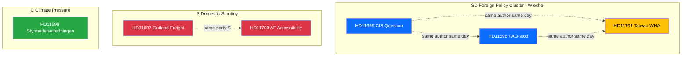

# Cross-Reference Map - 2026-04-10

## Cross-Reference Context

| Field | Value |
|-------|-------|
| **Map ID** | XRF-2026-04-10-1026 |
| **Analysis Date** | 2026-04-10 10:26 UTC |
| **Documents Mapped** | 6 |
| **Produced By** | news-realtime-monitor (realtime-1026) |

---

## Document Relationship Diagram

## Identified Clusters

### Cluster 1: SD Foreign Policy (Wiechel)
- **Documents:** HD11696, HD11698, HD11701
- **Author:** Markus Wiechel (SD)
- **Addressees:** Stenergard (M), Dousa (M)
- **Theme:** Coordinated foreign policy scrutiny covering CIS/Russia, Taiwan/WHA, PAO democracy aid
- **Pattern:** Single MP filing 3 foreign policy questions in one day signals systematic committee-level research

### Cluster 2: S Domestic Service Delivery
- **Documents:** HD11697, HD11700
- **Authors:** Westeren (S), Svensson (S)
- **Addressees:** Kullgren (KD), Britz (L)
- **Theme:** Government domestic service delivery gaps (rural freight, employment agency accessibility)
- **Pattern:** S building pre-election narrative on everyday citizen concerns

### Cluster 3: C Climate Policy
- **Documents:** HD11699
- **Author:** Nordin (C)
- **Addressee:** Britz (L)
- **Theme:** Climate policy instrument investigation delay
- **Pattern:** C positioning as credible environmental alternative to coalition

---

## Cross-Day References

| Today's Document | Related Historical | Relationship |
|-----------------|-------------------|-------------|
| HD11701 (Taiwan WHA) | HD03220 (NATO eFP Finland, 2026-04-09) | Same-week foreign policy/security context |
| HD11699 (Styrmedelsutredningen) | HD12682 (Miljomalseredningen, 2026-04-10) | Nordin (C) climate governance questions |

---

## MCP Data Files Used

| # | Data Source | File / Tool Path | Retrieved |
|:-:|-----------|-----------------|-----------|
| 1 | riksdag-regering-mcp | search_dokument(from_date=2026-04-09) | 2026-04-10 10:27 UTC |
