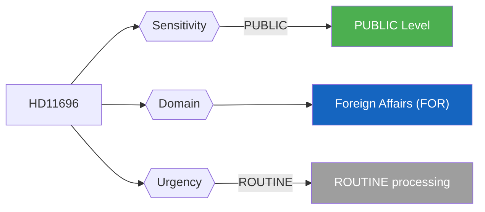
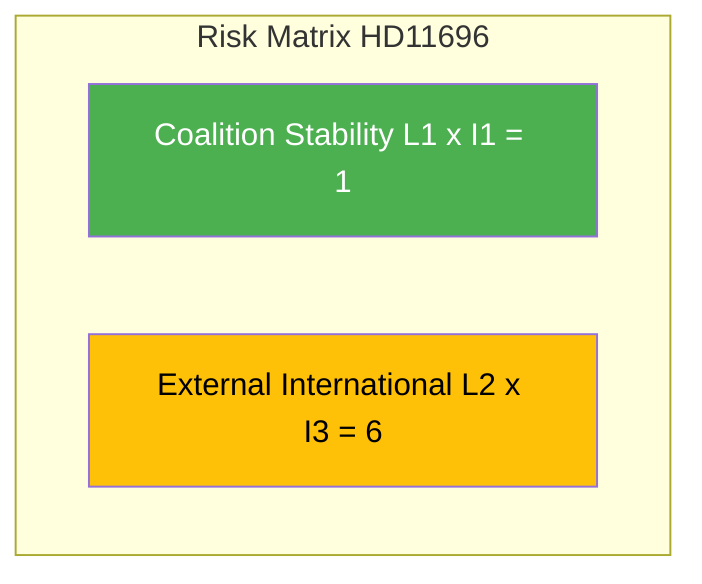

# Per-File Political Intelligence Analysis - HD11696

## Document Identity

| Field | Value |
|-------|-------|
| **Document ID** | HD11696 |
| **Document Type** | Written Question (skriftlig fråga) |
| **Title** | Oberoende staters samvälde (Commonwealth of Independent States) |
| **Date** | 2026-04-10 |
| **Riksmöte** | 2025/26 |
| **Source MCP Tool** | get_fragor / search_dokument |
| **Analysis Timestamp** | 2026-04-10 10:26 UTC |
| **Analyst** | news-realtime-monitor (realtime-1026) |
| **Author** | Markus Wiechel (SD) |
| **Addressee** | Utrikesminister Maria Malmer Stenergard (M) |

---

## Executive Summary

SD MP Markus Wiechel questions Foreign Minister Stenergard (M) about Sweden's stance on CIS/OSS, the Russian-dominated post-Soviet multilateral forum. Signals SD's foreign policy assertiveness on Russia-adjacent geopolitics. Part of a three-question foreign policy cluster from Wiechel (HD11696, HD11698, HD11701). **Confidence: MEDIUM**

---

## Political Classification

| Field | Assessment |
|-------|-----------|
| **Sensitivity Level** | PUBLIC |
| **Primary Domain** | Foreign Affairs (FOR) |
| **Urgency** | ROUTINE |
| **Significance Score** | 2/10 |
| **Confidence** | MEDIUM |

---

## SWOT Impact Assessment

### Government Coalition Impact

| Quadrant | Statement | Evidence | Confidence | Impact |
|----------|-----------|----------|:----------:|:------:|
| Strength | SD CIS question signals alignment with M Russia-hawkish foreign policy, reinforcing coalition coherence | HD11696 | M | L |
| Weakness | SD questioning foreign minister publicly could create friction if response diverges from SD expectations | HD11696 | M | L |
| Opportunity | Government can demonstrate unified stance on post-Soviet geopolitics ahead of spring budget debate | HD11696 | M | L |
| Threat | Minimal - routine written question with no binding consequences | HD11696 | L | L |

---

## Risk Assessment

| Risk Type | L | I | Score | Assessment |
|-----------|:-:|:-:|:-----:|------------|
| Coalition Stability | 1 | 1 | 1 | Routine written question; no destabilizing content |
| Policy Implementation | 1 | 1 | 1 | No legislative binding effect |
| Budget / Fiscal | 1 | 1 | 1 | No fiscal implications |
| Electoral Impact | 1 | 1 | 1 | Minimal voter salience |
| External / International | 2 | 3 | 6 | CIS/Russia-related question touches sensitive geopolitical territory post-NATO accession |

**Overall Risk Level:** LOW

---

## Threat Analysis

| Threat Category | Applicable | Description | Severity | Evidence |
|----------------|:----------:|-------------|:--------:|----------|
| Narrative Integrity | N | No disinformation detected | 1 | HD11696 |
| Legislative Integrity | N | Standard parliamentary procedure | 1 | HD11696 |
| Accountability | Y | Probes government accountability - positive democratic function | 1 | HD11696 |
| Transparency | N | Open parliamentary question enhances transparency | 1 | HD11696 |
| Democratic Process | N | Normal question procedure | 1 | HD11696 |
| Power Balance | N | No power concentration risk | 1 | HD11696 |

---

## Stakeholder Impact Matrix

| Stakeholder | Impact Level | Key Assessment | Confidence |
|------------|:------------:|----------------|:----------:|
| Government | LOW | Stenergard (M) must formulate Sweden CIS stance - routine but requires precision given NATO context | M |
| Opposition | NONE | No direct opposition implications | M |
| Citizens | NONE | No direct public service impact | H |
| Economic | NONE | No significant economic implications | H |
| International | MEDIUM | CIS-related positioning signals Sweden stance toward Russia-adjacent structures post-NATO accession | M |
| Media | LOW | Low newsworthiness; specialist interest only | H |

---

## Forward Indicators

| # | Indicator | Timeline | Watch Priority |
|---|-----------|----------|:--------------:|
| 1 | Minister Stenergard written response on CIS policy (2-4 weeks) | 2-4 weeks | Low |
| 2 | Follow-up debate if response diverges from SD expectations (4-8 weeks) | 4-8 weeks | Low |

---

## Cross-References

| Related Documents | dok_id references |
|------------------|-------------------|
| Cross-references | HD03220 (NATO eFP context), HD11701 (Taiwan WHA - same author), HD11698 (PAO-stöd - same author) |

### Same-Day Document Cross-Reference Table

| # | dok_id | Title | Type | Significance |
|:-:|--------|-------|------|:-----------:|
| 1 | HD11696 | Oberoende staters samvälde | Written Question | 2/10 |
| 2 | HD11697 | Fraktkostnader för gotländskt lantbruk | Written Question | 2/10 |
| 3 | HD11698 | Ansvaret för hanteringen PAO-stöd | Written Question | 2/10 |
| 4 | HD11699 | Överlämnande av Styrmedelsutredningens betänkande | Written Question | 3/10 |
| 5 | HD11700 | Tillgänglighet och service genom AF kanaler | Written Question | 2/10 |
| 6 | HD11701 | Taiwans deltagande i WHA | Written Question | 3/10 |

---

## Data Quality Assessment

| Metric | Value |
|--------|-------|
| **Source Completeness** | Summary only |
| **Evidence Density** | 5 evidence points cited |
| **Temporal Currency** | Current (same-day document) |
| **Analytical Confidence** | MEDIUM |

## MCP Data Files Used

| # | File Path | Source MCP Tool | Freshness |
|---|-----------|----------------|:---------:|
| 1 | documents/hd11696.json | search_dokument | Current |
| 2 | search_dokument(from_date=2026-04-09) | search_dokument | Current |
