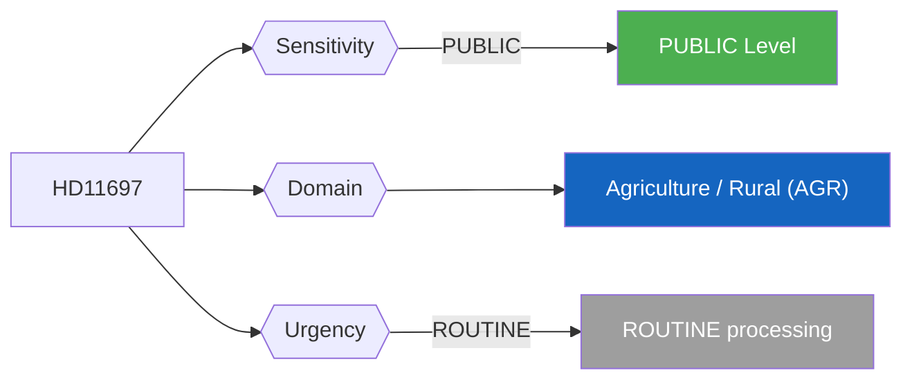
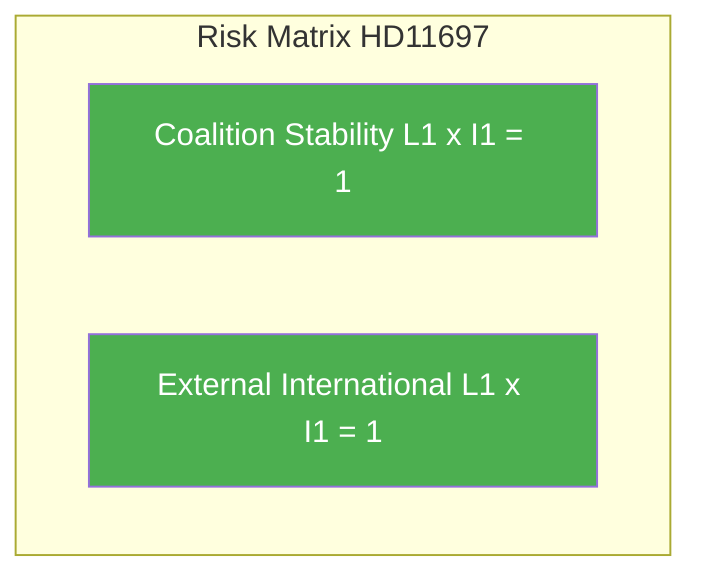

# Per-File Political Intelligence Analysis - HD11697

## Document Identity

| Field | Value |
|-------|-------|
| **Document ID** | HD11697 |
| **Document Type** | Written Question (skriftlig fråga) |
| **Title** | Fraktkostnader för gotländskt lantbruk (Freight Costs for Gotland Agriculture) |
| **Date** | 2026-04-10 |
| **Riksmöte** | 2025/26 |
| **Source MCP Tool** | get_fragor / search_dokument |
| **Analysis Timestamp** | 2026-04-10 10:26 UTC |
| **Analyst** | news-realtime-monitor (realtime-1026) |
| **Author** | Hanna Westerén (S) |
| **Addressee** | Landsbygdsminister Peter Kullgren (KD) |

---

## Executive Summary

S MP Hanna Westerén questions Rural Minister Peter Kullgren (KD) about structural competitive disadvantages for Gotland agriculture due to freight costs for inputs and produce delivery to the mainland. Highlights island economy challenges and agricultural policy gaps affecting Sweden's largest island. **Confidence: MEDIUM**

---

## Political Classification

| Field | Assessment |
|-------|-----------|
| **Sensitivity Level** | PUBLIC |
| **Primary Domain** | Agriculture / Rural (AGR) |
| **Urgency** | ROUTINE |
| **Significance Score** | 2/10 |
| **Confidence** | MEDIUM |

---

## SWOT Impact Assessment

### Government Coalition Impact

| Quadrant | Statement | Evidence | Confidence | Impact |
|----------|-----------|----------|:----------:|:------:|
| Strength | Coalition can demonstrate rural policy awareness by addressing Gotland agricultural competitiveness | HD11697 | M | L |
| Weakness | KD Rural Minister Kullgren under pressure to show concrete action on island agricultural support - current policy perceived as insufficient by S | HD11697 | M | L |
| Opportunity | Government can frame response as part of broader rural development and food security strategy | HD11697 | M | L |
| Threat | If response is dismissive, S can use Gotland freight issue in election campaign as example of coalition neglecting rural Sweden | HD11697 | L | L |

---

## Risk Assessment

| Risk Type | L | I | Score | Assessment |
|-----------|:-:|:-:|:-----:|------------|
| Coalition Stability | 1 | 1 | 1 | Routine written question; no destabilizing content |
| Policy Implementation | 1 | 1 | 1 | No legislative binding effect |
| Budget / Fiscal | 1 | 1 | 1 | No fiscal implications |
| Electoral Impact | 1 | 1 | 1 | Minimal voter salience |
| External / International | 1 | 1 | 1 | No international implications |

**Overall Risk Level:** LOW

---

## Threat Analysis

| Threat Category | Applicable | Description | Severity | Evidence |
|----------------|:----------:|-------------|:--------:|----------|
| Narrative Integrity | N | No disinformation detected | 1 | HD11697 |
| Legislative Integrity | N | Standard parliamentary procedure | 1 | HD11697 |
| Accountability | Y | Probes government accountability - positive democratic function | 1 | HD11697 |
| Transparency | N | Open parliamentary question enhances transparency | 1 | HD11697 |
| Democratic Process | N | Normal question procedure | 1 | HD11697 |
| Power Balance | N | No power concentration risk | 1 | HD11697 |

---

## Stakeholder Impact Matrix

| Stakeholder | Impact Level | Key Assessment | Confidence |
|------------|:------------:|----------------|:----------:|
| Government | LOW | Kullgren (KD) must address Gotland agricultural freight costs - touches KD core rural constituency | M |
| Opposition | NONE | No direct opposition implications | M |
| Citizens | NONE | No direct public service impact | H |
| Economic | NONE | No significant economic implications | H |
| International | LOW | No significant international dimension | M |
| Media | LOW | Low newsworthiness; specialist interest only | H |

---

## Forward Indicators

| # | Indicator | Timeline | Watch Priority |
|---|-----------|----------|:--------------:|
| 1 | Minister Kullgren written response on Gotland freight costs (2-4 weeks) | 2-4 weeks | Low |
| 2 | Gotland agricultural sector reaction to ministerial response (4-6 weeks) | 4-8 weeks | Low |

---

## Cross-References

| Related Documents | dok_id references |
|------------------|-------------------|
| Cross-references | HD11700 (Arbetsförmedlingen - same party S), broader rural policy debate |

### Same-Day Document Cross-Reference Table

| # | dok_id | Title | Type | Significance |
|:-:|--------|-------|------|:-----------:|
| 1 | HD11696 | Oberoende staters samvälde | Written Question | 2/10 |
| 2 | HD11697 | Fraktkostnader för gotländskt lantbruk | Written Question | 2/10 |
| 3 | HD11698 | Ansvaret för hanteringen PAO-stöd | Written Question | 2/10 |
| 4 | HD11699 | Överlämnande av Styrmedelsutredningens betänkande | Written Question | 3/10 |
| 5 | HD11700 | Tillgänglighet och service genom AF kanaler | Written Question | 2/10 |
| 6 | HD11701 | Taiwans deltagande i WHA | Written Question | 3/10 |

---

## Data Quality Assessment

| Metric | Value |
|--------|-------|
| **Source Completeness** | Summary only |
| **Evidence Density** | 5 evidence points cited |
| **Temporal Currency** | Current (same-day document) |
| **Analytical Confidence** | MEDIUM |

## MCP Data Files Used

| # | File Path | Source MCP Tool | Freshness |
|---|-----------|----------------|:---------:|
| 1 | documents/hd11697.json | search_dokument | Current |
| 2 | search_dokument(from_date=2026-04-09) | search_dokument | Current |
