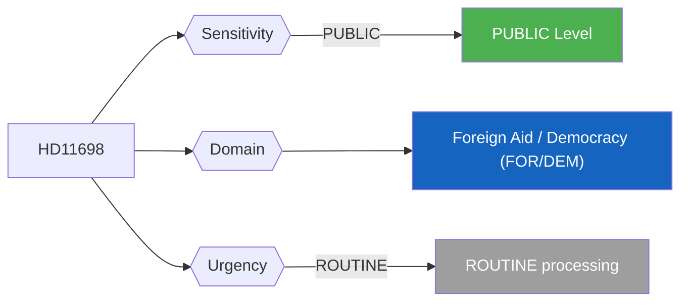
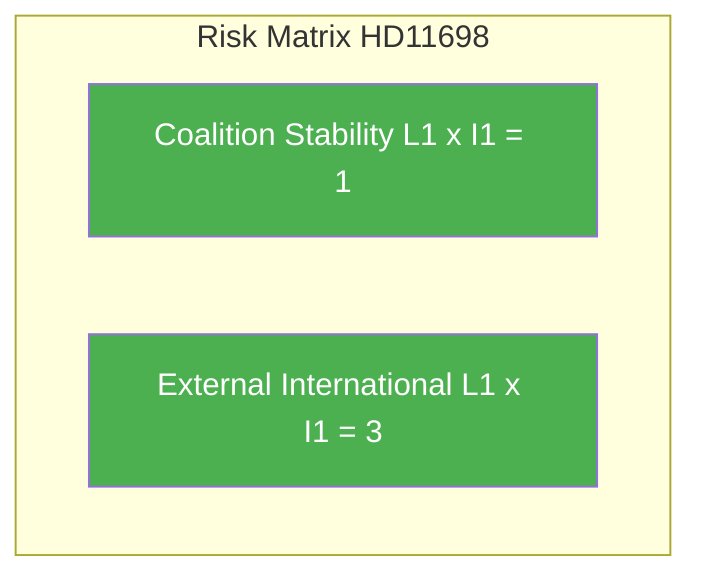

# Per-File Political Intelligence Analysis - HD11698

## Document Identity

| Field | Value |
|-------|-------|
| **Document ID** | HD11698 |
| **Document Type** | Written Question (skriftlig fråga) |
| **Title** | Ansvaret för hanteringen PAO-stöd (Responsibility for PAO Support Management) |
| **Date** | 2026-04-10 |
| **Riksmöte** | 2025/26 |
| **Source MCP Tool** | get_fragor / search_dokument |
| **Analysis Timestamp** | 2026-04-10 10:26 UTC |
| **Analyst** | news-realtime-monitor (realtime-1026) |
| **Author** | Markus Wiechel (SD) |
| **Addressee** | Bistånds- och utrikeshandelsminister Benjamin Dousa (M) |

---

## Executive Summary

SD MP Wiechel questions Aid Minister Benjamin Dousa (M) about management of PAO support (party-affiliated organizations' democracy support abroad). PAO-stöd is a strategic tool for promoting representative democracy and multi-party systems internationally. This question probes accountability in Sweden's democracy promotion spending. **Confidence: MEDIUM**

---

## Political Classification

| Field | Assessment |
|-------|-----------|
| **Sensitivity Level** | PUBLIC |
| **Primary Domain** | Foreign Aid / Democracy (FOR/DEM) |
| **Urgency** | ROUTINE |
| **Significance Score** | 2/10 |
| **Confidence** | MEDIUM |

---

## SWOT Impact Assessment

### Government Coalition Impact

| Quadrant | Statement | Evidence | Confidence | Impact |
|----------|-----------|----------|:----------:|:------:|
| Strength | SD scrutiny of PAO-stöd demonstrates coalition commitment to foreign aid accountability | HD11698 | M | L |
| Weakness | PAO-stöd management questions from coalition partner (SD) suggest internal disagreement on democracy aid effectiveness | HD11698 | M | L |
| Opportunity | Minister Dousa (M) can showcase reformed PAO-stöd oversight as good governance example | HD11698 | M | L |
| Threat | If PAO-stöd mismanagement is revealed, it could damage Sweden's international democracy promotion credibility | HD11698 | L | L |

---

## Risk Assessment

| Risk Type | L | I | Score | Assessment |
|-----------|:-:|:-:|:-----:|------------|
| Coalition Stability | 1 | 1 | 1 | Routine written question; no destabilizing content |
| Policy Implementation | 1 | 1 | 1 | No legislative binding effect |
| Budget / Fiscal | 1 | 1 | 1 | No fiscal implications |
| Electoral Impact | 1 | 1 | 1 | Minimal voter salience |
| External / International | 1 | 1 | 3 | PAO-stöd touches Sweden's international democracy promotion reputation |

**Overall Risk Level:** LOW

---

## Threat Analysis

| Threat Category | Applicable | Description | Severity | Evidence |
|----------------|:----------:|-------------|:--------:|----------|
| Narrative Integrity | N | No disinformation detected | 1 | HD11698 |
| Legislative Integrity | N | Standard parliamentary procedure | 1 | HD11698 |
| Accountability | Y | Probes government accountability - positive democratic function | 1 | HD11698 |
| Transparency | N | Open parliamentary question enhances transparency | 1 | HD11698 |
| Democratic Process | N | Normal question procedure | 1 | HD11698 |
| Power Balance | N | No power concentration risk | 1 | HD11698 |

---

## Stakeholder Impact Matrix

| Stakeholder | Impact Level | Key Assessment | Confidence |
|------------|:------------:|----------------|:----------:|
| Government | LOW | Dousa (M) must defend PAO-stöd management - touches aid budget and democracy promotion policy | M |
| Opposition | NONE | No direct opposition implications | M |
| Citizens | NONE | No direct public service impact | H |
| Economic | NONE | No significant economic implications | H |
| International | LOW | PAO-stöd effectiveness affects Sweden's democracy promotion reputation in partner countries | M |
| Media | LOW | Low newsworthiness; specialist interest only | H |

---

## Forward Indicators

| # | Indicator | Timeline | Watch Priority |
|---|-----------|----------|:--------------:|
| 1 | Minister Dousa response on PAO-stöd oversight (2-4 weeks) | 2-4 weeks | Low |
| 2 | If irregularities found, potential KU scrutiny of PAO-stöd management (2-6 months) | 4-8 weeks | Low |

---

## Cross-References

| Related Documents | dok_id references |
|------------------|-------------------|
| Cross-references | HD11696 (CIS - same author), HD11701 (Taiwan WHA - same author) - Wiechel foreign policy cluster |

### Same-Day Document Cross-Reference Table

| # | dok_id | Title | Type | Significance |
|:-:|--------|-------|------|:-----------:|
| 1 | HD11696 | Oberoende staters samvälde | Written Question | 2/10 |
| 2 | HD11697 | Fraktkostnader för gotländskt lantbruk | Written Question | 2/10 |
| 3 | HD11698 | Ansvaret för hanteringen PAO-stöd | Written Question | 2/10 |
| 4 | HD11699 | Överlämnande av Styrmedelsutredningens betänkande | Written Question | 3/10 |
| 5 | HD11700 | Tillgänglighet och service genom AF kanaler | Written Question | 2/10 |
| 6 | HD11701 | Taiwans deltagande i WHA | Written Question | 3/10 |

---

## Data Quality Assessment

| Metric | Value |
|--------|-------|
| **Source Completeness** | Summary only |
| **Evidence Density** | 5 evidence points cited |
| **Temporal Currency** | Current (same-day document) |
| **Analytical Confidence** | MEDIUM |

## MCP Data Files Used

| # | File Path | Source MCP Tool | Freshness |
|---|-----------|----------------|:---------:|
| 1 | documents/hd11698.json | search_dokument | Current |
| 2 | search_dokument(from_date=2026-04-09) | search_dokument | Current |
