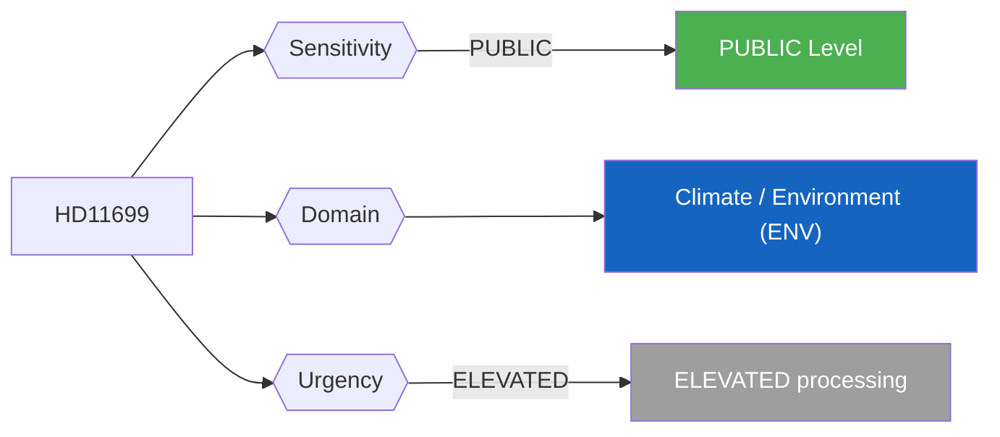
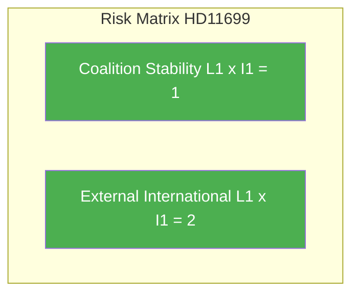

# Per-File Political Intelligence Analysis - HD11699

## Document Identity

| Field | Value |
|-------|-------|
| **Document ID** | HD11699 |
| **Document Type** | Written Question (skriftlig fråga) |
| **Title** | Överlämnande av Styrmedelsutredningens betänkande (Handover of the Policy Instruments Investigation Report) |
| **Date** | 2026-04-10 |
| **Riksmöte** | 2025/26 |
| **Source MCP Tool** | get_fragor / search_dokument |
| **Analysis Timestamp** | 2026-04-10 10:26 UTC |
| **Analyst** | news-realtime-monitor (realtime-1026) |
| **Author** | Rickard Nordin (C) |
| **Addressee** | Arbetsmarknadsminister och vikarierande klimat- och miljöminister Johan Britz (L) |

---

## Executive Summary

C MP Rickard Nordin questions acting Climate Minister Johan Britz (L) about the handover timeline of the Styrmedelsutredningen (Policy Instruments Investigation), commissioned in 2024 to analyze cost-effective climate policy instruments for Sweden. This question signals opposition pressure on government climate policy delivery, a key vulnerability for the coalition. **Confidence: MEDIUM**

---

## Political Classification

| Field | Assessment |
|-------|-----------|
| **Sensitivity Level** | PUBLIC |
| **Primary Domain** | Climate / Environment (ENV) |
| **Urgency** | ELEVATED |
| **Significance Score** | 3/10 |
| **Confidence** | MEDIUM |

---

## SWOT Impact Assessment

### Government Coalition Impact

| Quadrant | Statement | Evidence | Confidence | Impact |
|----------|-----------|----------|:----------:|:------:|
| Strength | Government commissioned the investigation - shows policy ambition on climate instruments | HD11699 | M | L |
| Weakness | Delay in delivering the Styrmedelsutredningen report signals policy implementation weakness on climate - key vulnerability for L and coalition | HD11699 | M | L |
| Opportunity | Timely delivery could demonstrate government commitment to cost-effective climate action | HD11699 | M | L |
| Threat | C (Nordin) using climate policy delays to position as more credible environmental voice than coalition parties L and KD | HD11699 | L | L |

---

## Risk Assessment

| Risk Type | L | I | Score | Assessment |
|-----------|:-:|:-:|:-----:|------------|
| Coalition Stability | 1 | 1 | 1 | Routine written question; no destabilizing content |
| Policy Implementation | 1 | 1 | 1 | No legislative binding effect |
| Budget / Fiscal | 1 | 1 | 1 | No fiscal implications |
| Electoral Impact | 1 | 1 | 1 | Minimal voter salience |
| External / International | 1 | 1 | 2 | EU climate policy compliance implications if Swedish policy instruments are delayed |

**Overall Risk Level:** LOW

---

## Threat Analysis

| Threat Category | Applicable | Description | Severity | Evidence |
|----------------|:----------:|-------------|:--------:|----------|
| Narrative Integrity | N | No disinformation detected | 1 | HD11699 |
| Legislative Integrity | N | Standard parliamentary procedure | 1 | HD11699 |
| Accountability | Y | Probes government accountability - positive democratic function | 1 | HD11699 |
| Transparency | N | Open parliamentary question enhances transparency | 1 | HD11699 |
| Democratic Process | N | Normal question procedure | 1 | HD11699 |
| Power Balance | N | No power concentration risk | 1 | HD11699 |

---

## Stakeholder Impact Matrix

| Stakeholder | Impact Level | Key Assessment | Confidence |
|------------|:------------:|----------------|:----------:|
| Government | LOW | Britz (L, acting Climate Minister) under pressure on climate policy delivery - investigation delay reflects on L credibility | M |
| Opposition | NONE | No direct opposition implications | M |
| Citizens | NONE | No direct public service impact | H |
| Economic | NONE | No significant economic implications | H |
| International | LOW | EU climate targets require Sweden to have effective policy instruments - delay has compliance implications | M |
| Media | LOW | Low newsworthiness; specialist interest only | H |

---

## Forward Indicators

| # | Indicator | Timeline | Watch Priority |
|---|-----------|----------|:--------------:|
| 1 | Styrmedelsutredningen report delivery date (weeks to months - depends on government response) | 2-4 weeks | Low |
| 2 | C and MP using climate policy delays in pre-election positioning (ongoing through 2026) | 4-8 weeks | Low |

---

## Cross-References

| Related Documents | dok_id references |
|------------------|-------------------|
| Cross-references | HD12682 (Miljömålsberedningen - related climate governance question from Nordin C), environmental policy cluster |

### Same-Day Document Cross-Reference Table

| # | dok_id | Title | Type | Significance |
|:-:|--------|-------|------|:-----------:|
| 1 | HD11696 | Oberoende staters samvälde | Written Question | 2/10 |
| 2 | HD11697 | Fraktkostnader för gotländskt lantbruk | Written Question | 2/10 |
| 3 | HD11698 | Ansvaret för hanteringen PAO-stöd | Written Question | 2/10 |
| 4 | HD11699 | Överlämnande av Styrmedelsutredningens betänkande | Written Question | 3/10 |
| 5 | HD11700 | Tillgänglighet och service genom AF kanaler | Written Question | 2/10 |
| 6 | HD11701 | Taiwans deltagande i WHA | Written Question | 3/10 |

---

## Data Quality Assessment

| Metric | Value |
|--------|-------|
| **Source Completeness** | Summary only |
| **Evidence Density** | 5 evidence points cited |
| **Temporal Currency** | Current (same-day document) |
| **Analytical Confidence** | MEDIUM |

## MCP Data Files Used

| # | File Path | Source MCP Tool | Freshness |
|---|-----------|----------------|:---------:|
| 1 | documents/hd11699.json | search_dokument | Current |
| 2 | search_dokument(from_date=2026-04-09) | search_dokument | Current |
