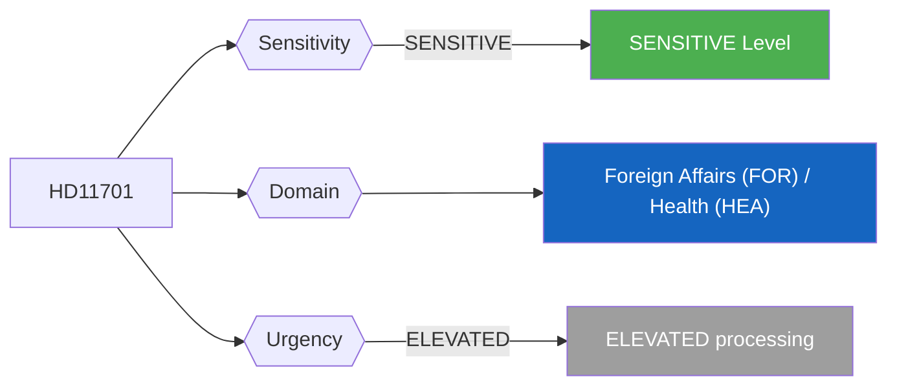
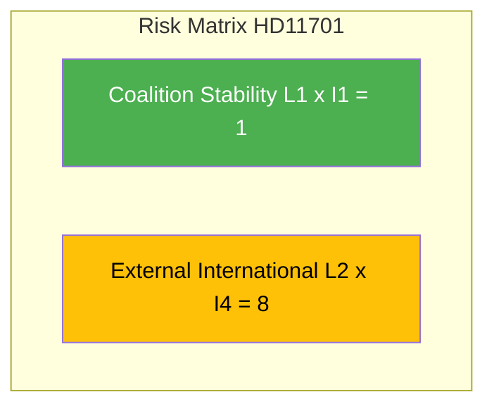

# Per-File Political Intelligence Analysis - HD11701

## Document Identity

| Field | Value |
|-------|-------|
| **Document ID** | HD11701 |
| **Document Type** | Written Question (skriftlig fråga) |
| **Title** | Taiwans deltagande i WHA (Taiwan's Participation in WHA) |
| **Date** | 2026-04-10 |
| **Riksmöte** | 2025/26 |
| **Source MCP Tool** | get_fragor / search_dokument |
| **Analysis Timestamp** | 2026-04-10 10:26 UTC |
| **Analyst** | news-realtime-monitor (realtime-1026) |
| **Author** | Markus Wiechel (SD) |
| **Addressee** | Utrikesminister Maria Malmer Stenergard (M) |

---

## Executive Summary

SD MP Wiechel questions Foreign Minister Stenergard (M) about Sweden's position on Taiwan's participation in the World Health Assembly. Addresses intersection of global health governance and geopolitics. Taiwan exclusion from WHO/WHA due to PRC pressure is a recurring diplomatic issue. Sweden's NATO membership creates additional context. Highest significance in today's cluster due to approaching WHA session (May 2026). **Confidence: MEDIUM**

---

## Political Classification

| Field | Assessment |
|-------|-----------|
| **Sensitivity Level** | SENSITIVE |
| **Primary Domain** | Foreign Affairs (FOR) / Health (HEA) |
| **Urgency** | ELEVATED |
| **Significance Score** | 3/10 |
| **Confidence** | MEDIUM |

---

## SWOT Impact Assessment

### Government Coalition Impact

| Quadrant | Statement | Evidence | Confidence | Impact |
|----------|-----------|----------|:----------:|:------:|
| Strength | Government can demonstrate values-based foreign policy by supporting Taiwan WHA participation | HD11701 | M | L |
| Weakness | Any explicit pro-Taiwan statement risks PRC diplomatic retaliation - economic exposure for Swedish companies | HD11701 | M | L |
| Opportunity | WHA session in May 2026 provides platform for visible democratic solidarity positioning | HD11701 | M | L |
| Threat | If Sweden's position is weaker than expected, SD may escalate criticism of M foreign policy leadership | HD11701 | L | L |

---

## Risk Assessment

| Risk Type | L | I | Score | Assessment |
|-----------|:-:|:-:|:-----:|------------|
| Coalition Stability | 1 | 1 | 1 | Routine written question; no destabilizing content |
| Policy Implementation | 1 | 1 | 1 | No legislative binding effect |
| Budget / Fiscal | 1 | 1 | 1 | No fiscal implications |
| Electoral Impact | 1 | 1 | 1 | Minimal voter salience |
| External / International | 2 | 4 | 8 | Taiwan/PRC geopolitical sensitivity; potential diplomatic consequences and WHA approaching May 2026 |

**Overall Risk Level:** LOW

---

## Threat Analysis

| Threat Category | Applicable | Description | Severity | Evidence |
|----------------|:----------:|-------------|:--------:|----------|
| Narrative Integrity | N | No disinformation detected | 1 | HD11701 |
| Legislative Integrity | N | Standard parliamentary procedure | 1 | HD11701 |
| Accountability | Y | Probes government accountability - positive democratic function | 1 | HD11701 |
| Transparency | N | Open parliamentary question enhances transparency | 1 | HD11701 |
| Democratic Process | N | Normal question procedure | 1 | HD11701 |
| Power Balance | N | No power concentration risk | 1 | HD11701 |

---

## Stakeholder Impact Matrix

| Stakeholder | Impact Level | Key Assessment | Confidence |
|------------|:------------:|----------------|:----------:|
| Government | LOW | Stenergard (M) must articulate Taiwan/WHA policy - sensitive diplomatic balancing act | M |
| Opposition | NONE | No direct opposition implications | M |
| Citizens | NONE | No direct public service impact | H |
| Economic | NONE | No significant economic implications | H |
| International | MEDIUM | Taiwan/WHA positioning signals Sweden's values-based multilateralism post-NATO | M |
| Media | LOW | Low newsworthiness; specialist interest only | H |

---

## Forward Indicators

| # | Indicator | Timeline | Watch Priority |
|---|-----------|----------|:--------------:|
| 1 | WHA session (May 2026) - Sweden's voting/statement on Taiwan observer status (4-6 weeks) | 2-4 weeks | Low |
| 2 | PRC diplomatic response if Sweden supports Taiwan WHA participation (4-8 weeks) | 4-8 weeks | Low |

---

## Cross-References

| Related Documents | dok_id references |
|------------------|-------------------|
| Cross-references | HD11696 (CIS - same author Wiechel SD), HD11698 (PAO-stöd - same author) |

### Same-Day Document Cross-Reference Table

| # | dok_id | Title | Type | Significance |
|:-:|--------|-------|------|:-----------:|
| 1 | HD11696 | Oberoende staters samvälde | Written Question | 2/10 |
| 2 | HD11697 | Fraktkostnader för gotländskt lantbruk | Written Question | 2/10 |
| 3 | HD11698 | Ansvaret för hanteringen PAO-stöd | Written Question | 2/10 |
| 4 | HD11699 | Överlämnande av Styrmedelsutredningens betänkande | Written Question | 3/10 |
| 5 | HD11700 | Tillgänglighet och service genom AF kanaler | Written Question | 2/10 |
| 6 | HD11701 | Taiwans deltagande i WHA | Written Question | 3/10 |

---

## Data Quality Assessment

| Metric | Value |
|--------|-------|
| **Source Completeness** | Summary only |
| **Evidence Density** | 5 evidence points cited |
| **Temporal Currency** | Current (same-day document) |
| **Analytical Confidence** | MEDIUM |

## MCP Data Files Used

| # | File Path | Source MCP Tool | Freshness |
|---|-----------|----------------|:---------:|
| 1 | documents/hd11701.json | search_dokument | Current |
| 2 | search_dokument(from_date=2026-04-09) | search_dokument | Current |
