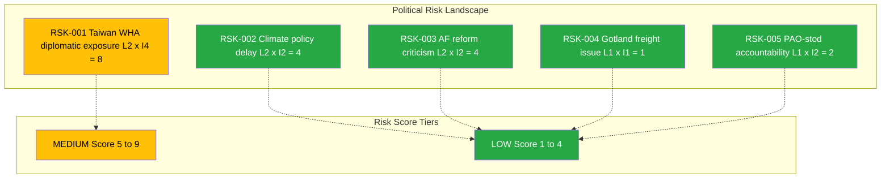
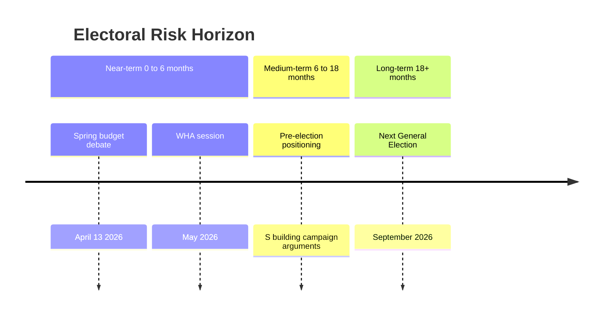
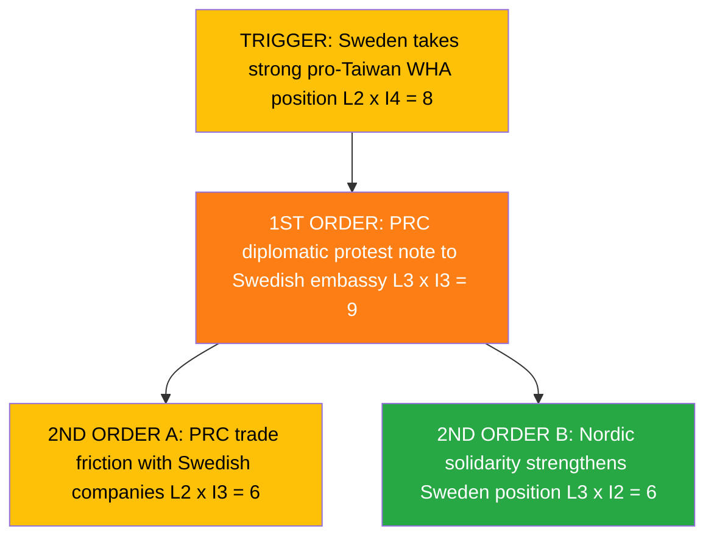
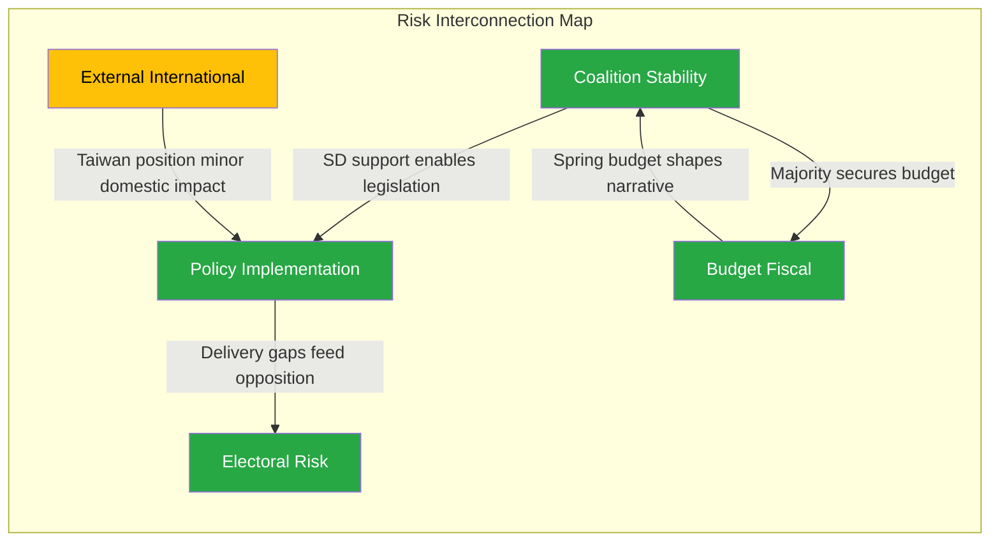

# Political Risk Assessment - 2026-04-10

## Risk Context

| Field | Value |
|-------|-------|
| **Risk Assessment ID** | RSK-2026-04-10-1026 |
| **Assessment Date** | 2026-04-10 10:26 UTC |
| **Assessment Period** | 2026-04-10 |
| **Produced By** | news-realtime-monitor (realtime-1026) |
| **Political Context** | Tidokoalitionen (M+SD+KD+L) governs with SD confidence-and-supply. Major propositions delivered yesterday (NATO eFP HD03220, doubled criminal penalties HD03218, expanded accountability HD03217). Spring budget debate scheduled April 13. Today's activity: 6 written questions only. |
| **Riksmote** | 2025/26 |
| **Overall Risk Level** | LOW |

---

## Risk Inventory

### Risk Heat Map

| Risk ID | Description | L | I | Score | Tier | Trend | Mitigation |
|---------|-------------|:-:|:-:|:-----:|------|:-----:|------------|
| RSK-001 | Taiwan WHA diplomatic positioning ahead of May session - PRC retaliation risk | 2 | 4 | 8 | Medium | Up | Calibrate Sweden WHA statement with Nordic/EU allies. Trend evidence: approaching WHA session elevates urgency. |
| RSK-002 | Climate policy instrument investigation delay weakens L credibility | 2 | 2 | 4 | Low | -> | Announce Styrmedelsutredningen delivery timeline. Trend evidence: no change since investigation commissioned 2024. |
| RSK-003 | Arbetsformedlingen reform accessibility criticized by S | 2 | 2 | 4 | Low | -> | Release AF service delivery metrics showing digital improvements. Trend evidence: ongoing reform criticism. |
| RSK-004 | Gotland agricultural freight cost disadvantage unaddressed | 1 | 1 | 1 | Low | -> | Rural ministry review of island freight compensation. Trend evidence: long-standing issue. |
| RSK-005 | PAO-stod management accountability questioned by SD | 1 | 2 | 2 | Low | -> | Ministry provides PAO-stod audit report. Trend evidence: first question on this topic this session. |

**Risk Score Summary:**

| Risk ID | Risk Score | Tier |
|---------|:----------:|------|
| RSK-001 | 8 | Medium |
| RSK-002 | 4 | Low |
| RSK-003 | 4 | Low |
| RSK-004 | 1 | Low |
| RSK-005 | 2 | Low |

---

## Coalition Stability Risk

### Current Coalition Assessment

| Parameter | Value |
|-----------|-------|
| **Governing Coalition** | Tidokoalitionen: M + KD + L (SD confidence-and-supply) |
| **Coalition Strength** | HIGH |
| **Confidence Level** | 85% |
| **Supporting Parties** | SD (external support) |
| **Opposition Majority Risk** | NO |
| **Next Confidence Test** | None scheduled |

### Coalition Risk Factors

| Factor | Status | Evidence | Risk Contribution |
|--------|--------|----------|-------------------|
| Internal party disagreements | Latent | HD11699 exposes L climate policy pressure | LOW |
| Budget disagreements | None | Spring budget debate April 13 upcoming | LOW |
| SD confidence threshold | Stable | SD using questions to probe M ministers - constructive engagement | LOW |
| EU policy conflict | None | No EU-related tensions in today's documents | LOW |

**Coalition Collapse Probability (next 90 days):** LOW (<15%)

---

## Policy Implementation Risk

| Policy | Ministry | Stage | Risk Level | Blocking Factor |
|--------|----------|-------|------------|-----------------|
| Styrmedelsutredningen delivery | Klimat- och naringsdep (L) | Investigation phase | Low | Delay in report completion |
| AF reform accessibility | Arbetsmarknadsdep (L) | Implementation | Low | Service delivery gaps in channel accessibility |
| Gotland freight compensation | Landsbygdsdep (KD) | Question phase | Low | No concrete proposal yet |

**Overall Policy Risk:** LOW

---

## Budget Risk

| Parameter | Value |
|-----------|-------|
| **Budget Year** | 2026 |
| **Fiscal Committee (FiU) Status** | Approved 2025-12 |
| **Budget Risk Level** | LOW |
| **Key Budget Risks** | Spring amendment budget debate April 13; no fiscal crises detected |

---

## Electoral Risk Timeline

| Electoral Event | Date | Risk to Coalition | Impact if Adverse |
|----------------|------|-------------------|-------------------|
| Spring budget debate | 2026-04-13 | LOW | Opposition may score rhetorical points but no vote threat |
| General Election | 2026-09 | MEDIUM | Coalition must address domestic policy gaps before campaign |

**Pre-election Fragility Index:** LOW
**Assessment Confidence:** MEDIUM

---

## Risk Summary and Recommendations

### Top 3 Risks This Period

1. **RSK-001:** Taiwan WHA positioning - Score 8 - Sweden must calibrate May WHA statement carefully given PRC economic exposure
2. **RSK-002:** Climate policy delay - Score 4 - Styrmedelsutredningen delivery timeline needed to address C criticism
3. **RSK-003:** AF reform accessibility - Score 4 - Service delivery metrics needed to counter S campaign narrative

### Recommended Actions

- Monitor WHA preparatory meetings for Taiwan agenda item status
- Track Styrmedelsutredningen delivery announcement
- Prepare spring budget messaging on domestic service delivery improvements

---

## Section 5: Cascading Risk Chain

| Chain Stage | Risk Event | L | I | Score | Circuit Breaker |
|:-----------:|-----------|:-:|:-:|:-----:|----------------|
| Trigger | Sweden pro-Taiwan WHA statement | 2 | 4 | 8 | Coordinate with Nordic/EU allies for collective position |
| 1st Order | PRC diplomatic protest | 3 | 3 | 9 | Established diplomatic channels absorb protests routinely |
| 2nd Order | Trade friction or Nordic solidarity | 2 | 3 | 6 | EU trade defense mechanisms; Nordic coordination |

---

## Section 6: Risk Interconnection Map

| From to To | Connection Strength | Mechanism | Evidence |
|:----------:|:-------------------:|-----------|---------|
| Coalition to Policy | Medium | Coalition stability enables policy delivery; SD support needed for legislation | HD03218, HD03220 |
| Policy to Electoral | Medium | Policy delivery gaps (AF, climate) feed opposition campaign narratives | HD11699, HD11700 |
| External to Policy | Weak | Taiwan WHA position has minimal domestic policy impact | HD11701 |

**System fragility assessment:** System is not fragile - only 1 risk dimension (External) at Medium level. Coalition stability, policy, budget, and electoral risks all at Low.

---

## Section 7: Forward Indicators and Scenario Outlook

| Scenario | Probability | Key Trigger | Risk Dimensions Affected |
|----------|:----------:|------------|-------------------------|
| Stable continuation - coalition manages spring budget, WHA passes quietly | 75% | Budget debate April 13 uneventful | Coalition + Electoral |
| Climate policy controversy if investigation further delayed | 15% | No Styrmedelsutredningen date by May | Policy + Electoral |
| Taiwan WHA friction with PRC | 10% | Sweden makes explicit pro-Taiwan statement | External |

---

## MCP Data Files Used

| # | Data Source | File / Tool Path | Data Type | Retrieved |
|:-:|-----------|-----------------|-----------|-----------|
| 1 | riksdag-regering-mcp | search_dokument(from_date=2026-04-09) | Documents | 2026-04-10 10:27 UTC |
| 2 | riksdag-regering-mcp | search_voteringar(rm=2025/26) | Votes | 2026-04-10 10:27 UTC |
| 3 | riksdag-regering-mcp | get_propositioner(rm=2025/26) | Propositions | 2026-04-10 10:27 UTC |
| 4 | riksdag-regering-mcp | search_regering(dateFrom=2026-04-09) | Government docs | 2026-04-10 10:27 UTC |

### Risk-Specific MCP Tool Usage

| Risk Dimension | Primary MCP Tool | Key Parameters | Evidence Count |
|---------------|-----------------|----------------|:--------------:|
| Coalition Stability | search_voteringar | rm=2025/26 | 10 |
| Policy Implementation | search_dokument | from_date=2026-04-10 | 6 |
| Budget | get_propositioner | rm=2025/26 | 253 |
| Electoral | search_anforanden | rm=2025/26 | 10 |
| External | search_dokument | fr, HD11701, HD11696 | 3 |

---

## Section 8: Previous Assessment Comparison

| Risk ID | Previous Score | Current Score | Change | Trend | Evidence |
|---------|:--------------:|:------------:|:------:|:-----:|---------|
| RSK-001 | N/A | 8 | New | Up | Taiwan WHA question is new this run |
| RSK-002 | N/A | 4 | New | -> | Climate policy delay is ongoing |
| RSK-003 | N/A | 4 | New | -> | AF reform criticism is ongoing |

**Previous Assessment Reference:** analysis/daily/2026-04-09/realtime-1436/risk-assessment.md
**Overall Risk Trend:** -> Stable
**Trend Confidence:** MEDIUM

---

## Section 9: Risk Interconnection Diagram

---

## Cross-References

| Related Analysis File | Relationship | Key Finding |
|----------------------|-------------|-------------|
| swot-analysis.md | SWOT threats feed into risk register | Climate and AF weaknesses create electoral risk |
| threat-analysis.md | Threat assessment informs risk context | No democratic threats; low overall threat |
| synthesis-summary.md | Risk assessment consumed by synthesis | Overall LOW risk supports ANALYSIS-ONLY decision |
