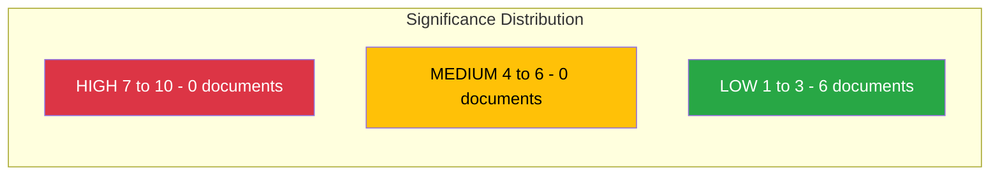

# Document Significance Scoring - 2026-04-10

## Scoring Context

| Field | Value |
|-------|-------|
| **Scoring ID** | SIG-2026-04-10-1026 |
| **Analysis Date** | 2026-04-10 10:26 UTC |
| **Documents Scored** | 6 |
| **Produced By** | news-realtime-monitor (realtime-1026) |
| **Scoring Method** | Multi-factor: document type + committee tier + domain + coalition context + content |

---

## Significance Dashboard

## Detailed Scoring

| Score | Level | dok_id | Title | Key Scoring Factors |
|:-----:|:-----:|--------|-------|---------------------|
| 3/10 | Low | HD11701 | Taiwans deltagande i WHA | Foreign Affairs + SENSITIVE (Taiwan/PRC) + ELEVATED urgency (WHA May) |
| 3/10 | Low | HD11699 | Styrmedelsutredningens betankande | Climate policy + ELEVATED urgency + opposition pressure on coalition |
| 2/10 | Low | HD11696 | Oberoende staters samvalde | Foreign Affairs + CIS/Russia context + SD-M dynamics |
| 2/10 | Low | HD11698 | Ansvaret for PAO-stod | Foreign Aid + democracy promotion + SD-M accountability |
| 2/10 | Low | HD11697 | Fraktkostnader gotlandskt lantbruk | Agriculture + rural policy + S vs KD dynamics |
| 2/10 | Low | HD11700 | AF tillganglighet och service | Labour market + service delivery + S vs L dynamics |

### Scoring Formula Applied

Written questions (skriftliga fragor) have a base score of 1/10 due to low legislative binding power. Modifiers:
- +1 for SENSITIVE sensitivity level (HD11701)
- +1 for ELEVATED urgency (HD11699, HD11701)
- +0.5 for foreign policy relevance in current geopolitical context (HD11696, HD11698)
- No documents cross the 5.0 publish threshold or 7.0 breaking threshold

## Key Findings

1. **0** document(s) rated High (score >= 7) - no breaking news
2. **0** document(s) rated Medium (score 4-6) - no standard articles
3. **6** document(s) rated Low (score 1-3) - analysis only
4. **Top document:** HD11701 (Taiwan WHA) at 3/10 - elevated by approaching WHA session and Taiwan/PRC sensitivity

## Editorial Decision

All documents fall below the 5.0 publish threshold. Recommendation: **ANALYSIS-ONLY** - commit analysis artifacts, no articles generated.

---

## MCP Data Files Used

| # | Data Source | File / Tool Path | Retrieved |
|:-:|-----------|-----------------|-----------|
| 1 | riksdag-regering-mcp | search_dokument(from_date=2026-04-10) | 2026-04-10 10:27 UTC |

---

## Cross-References

| Related Analysis File | Relationship | Key Finding |
|----------------------|-------------|-------------|
| classification-results.md | Classification informs significance | 5 PUBLIC + 1 SENSITIVE |
| synthesis-summary.md | Significance consumed by synthesis | Max 3/10 supports ANALYSIS-ONLY |
