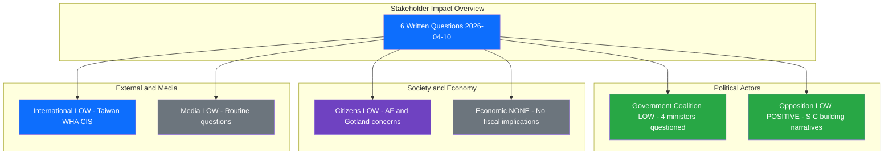

# Stakeholder Impact Analysis - 2026-04-10

## Stakeholder Context

| Field | Value |
|-------|-------|
| **Assessment ID** | STK-2026-04-10-1026 |
| **Assessment Date** | 2026-04-10 10:26 UTC |
| **Documents Analyzed** | 6 written questions |
| **Produced By** | news-realtime-monitor (realtime-1026) |

---

## Stakeholder Impact Dashboard

## Detailed Stakeholder Assessment

### 8 Mandatory Stakeholder Groups

| Stakeholder | Impact Level | Direction | Key Assessment | Confidence |
|------------|:------------:|:---------:|----------------|:----------:|
| Citizens | LOW | neutral | AF accessibility (HD11700) and Gotland freight (HD11697) touch everyday service delivery concerns | M |
| Government Coalition | LOW | neutral | Four ministers from M, KD, L questioned - routine but requires coordination on responses | M |
| Opposition Bloc | LOW | positive | S (Westeren, Svensson) and C (Nordin) building pre-election scrutiny narratives | M |
| Business/Industry | NONE | neutral | No direct business implications in today's questions | H |
| Civil Society | NONE | neutral | No direct civil society impact | H |
| International/EU | LOW | neutral | Taiwan WHA (HD11701) and CIS (HD11696) questions signal Sweden's geopolitical positioning | M |
| Judiciary/Constitutional | NONE | neutral | No judicial or constitutional implications | H |
| Media/Public Opinion | LOW | neutral | Low newsworthiness - routine written questions rarely generate media coverage | H |

---

## Named Actor Analysis

| Actor | Party | Role | Involved Documents | Impact Direction |
|-------|-------|------|-------------------|:----------------:|
| Markus Wiechel | SD | MP - foreign policy questioner | HD11696, HD11698, HD11701 | Probing M ministers |
| Maria Malmer Stenergard | M | Foreign Minister | HD11696, HD11701 | Must respond on CIS and Taiwan |
| Benjamin Dousa | M | Aid/Trade Minister | HD11698 | Must respond on PAO-stod |
| Peter Kullgren | KD | Rural Minister | HD11697 | Must respond on Gotland freight |
| Johan Britz | L | Labour/Climate Minister | HD11699, HD11700 | Must respond on climate and AF |
| Hanna Westeren | S | MP - domestic policy | HD11697 | Scrutinizing KD rural policy |
| Jonathan Svensson | S | MP - labour policy | HD11700 | Scrutinizing L AF reform |
| Rickard Nordin | C | MP - climate policy | HD11699 | Pressing L on climate instruments |

---

## MCP Data Files Used

| # | Data Source | File / Tool Path | Retrieved |
|:-:|-----------|-----------------|-----------|
| 1 | riksdag-regering-mcp | search_dokument(from_date=2026-04-10) | 2026-04-10 10:27 UTC |

---

## Cross-References

| Related Analysis File | Relationship | Key Finding |
|----------------------|-------------|-------------|
| synthesis-summary.md | Stakeholder impact feeds into synthesis | Low overall stakeholder impact |
| swot-analysis.md | Stakeholder positions inform SWOT | S and C building opposition narratives |
