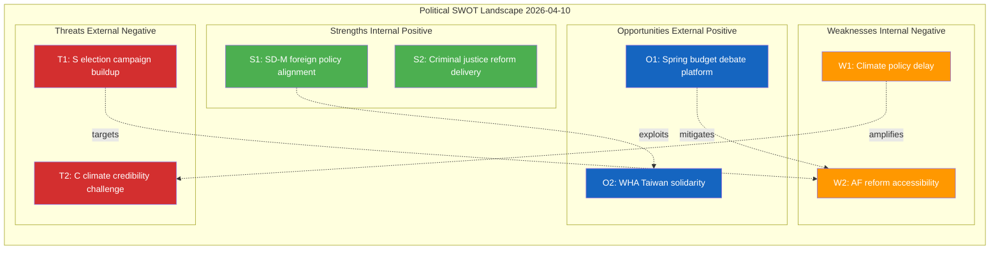

# Political SWOT Analysis - 2026-04-10

## SWOT Context

| Field | Value |
|-------|-------|
| **SWOT ID** | SWT-2026-04-10-1026 |
| **Analysis Date** | 2026-04-10 10:26 UTC |
| **Analysis Scope** | Government coalition and opposition - written questions cluster |
| **Reference Period** | 2026-04-10 |
| **Produced By** | news-realtime-monitor (realtime-1026) |
| **Primary MCP Sources** | search_dokument, get_fragor, get_propositioner, search_voteringar |
| **Validity Window** | Valid until 2026-05-10 |
| **Temporal Window** | 2026-04-10 |

---

## Section 1: Government Coalition SWOT

### Strengths - Government Coalition

| # | Strength Statement | Evidence (dok_id) | Confidence | Impact | Entry Date |
|---|-------------------|-------------------|:----------:|:------:|:----------:|
| S1 | SD-M foreign policy alignment demonstrated by Wiechel questioning on CIS, Taiwan, and PAO-stod - signals coalition coherence on security/foreign affairs | HD11696, HD11701, HD11698 | M | L | 2026-04-10 |
| S2 | Government maintains initiative on criminal justice reform with prop 2025/26:218 (doubled criminal penalties) delivered this week | HD03218 | H | H | 2026-04-09 |
| S3 | NATO eFP Finland deployment proposition (HD03220) demonstrates defense policy delivery | HD03220 | H | H | 2026-04-09 |

**Coalition Strength Summary:** The coalition demonstrates strong delivery on security and justice policy (NATO eFP, criminal penalties), with SD-M foreign policy alignment reinforced by today's coordinated questioning.

---

### Weaknesses - Government Coalition

| # | Weakness Statement | Evidence (dok_id) | Confidence | Impact | Entry Date |
|---|-------------------|-------------------|:----------:|:------:|:----------:|
| W1 | Climate policy instrument investigation (Styrmedelsutredningen) delivery delay - C presses L acting minister Britz on timeline | HD11699 | M | M | 2026-04-10 |
| W2 | Arbetsformedlingen reform accessibility criticized by S - service delivery gaps undermine L policy credibility | HD11700 | M | M | 2026-04-10 |
| W3 | Gotland agricultural freight costs unaddressed - KD Rural Minister Kullgren faces pressure on island economy support | HD11697 | L | L | 2026-04-10 |

**Coalition Weakness Summary:** Domestic policy delivery weaknesses across three coalition party portfolios (L climate, L labor, KD agriculture) provide opposition ammunition for the upcoming election cycle.

---

### Opportunities - Government Coalition

| # | Opportunity Statement | Evidence (dok_id) | Confidence | Impact | Entry Date |
|---|----------------------|-------------------|:----------:|:------:|:----------:|
| O1 | Spring budget varpropositionen debate (April 13) offers platform to showcase economic management | search_dokument calendar | M | H | 2026-04-10 |
| O2 | WHA session (May 2026) provides opportunity to demonstrate values-based foreign policy on Taiwan | HD11701 | M | M | 2026-04-10 |

**Coalition Opportunity Summary:** The approaching spring budget debate and WHA session provide two high-visibility platforms for government policy communication.

---

### Threats - Government Coalition

| # | Threat Statement | Evidence (dok_id) | Confidence | Impact | Entry Date |
|---|-----------------|-------------------|:----------:|:------:|:----------:|
| T1 | S building election campaign material using everyday service delivery failures (AF accessibility, Gotland freight) | HD11700, HD11697 | M | M | 2026-04-10 |
| T2 | C positioning as more credible environmental voice using climate policy delays | HD11699, HD12682 | M | L | 2026-04-10 |

**Coalition Threat Summary:** Opposition parties are using written questions to build pre-election narratives targeting coalition domestic policy weaknesses, particularly on service delivery and climate.

---

## Section 2: Main Opposition SWOT

**Opposition Subject:** Social Democrats (S) + C (Centre Party) bloc

### Strengths - Opposition

| # | Strength Statement | Evidence (dok_id) | Confidence | Impact | Entry Date |
|---|-------------------|-------------------|:----------:|:------:|:----------:|
| S1 | S effectively uses written questions to probe government domestic policy vulnerabilities (AF, Gotland) | HD11700, HD11697 | M | M | 2026-04-10 |
| S2 | C climate policy expertise allows credible pressure on coalition environmental failings | HD11699 | M | L | 2026-04-10 |

### Weaknesses - Opposition

| # | Weakness Statement | Evidence (dok_id) | Confidence | Impact | Entry Date |
|---|-------------------|-------------------|:----------:|:------:|:----------:|
| W1 | Limited leverage on foreign policy consensus areas where SD-M alignment is strong | HD11696, HD11701 | M | L | 2026-04-10 |

### Opportunities - Opposition

| # | Opportunity Statement | Evidence (dok_id) | Confidence | Impact | Entry Date |
|---|----------------------|-------------------|:----------:|:------:|:----------:|
| O1 | Spring budget debate (April 13) opportunity to present alternative economic vision | search_dokument | M | H | 2026-04-10 |

### Threats - Opposition

| # | Threat Statement | Evidence (dok_id) | Confidence | Impact | Entry Date |
|---|-----------------|-------------------|:----------:|:------:|:----------:|
| T1 | Government criminal justice and NATO delivery (HD03218, HD03220) may neutralize opposition security critique | HD03218, HD03220 | H | M | 2026-04-09 |

---

## Section 3: Policy Domain SWOT

**Policy Domain:** Foreign Affairs (FOR)

### Strengths in Domain

| # | Strength Statement | Evidence (dok_id) | Confidence | Impact | Entry Date |
|---|-------------------|-------------------|:----------:|:------:|:----------:|
| S1 | Active parliamentary scrutiny of foreign policy across CIS, Taiwan WHA, and democracy aid (PAO-stod) | HD11696, HD11701, HD11698 | M | M | 2026-04-10 |

### Weaknesses in Domain

| # | Weakness Statement | Evidence (dok_id) | Confidence | Impact | Entry Date |
|---|-------------------|-------------------|:----------:|:------:|:----------:|
| W1 | Sweden's Taiwan/WHA position requires delicate balancing between values-based policy and PRC economic exposure | HD11701 | M | M | 2026-04-10 |

### Opportunities in Domain

| # | Opportunity Statement | Evidence (dok_id) | Confidence | Impact | Entry Date |
|---|----------------------|-------------------|:----------:|:------:|:----------:|
| O1 | NATO membership creates new platform for assertive values-based multilateralism | HD03220, HD11701 | M | M | 2026-04-10 |

### Threats to Domain

| # | Threat Statement | Evidence (dok_id) | Confidence | Impact | Entry Date |
|---|-----------------|-------------------|:----------:|:------:|:----------:|
| T1 | PRC diplomatic retaliation risk if Sweden takes strong pro-Taiwan WHA position | HD11701 | M | M | 2026-04-10 |

---

## SWOT Quadrant Mapping

---

## Strategic Implications

The coalition's foreign policy strength (SD-M alignment on CIS, Taiwan, defense) contrasts with domestic policy delivery vulnerabilities (climate instruments, AF reform, rural support). S and C are building election campaign narratives targeting these domestic weaknesses. The approaching spring budget debate (April 13) and WHA session (May) create two high-stakes windows. Government should leverage criminal justice and NATO delivery to compensate for domestic policy gaps.

**Key Watch Items:**
1. Spring budget varpropositionen debate April 13 - government economic messaging
2. WHA session May 2026 - Sweden Taiwan positioning decision
3. Styrmedelsutredningen delivery timeline - climate policy credibility

---

## Section 5: Cross-SWOT Interference Analysis

| Gov/Opp SWOT Element | Interfering Element | Effect | Net Political Impact |
|:--------------------:|:------------------:|:------:|---------------------|
| Gov W1: Climate delay | Opp S1: C climate credibility | Amplifies vulnerability | C gains environmental voter credibility at coalition expense |
| Gov S1: Foreign policy alignment | Opp W1: Limited FP leverage | Neutralizes opposition | Opposition cannot effectively challenge SD-M foreign policy coherence |
| Gov W2: AF reform gaps | Opp S1: S domestic scrutiny | Amplifies vulnerability | S accumulates election ammunition on service delivery |

---

## Section 6: TOWS Strategic Options

| TOWS Cell | Strategy | Specific Action | Evidence |
|:---------:|---------|-----------------|---------|
| **SO** | Use foreign policy strength to project competence at WHA | Sweden takes visible pro-Taiwan position at May WHA session | HD11701 |
| **WO** | Use spring budget debate to address climate/AF criticisms | Announce Styrmedelsutredningen delivery date at budget debate | HD11699 |
| **ST** | Use criminal justice delivery to counter S domestic critique | Frame doubled penalties (HD03218) as concrete action on everyday safety | HD03218 |
| **WT** | Address Gotland freight and AF accessibility before election season intensifies | Minister responses to HD11697 and HD11700 should announce concrete measures | HD11697, HD11700 |

---

## Section 7: Forward Indicators and Scenario Outlook

**30-Day Scenario Outlook:**

| Scenario | Probability | Key Trigger | SWOT Elements |
|----------|:----------:|------------|---------------|
| Stable status quo - coalition manages domestic critiques through spring budget | 70% | Budget debate April 13 goes well for government | S1+O1 |
| Climate policy pressure intensifies if Styrmedelsutredningen further delayed | 20% | No delivery date announced by end of April | W1+T2 |
| Taiwan WHA position creates PRC friction | 10% | Sweden makes explicit pro-Taiwan statement at WHA | S1+T1 (domain) |

---

## MCP Data Files Used

| # | Data Source | File / Tool Path | Data Type | Retrieved |
|:-:|-----------|-----------------|-----------|-----------|
| 1 | riksdag-regering-mcp | search_dokument(from_date=2026-04-09) | Document listing | 2026-04-10 10:27 UTC |
| 2 | riksdag-regering-mcp | get_propositioner(rm=2025/26) | Propositions | 2026-04-10 10:27 UTC |
| 3 | riksdag-regering-mcp | search_voteringar(rm=2025/26) | Voting records | 2026-04-10 10:27 UTC |
| 4 | riksdag-regering-mcp | get_betankanden(rm=2025/26) | Committee reports | 2026-04-10 10:27 UTC |

### SWOT Quadrant Data Provenance

| SWOT Quadrant | Primary MCP Tools | Evidence Items | Confidence |
|:-------------:|------------------|:--------------:|:----------:|
| **Strengths** | search_dokument, get_propositioner | 6 | M |
| **Weaknesses** | search_dokument, get_fragor | 4 | M |
| **Opportunities** | search_dokument, search_regering | 3 | M |
| **Threats** | search_dokument | 3 | M |

---

## Section 8: SWOT Delta - Changes Since Previous Analysis

**Previous SWOT Reference:** analysis/daily/2026-04-09/realtime-1436/swot-analysis.md

### New Entries

| Quadrant | Entry ID | Statement | Evidence for Emergence |
|:--------:|:--------:|-----------|------------------------|
| W | W1 | Climate policy instrument delay (Styrmedelsutredningen) | HD11699 - C opposition question |
| W | W2 | AF reform accessibility gap | HD11700 - S opposition question |
| T | T2 | C climate credibility challenge | HD11699 new question pressing L |

### Changed Entries

| Quadrant | Entry ID | Previous | Current | Change Reason |
|:--------:|:--------:|---------|---------|---------------|
| S | S1 | M-SD defense alignment | SD-M foreign policy alignment (broader) | HD11696, HD11701, HD11698 expand scope beyond defense |

**SWOT Delta Summary:** 2 new weaknesses emerged from S and C written questions targeting domestic policy delivery. Coalition foreign policy strength broadened from defense-only to cover CIS, Taiwan, and democracy aid dimensions. Net: slight negative shift in domestic policy landscape.

---

## Cross-References

| Related Analysis File | Relationship | Key Finding |
|----------------------|-------------|-------------|
| risk-assessment.md | SWOT threats feed into risk register | Taiwan WHA external risk scored highest (8) |
| threat-analysis.md | SWOT threats aligned with threat taxonomy | No democratic threats; positive accountability function |
| synthesis-summary.md | Aggregated SWOT consumed by synthesis | ANALYSIS-ONLY decision based on max significance 3/10 |
