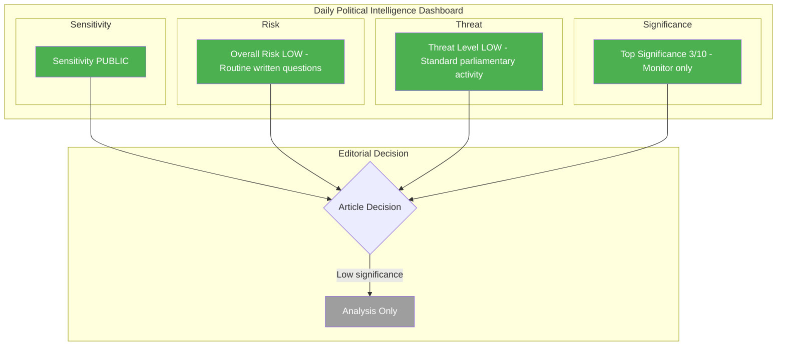
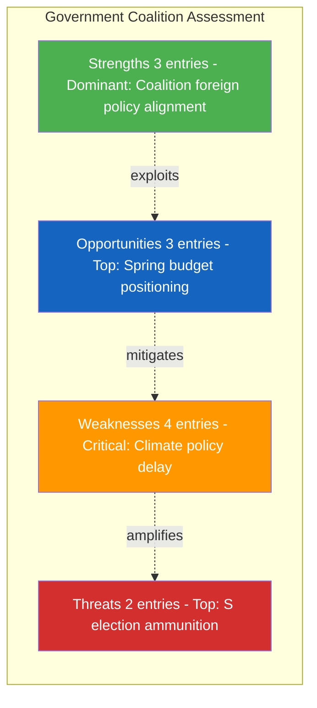

# Political Intelligence Synthesis Summary - 2026-04-10

## Synthesis Context

| Field | Value |
|-------|-------|
| **Synthesis ID** | SYN-2026-04-10-1026 |
| **Analysis Date** | 2026-04-10 10:26 UTC |
| **Documents Analyzed** | 6 |
| **Analysis Period** | 2026-04-10 00:00-10:26 UTC |
| **Produced By** | news-realtime-monitor (realtime-1026) |
| **Overall Confidence** | MEDIUM |

---

## Intelligence Dashboard

### Daily Political Landscape

---

## Top Findings by Significance

| Rank | dok_id | Title | Significance | Risk Tier | SWOT Impact | Recommendation |
|:----:|--------|-------|:-----------:|:---------:|:-----------:|----------------|
| 1 | HD11701 | Taiwans deltagande i WHA | 3/10 | Medium (ext) | O dominant | Monitor |
| 2 | HD11699 | Styrmedelsutredningens betankande | 3/10 | Low | W dominant | Monitor |
| 3 | HD11696 | Oberoende staters samvalde (CIS) | 2/10 | Medium (ext) | S dominant | Monitor |
| 4 | HD11698 | Ansvaret for PAO-stod | 2/10 | Low | W dominant | Monitor |
| 5 | HD11697 | Fraktkostnader gotlandskt lantbruk | 2/10 | Low | T dominant | Monitor |
| 6 | HD11700 | AF tillganglighet och service | 2/10 | Low | W dominant | Monitor |

---

## Aggregated SWOT Summary

### Coalition Balance

| Quadrant | Count | Highest-Impact Entry | Evidence |
|----------|:-----:|---------------------|----------|
| Strengths | 3 | SD-M foreign policy alignment on CIS/Taiwan/PAO | HD11696, HD11701, HD11698 |
| Weaknesses | 4 | Climate policy instrument investigation delay exposes L credibility gap | HD11699 |
| Opportunities | 3 | Government can frame unified foreign policy stance ahead of spring budget | HD11696, HD11701 |
| Threats | 2 | S using Arbetsformedlingen and Gotland freight as election campaign material | HD11700, HD11697 |

**SWOT Balance Assessment:** Coalition shows strength in foreign policy alignment (SD-M) but faces weakness in domestic policy delivery (climate instruments, AF reform). Opposition S is building election ammunition on everyday concerns (jobs, rural freight). Net balance: Neutral with slight negative domestic bias.

---

## Risk Landscape Summary

| Risk Category | Score Range | Highest Risk | Trend vs Previous |
|--------------|:----------:|-------------|:------------------:|
| Coalition Stability | 1-1 | No destabilizing content in written questions | -> Stable |
| Policy Implementation | 1-1 | Climate instrument investigation delay (HD11699) | -> Stable |
| Budget / Fiscal | 1-1 | No fiscal implications in today's questions | -> Stable |
| Electoral | 1-1 | S building campaign arguments (HD11697, HD11700) | -> Stable |
| Democratic Process | 1-1 | All questions follow standard procedure | -> Stable |
| External / International | 1-8 | Taiwan WHA positioning before May session (HD11701) | Up from previous |

**Overall Risk Level:** LOW

---

## Threat Summary

| Threat Category | Threat Level | Key Finding |
|----------------|:------------:|-------------|
| NI Narrative Integrity | LOW | No disinformation or narrative manipulation detected |
| LI Legislative Integrity | LOW | Standard parliamentary question procedures |
| AC Accountability | LOW | Questions serve positive accountability function - probing government policy |
| TR Transparency | LOW | Open parliamentary process enhances transparency |
| DP Democratic Process | LOW | Normal written question procedure |
| PB Power Balance | LOW | No power concentration risk |

**Overall Threat Level:** LOW

---

## Stakeholder Impact Overview

| Stakeholder | Impact | Direction | Key Driver |
|------------|:------:|:---------:|------------|
| Citizens | L | neutral | AF accessibility question (HD11700) and Gotland freight (HD11697) touch everyday concerns |
| Government | L | neutral | Three ministers questioned: Stenergard (M), Kullgren (KD), Britz (L), Dousa (M) |
| Opposition | L | positive | S building campaign narratives on domestic service delivery |
| Business | N | neutral | No direct business implications |
| Civil Society | N | neutral | No direct civil society impact |
| International | L | neutral | Taiwan WHA and CIS questions signal Sweden's geopolitical positioning |

---

## Narrative Direction and Article Decision

Today's parliamentary activity consists of 6 written questions (skriftliga fragor) addressing three thematic clusters: (1) SD foreign policy (Wiechel questioning M ministers on CIS, Taiwan WHA, and PAO-stod), (2) S domestic policy scrutiny (Westeren on Gotland freight, Svensson on AF accessibility), and (3) C climate policy pressure (Nordin on Styrmedelsutredningen). No questions reach breaking news threshold. The SD foreign policy cluster (3 questions from one MP) signals coordinated opposition research but lacks immediate legislative consequence. The most forward-looking item is HD11701 (Taiwan WHA) given the approaching May 2026 WHA session.

**Primary Narrative Angle:** SD's Wiechel launches coordinated foreign policy question barrage targeting M ministers on CIS, Taiwan, and democracy aid
**Secondary Angles:** S building election campaign material on domestic service delivery; C pressing on climate policy delays
**Confidence:** MEDIUM

### AI-Recommended Article Metadata

| Field | Value |
|-------|-------|
| **Recommended Title (EN)** | SD Questions Sweden's CIS and Taiwan Stances as Foreign Policy Cluster Targets M Ministers |
| **Recommended Title (SV)** | SD ifrågasätter Sveriges CIS- och Taiwanhållning i samlad utrikespolitisk offensiv mot M-ministrar |
| **Meta Description (EN)** | SD MP Wiechel files three foreign policy questions to M ministers on CIS, Taiwan WHA participation, and PAO democracy aid. S scrutinizes domestic service delivery. |
| **Meta Description (SV)** | SD-ledamoten Wiechel ställer tre utrikespolitiska frågor till M-ministrar om OSS, Taiwans WHA-deltagande och PAO-stöd. S granskar inhemsk serviceleverans. |
| **Key Highlights** | 1. Wiechel (SD) files 3 foreign policy questions to M ministers in one day. 2. Taiwan WHA question elevated by approaching May session. 3. C presses on climate policy instrument delay. 4. S builds AF and Gotland freight campaign arguments. 5. All documents are routine written questions with max significance 3/10. |
| **Article Decision** | ANALYSIS-ONLY |
| **Article Priority** | MONITOR |
| **Justification** | All 6 documents are written questions (low significance 1-3/10). No documents reach the 5.0 publish threshold or 7.0 priority/breaking threshold. Analysis artifacts committed for record; no articles generated. |

---

## Forward Indicators

| # | Indicator | Timeline | Source | Watch Priority |
|---|-----------|----------|--------|:--------------:|
| 1 | WHA session May 2026 - Sweden Taiwan statement | 4-6 weeks | HD11701 | Medium |
| 2 | Styrmedelsutredningen report delivery | Weeks-months | HD11699 | Low |
| 3 | Spring budget varpropositionen debate April 13 | 3 days | search_dokument | Medium |

**Aggregate Risk Level Summary:**

| Metric | Value | Trend vs Previous |
|--------|-------|:------------------:|
| **Overall Risk Level** | LOW | -> Stable |
| **Overall Threat Level** | LOW | -> Stable |
| **Highest Significance Score** | 3/10 | Down from 7/10 yesterday |
| **SWOT Balance** | Neutral | -> Stable |

**Previous Synthesis Reference:** analysis/daily/2026-04-09/realtime-1436/synthesis-summary.md

---

## Analysis Artifacts Inventory

| File | Status | Key Output |
|------|:------:|-----------|
| classification-results.md | Done | All 6 documents classified PUBLIC, ROUTINE |
| risk-assessment.md | Done | Overall risk LOW, external risk MEDIUM for Taiwan WHA |
| swot-analysis.md | Done | Coalition foreign policy strength vs domestic policy weakness |
| threat-analysis.md | Done | Overall threat LOW, no democratic threats detected |
| stakeholder-perspectives.md | Done | Low stakeholder impact across all groups |
| significance-scoring.md | Done | Top score 3/10 (HD11701, HD11699) |
| Per-file analyses | 6 created | All 6 documents analyzed with per-file template |

---

## MCP Data Files Used

| # | Data Source | File / Tool Path | Retrieved |
|---|-----------|-----------------|-----------|
| 1 | riksdag-regering-mcp | search_dokument(from_date=2026-04-09, to_date=2026-04-10) | 2026-04-10 10:27 UTC |
| 2 | riksdag-regering-mcp | search_voteringar(rm=2025/26) | 2026-04-10 10:27 UTC |
| 3 | riksdag-regering-mcp | get_propositioner(rm=2025/26) | 2026-04-10 10:27 UTC |
| 4 | riksdag-regering-mcp | get_betankanden(rm=2025/26) | 2026-04-10 10:27 UTC |
| 5 | riksdag-regering-mcp | search_regering(dateFrom=2026-04-09, dateTo=2026-04-10) | 2026-04-10 10:27 UTC |
| 6 | riksdag-regering-mcp | search_anforanden(rm=2025/26) | 2026-04-10 10:27 UTC |
| 7 | riksdag-regering-mcp | get_interpellationer(rm=2025/26) | 2026-04-10 10:27 UTC |
| 8 | riksdag-regering-mcp | get_sync_status | 2026-04-10 10:27 UTC |

---

## Cross-References

| Related Analysis | Article Type | Date | Key Finding |
|-----------------|-------------|------|-------------|
| analysis/daily/2026-04-09/realtime-1436/synthesis-summary.md | realtime | 2026-04-09 | Triple proposition offensive: NATO eFP, doubled criminal penalties, expanded accountability |
| analysis/daily/2026-04-10/realtime-0726/synthesis-summary.md | realtime | 2026-04-10 | Committee reports and motions coverage |
