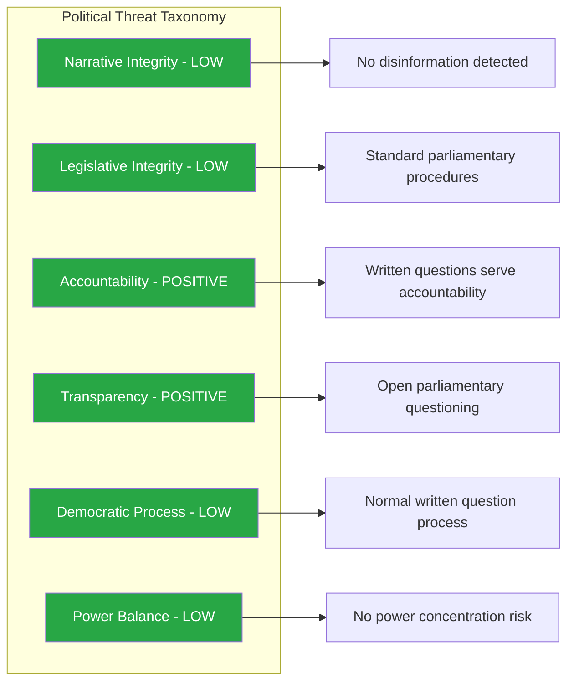

# Political Threat Analysis - 2026-04-10

## Threat Context

| Field | Value |
|-------|-------|
| **Threat Assessment ID** | THR-2026-04-10-1026 |
| **Assessment Date** | 2026-04-10 10:26 UTC |
| **Assessment Period** | 2026-04-10 |
| **Produced By** | news-realtime-monitor (realtime-1026) |
| **Overall Threat Level** | LOW |

---

## Threat Landscape Overview

## Threat Assessment

| Threat Category | Applicable | Threat Description | Severity | Evidence |
|----------------|:----------:|-------------------|:--------:|----------|
| Narrative Integrity | N | No disinformation, false framing, or misleading rhetoric detected in any of the 6 written questions | 1 | HD11696-HD11701 |
| Legislative Integrity | N | All questions follow standard skriftlig fraga procedure; no evidence of lobbying or manipulation | 1 | HD11696-HD11701 |
| Accountability | Positive | Written questions from SD (Wiechel), S (Westeren, Svensson), and C (Nordin) demonstrate active parliamentary accountability | 1 | HD11696-HD11701 |
| Transparency | Positive | All questions are public documents; ministers must respond openly | 1 | HD11696-HD11701 |
| Democratic Process | N | Standard written question procedure; no obstruction or procedural manipulation | 1 | HD11696-HD11701 |
| Power Balance | N | Questions from 3 parties (SD, S, C) to 4 ministers (Stenergard M, Kullgren KD, Britz L, Dousa M) demonstrate distributed accountability | 1 | HD11696-HD11701 |

**Overall Threat Level:** LOW - Today's parliamentary activity represents healthy democratic functioning with active opposition scrutiny across multiple policy domains.

---

## Forward Threat Indicators

| # | Indicator | Timeline | Watch Priority |
|---|-----------|----------|:--------------:|
| 1 | Monitor ministerial responses for evasion or deflection patterns | 2-4 weeks | Low |
| 2 | Track whether SD foreign policy questions lead to coalition friction | 4-8 weeks | Low |

---

## MCP Data Files Used

| # | Data Source | File / Tool Path | Retrieved |
|:-:|-----------|-----------------|-----------|
| 1 | riksdag-regering-mcp | search_dokument(from_date=2026-04-10) | 2026-04-10 10:27 UTC |
| 2 | riksdag-regering-mcp | get_fragor(rm=2025/26) | 2026-04-10 10:27 UTC |

---

## Cross-References

| Related Analysis File | Relationship | Key Finding |
|----------------------|-------------|-------------|
| risk-assessment.md | Threat analysis informs risk scores | Low threat level supports low risk assessment |
| swot-analysis.md | Threats map to SWOT quadrants | No democratic threats identified |
| synthesis-summary.md | Threat summary consumed by synthesis | LOW overall supports ANALYSIS-ONLY decision |
