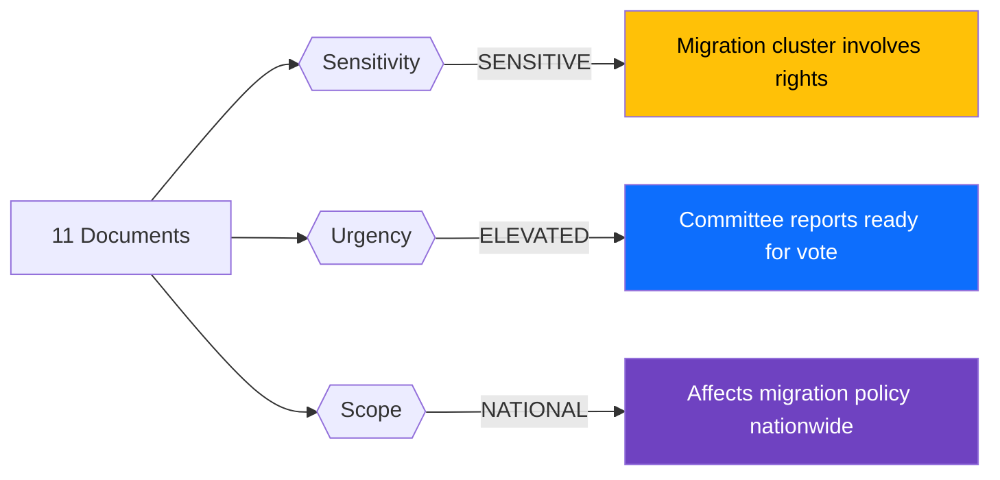

# 🏷️ Political Event Classification — 2026-04-10 Realtime-1424

## 📋 Document Metadata

| Field | Value |
|-------|-------|
| **Classification ID** | CLS-2026-04-10-1424 |
| **Document Type** | Political Event Classification |
| **Event Date** | 2026-04-10 |
| **Classification Date** | 2026-04-10 14:24 UTC |
| **Primary Source dok_id** | HD01SfU31, HD01SfU32, HD01SfU36 (cluster) |
| **Secondary Source(s)** | HD024075, HD11702, HD11696-HD11701 |
| **Classified By** | news-realtime-monitor (realtime-1424) |

---

## 🏷️ Classification Dimensions

### Classification Decision Tree

### Classification Results

| dok_id | Title | Sensitivity | Urgency | Domain | Significance | Political Temperature |
|--------|-------|:-----------:|:-------:|--------|:-----------:|:--------------------:|
| HD01SfU31 | Uppsikt och förvar | SENSITIVE | ELEVATED | MIG/JUS | 5/10 | 6/10 |
| HD01SfU32 | Stärkt återvändande | SENSITIVE | ELEVATED | MIG/SEC | 5/10 | 6/10 |
| HD01SfU36 | Skärpta vandel | SENSITIVE | ELEVATED | MIG/JUS | 5/10 | 5/10 |
| HD024075 | Slopat matkrav (S) | PUBLIC | ROUTINE | HEA/REG | 3/10 | 2/10 |
| HD11702 | Styrmedelsutredning | PUBLIC | ELEVATED | ENV/GOV | 4/10 | 4/10 |
| HD11696 | Oberoende staters samvälde | PUBLIC | ROUTINE | FOR | 2/10 | 2/10 |
| HD11697 | Taiwans deltagande i WHA | PUBLIC | ROUTINE | FOR | 2/10 | 2/10 |
| HD11698 | PAO-stöd ansvar | PUBLIC | ROUTINE | DEF | 2/10 | 2/10 |
| HD11699 | Styrmedelsutredningens betänkande | PUBLIC | ROUTINE | ENV | 3/10 | 3/10 |
| HD11700 | Arbetsförmedlingen tillgänglighet | PUBLIC | ROUTINE | LAB | 2/10 | 2/10 |
| HD11701 | Taiwans deltagande i WHA | PUBLIC | ROUTINE | FOR | 2/10 | 2/10 |

### Political Temperature Index

| Metric | Score | Rationale |
|--------|:-----:|-----------|
| **Cluster Political Temperature** | 6/10 | Three SfU migration reports constitute a coordinated policy push on Sweden's most politically charged topic |
| **Coalition Impact Vector** | +0.3 (strengthens government) | All three reports advance Tidö Agreement agenda; SD support secured |
| **Strategic Significance** | MEDIUM | Important policy delivery but no constitutional-level events |

---

**Document Control:**
- **Template:** analysis/templates/political-classification.md v2.2
