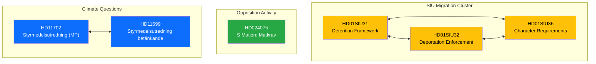

# 🔗 Cross-Reference Map — 2026-04-10 Realtime-1424

## Document Relationships

## Relationship Table

| Source | Target | Relationship | Strength |
|--------|--------|-------------|:--------:|
| HD01SfU31 | HD01SfU32 | Companion — same committee, complementary enforcement | Strong |
| HD01SfU31 | HD01SfU36 | Companion — same committee, complementary requirements | Strong |
| HD01SfU32 | HD01SfU36 | Companion — same committee, complementary enforcement | Strong |
| HD11702 | HD11699 | Same-topic — both address climate policy instrument investigation | Strong |
| HD024075 | HD01SfU31-36 | Same-day — different policy areas, no topical connection | Weak |

## Pattern Summary

Two document clusters identified:
1. **SfU Migration Cluster** (3 documents): Coordinated committee reporting on migration enforcement
2. **Climate Questions** (2 documents): MP questioning government on climate policy delay
