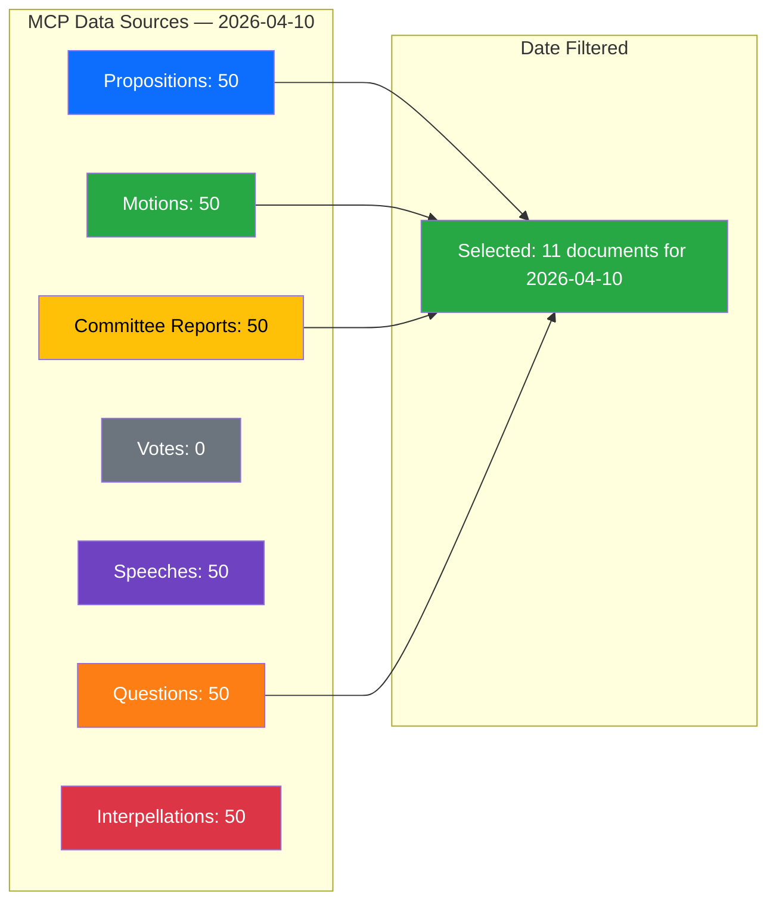

# Data Download Manifest — 2026-04-10

**Generated**: 2026-04-10 14:24 UTC
**Data Sources**: get_propositioner, get_motioner, get_betankanden, search_voteringar, search_anforanden, get_fragor, get_interpellationer
**Documents Analyzed**: 11
**Confidence**: HIGH
**Produced By**: pre-article-analysis script (automated data pipeline)

> ⚠️ **Script-Generated Analysis**: This file was produced by the automated data pipeline (`scripts/pre-article-analysis.ts`). It contains structured data extraction and basic statistical analysis only. For deep political intelligence with evidence-based claims, Mermaid diagrams, and multi-framework analysis, this file should be enriched or replaced by AI-driven analysis following `analysis/methodologies/ai-driven-analysis-guide.md`.

## Summary

Downloaded **300** documents (session-wide) from 7 MCP data sources.

After date filtering to **2026-04-10**: **11** documents selected for analysis.

## Document Counts by Type

- **propositions**: 50 documents
- **motions**: 50 documents
- **committeeReports**: 50 documents
- **votes**: 0 documents
- **speeches**: 50 documents
- **questions**: 50 documents
- **interpellations**: 50 documents

## Data Quality Notes

All documents sourced from official riksdag-regering-mcp API.