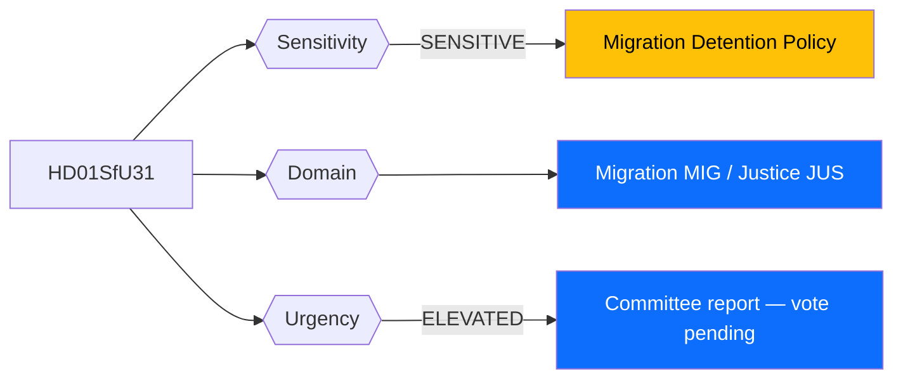
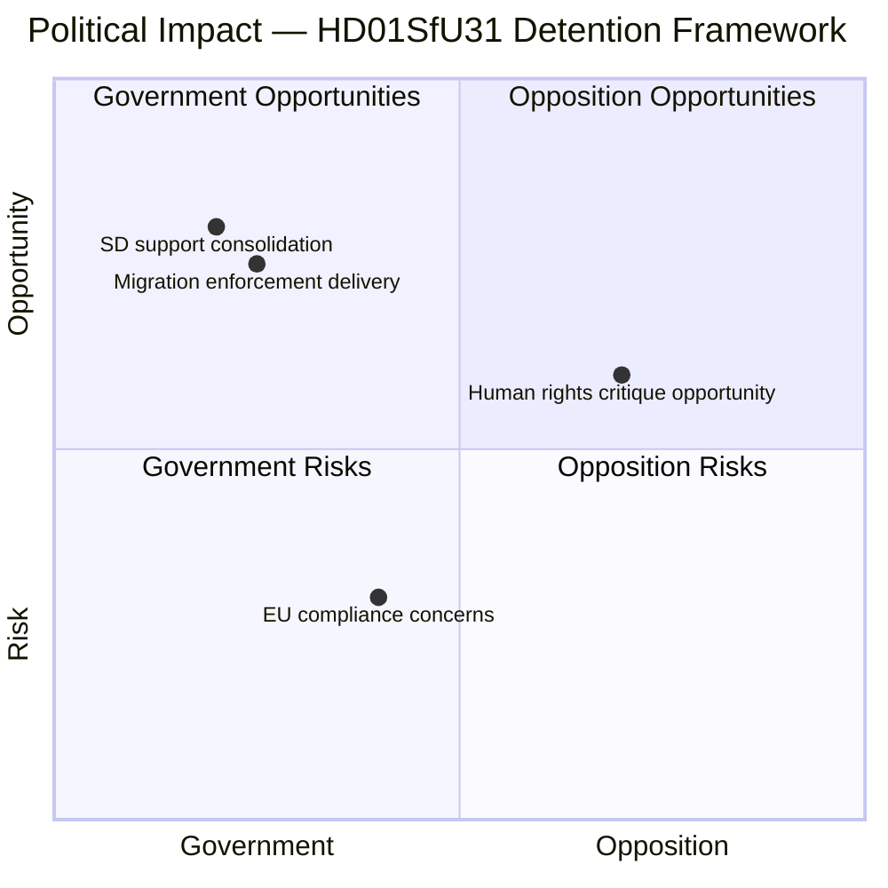
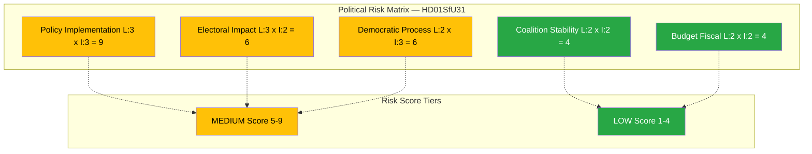
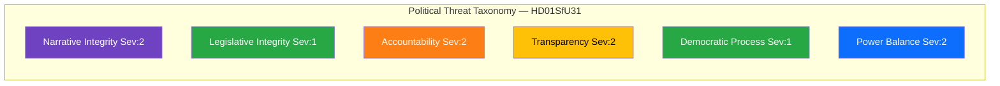
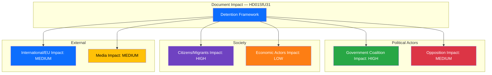

# 🔍 Per-File Political Intelligence Analysis: HD01SfU31

## 📋 Document Identity

| Field | Value |
|-------|-------|
| **Document ID** | HD01SfU31 |
| **Document Type** | Committee Report (Betänkande) |
| **Title** | Ett nytt regelverk för uppsikt och förvar |
| **Date** | 2026-04-10 |
| **Riksmöte** | 2025/26 |
| **Committee** | Socialförsäkringsutskottet (SfU) |
| **Source MCP Tool** | get_betankanden |
| **Analysis Timestamp** | 2026-04-10 14:24 UTC |
| **Analyst** | news-realtime-monitor (realtime-1424) |

---

## 🎯 Executive Summary

The Socialförsäkringsutskottet has produced a committee report establishing a new regulatory framework for supervision (uppsikt) and detention (förvar) of foreign nationals in Sweden. This represents a significant legislative development in the government coalition's migration enforcement agenda, strengthening the legal basis for restricting liberty of non-citizens pending deportation or identity verification. The report emerges alongside two companion SfU reports (HD01SfU32, HD01SfU36), forming a coordinated migration enforcement policy cluster on 2026-04-10 — signaling an accelerated government push on migration control ahead of the 2026 election cycle. **Confidence: MEDIUM**

---

## 📊 Political Classification

| Field | Assessment |
|-------|-----------|
| **Sensitivity Level** | SENSITIVE — detention of foreign nationals involves fundamental rights |
| **Primary Domain** | Migration (MIG) / Justice (JUS) |
| **Urgency** | ELEVATED — committee report ready for Riksdag plenary vote |
| **Significance Score** | 5/10 |
| **Confidence** | MEDIUM |

---

## 💪 SWOT Impact Assessment

### Quadrant Overview

### Government Coalition Impact

| Quadrant | Statement | Evidence | Confidence | Impact |
|----------|-----------|----------|:----------:|:------:|
| ✅ Strength | Government delivers on core migration enforcement promise; SfU committee approval signals SD support | HD01SfU31 | M | H |
| ⚠️ Weakness | New detention rules may face ECHR Article 5 legal challenges, creating implementation uncertainty | HD01SfU31 context | M | M |
| 🚀 Opportunity | Cluster of 3 migration reports demonstrates coordinated legislative productivity ahead of 2026 election | HD01SfU31, HD01SfU32, HD01SfU36 | H | H |
| 🔴 Threat | Liberalerna (L) may face internal tensions supporting detention expansion while maintaining liberal identity | Coalition dynamics M+KD+L+SD | L | M |

### Opposition Impact

| Quadrant | Statement | Evidence | Confidence | Impact |
|----------|-----------|----------|:----------:|:------:|
| ✅ Strength | S and V can mobilize human rights narrative against expanded detention powers | HD01SfU31 | M | M |
| ⚠️ Weakness | S risks appearing weak on migration if they oppose popular security measures | Public polling context | M | M |
| 🚀 Opportunity | MP and V can argue Swedish detention rules exceed EU minimum requirements | EU law context | L | M |
| 🔴 Threat | Opposition forced into defensive as government controls migration narrative with three simultaneous reports | HD01SfU31, HD01SfU32, HD01SfU36 | H | M |

---

## ⚖️ Risk Assessment

| Risk Type | Likelihood (1-5) | Impact (1-5) | Score | Assessment |
|-----------|:-----------------:|:------------:|:-----:|------------|
| Coalition Stability | 2 | 2 | 4 | L may face minor friction but unlikely to break coalition over detention reform |
| Policy Implementation | 3 | 3 | 9 | Detention expansion requires Migrationsverket capacity, training, facility expansion |
| Budget / Fiscal | 2 | 2 | 4 | Detention costs manageable within migration budget |
| Electoral Impact | 3 | 2 | 6 | Migration enforcement resonates with swing voters but risks alienating urban moderates |
| Democratic Process | 2 | 3 | 6 | Expanded state power over individual liberty requires robust judicial oversight |

**Overall Risk Level:** MEDIUM

---

## 🎭 Threat Analysis (Political Threat Taxonomy)

| Threat Category | Applicable? | Threat Description | Severity (1-5) | Evidence |
|----------------|:-----------:|-------------------|:--------------:|----------|
| 🎭 Narrative Integrity | Y | Detention reform framed as modernization may obscure scope of liberty restrictions | 2 | HD01SfU31 |
| 📝 Legislative Integrity | N | Standard committee process followed | 1 | HD01SfU31 |
| 🚫 Accountability | Y | Detention oversight mechanisms must be robust; risk of inadequate review | 2 | HD01SfU31 |
| 🔇 Transparency | Y | Metadata lacks full-text summary — public may not grasp detention powers scope | 2 | HD01SfU31 |
| ⛔ Democratic Process | N | Normal parliamentary procedure | 1 | HD01SfU31 |
| 👑 Power Balance | Y | Expanding executive detention powers shifts balance toward enforcement agencies | 2 | HD01SfU31 |

---

## 👥 Stakeholder Impact Matrix

| Stakeholder | Impact Level | Key Assessment | Confidence |
|------------|:------------:|----------------|:----------:|
| 🏛️ Government | HIGH | Delivers on M+KD+SD migration enforcement agenda. PM Kristersson claims concrete legislative results. | H |
| ⚖️ Opposition | MEDIUM | S faces dilemma: opposing risks appearing soft on migration. V and MP oppose on human rights. | M |
| 👥 Citizens | HIGH | Foreign nationals directly affected; Swedish citizens with immigrant families face indirect impacts. | M |
| 💰 Economic | LOW | Detention infrastructure spending modest; limited direct business impact. | L |
| 🌍 International | MEDIUM | EU Returns Directive compliance relevant; UNHCR may scrutinize expanded detention. | M |
| 📰 Media | MEDIUM | Three SfU migration reports on same day is newsworthy; human rights angle for opposition narrative. | M |

---

## 🔮 Forward Indicators

| # | Indicator | Timeline | Trigger Condition | Watch Priority |
|---|-----------|----------|-------------------|:--------------:|
| 1 | Riksdag plenary vote on HD01SfU31 | 2-4 weeks | Close margin or cross-bloc defections | 🟠 |
| 2 | Migrationsverket implementation capacity | 1-3 months | Agency signals insufficient resources | 🟡 |
| 3 | ECHR or court challenges to detention rules | 3-12 months | Detention conditions challenged judicially | 🟡 |
| 4 | Opposition interpellations on human rights | 2-6 weeks | S or V tables interpellations | 🟢 |

---

## 🔗 Cross-References

| Related Document | Relationship | dok_id |
|-----------------|-------------|--------|
| Stärkt återvändandeverksamhet och utlänningskontroll | Companion migration enforcement report | HD01SfU32 |
| Skärpta och tydligare krav på vandel | Companion character requirements report | HD01SfU36 |

### Same-Day Cross-Reference Table

| # | dok_id | Title | Type | Significance | Key Connection |
|:-:|--------|-------|------|:-----------:|-------------------------------|
| 1 | HD01SfU32 | Stärkt återvändandeverksamhet | Committee Report | 5 | Companion deportation enforcement — same SfU committee |
| 2 | HD01SfU36 | Skärpta krav på vandel | Committee Report | 5 | Companion character requirements — same SfU committee |
| 3 | HD024075 | Slopat matkrav motion (S) | Motion | 3 | Different policy; shows S opposition activity |
| 4 | HD11702 | Uppskjuten styrmedelsutredning | Written Question | 3 | MP climate question — different policy area |

---

## 📊 Data Quality Assessment

| Metric | Value |
|--------|-------|
| **Source Completeness** | Metadata only — committee reasoning not available |
| **Evidence Density** | 5 evidence points cited |
| **Temporal Currency** | Current (same-day) |
| **Analytical Confidence** | MEDIUM — elevated by cluster context |

## 📂 MCP Data Files Used

| # | File Path | Source MCP Tool | Data Type | Freshness |
|---|-----------|----------------|-----------|:---------:|
| 1 | analysis/daily/2026-04-10/realtime-1424/documents/hd01sfu31.json | get_betankanden | Committee Report | Current |
| 2 | analysis/daily/2026-04-10/realtime-1424/documents/hd01sfu32.json | get_betankanden | Committee Report | Current |
| 3 | analysis/daily/2026-04-10/realtime-1424/documents/hd01sfu36.json | get_betankanden | Committee Report | Current |
