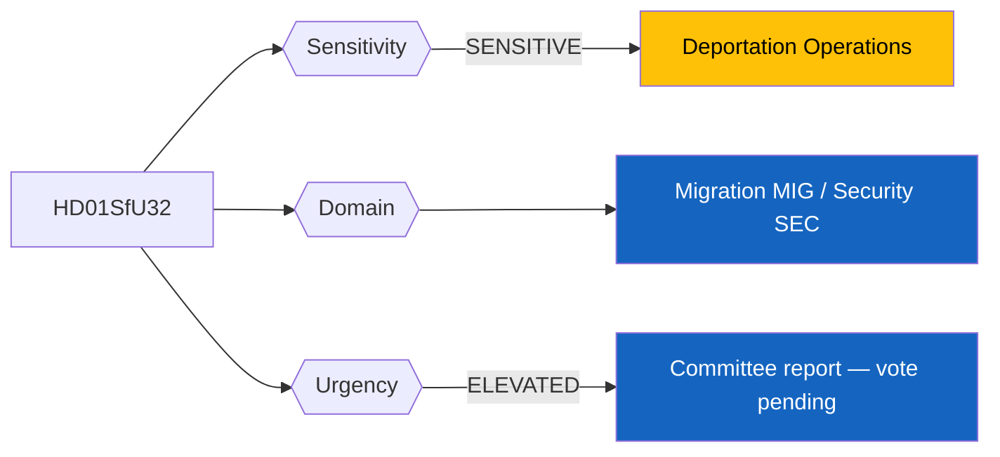
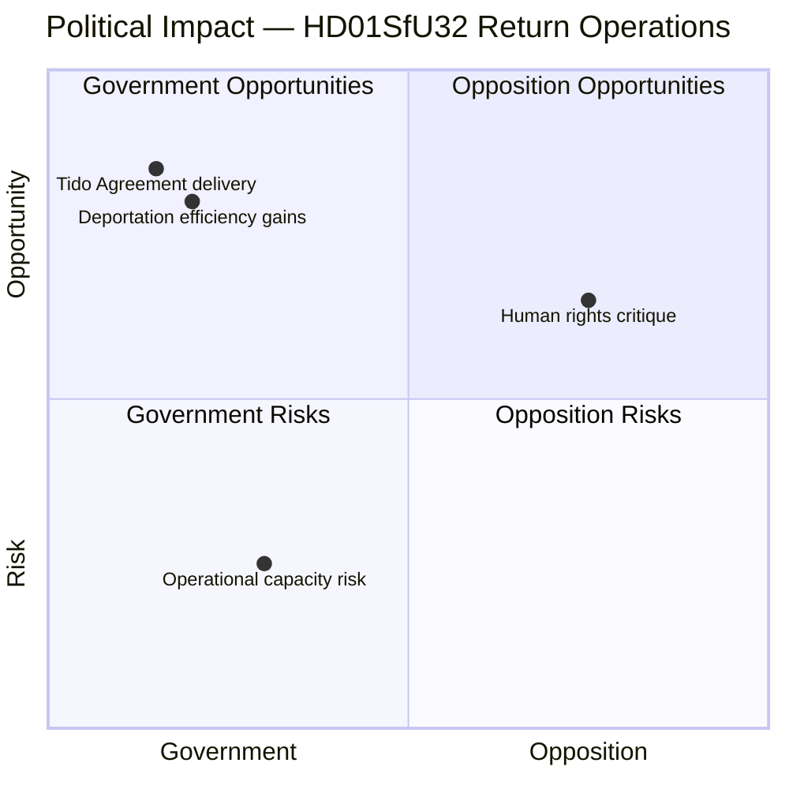
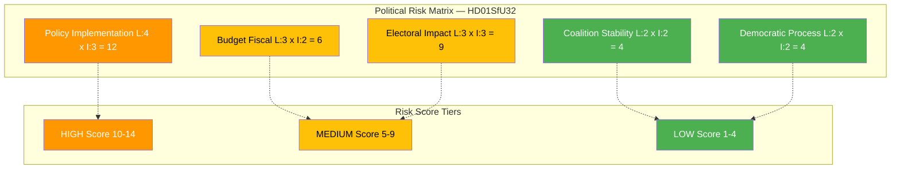
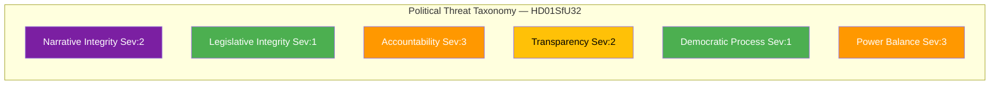
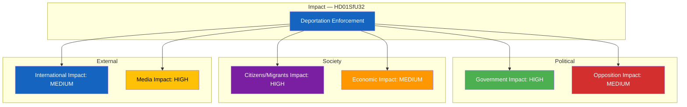

# 🔍 Per-File Political Intelligence Analysis: HD01SfU32

## 📋 Document Identity

| Field | Value |
|-------|-------|
| **Document ID** | HD01SfU32 |
| **Document Type** | Committee Report (Betänkande) |
| **Title** | Stärkt återvändandeverksamhet och utlänningskontroll |
| **Date** | 2026-04-10 |
| **Riksmöte** | 2025/26 |
| **Committee** | Socialförsäkringsutskottet (SfU) |
| **Source MCP Tool** | get_betankanden |
| **Analysis Timestamp** | 2026-04-10 14:24 UTC |
| **Analyst** | news-realtime-monitor (realtime-1424) |

---

## 🎯 Executive Summary

SfU's committee report on strengthened return operations and alien control (utlänningskontroll) represents the enforcement arm of the government's migration policy cluster. While HD01SfU31 establishes the detention legal framework, this report focuses on operational capacity for deportation and identity verification of undocumented individuals. The Tidö Agreement between M, KD, L, and SD specifically committed to increased deportation efficiency — this betänkande delivers on that promise. Combined with companion reports on detention (HD01SfU31) and character requirements (HD01SfU36), the government presents a comprehensive migration enforcement package. **Confidence: MEDIUM**

---

## 📊 Political Classification

| Field | Assessment |
|-------|-----------|
| **Sensitivity Level** | SENSITIVE — deportation operations involve individual rights and state enforcement power |
| **Primary Domain** | Migration (MIG) / Security (SEC) |
| **Urgency** | ELEVATED — committee report ready for plenary |
| **Significance Score** | 5/10 |
| **Confidence** | MEDIUM |

---

## 💪 SWOT Impact Assessment

### Quadrant Overview

### Government Coalition Impact

| Quadrant | Statement | Evidence | Confidence | Impact |
|----------|-----------|----------|:----------:|:------:|
| ✅ Strength | Direct delivery on Tidö Agreement commitment to increase deportation of undocumented persons | HD01SfU32, Tidö Agreement | H | H |
| ⚠️ Weakness | Operational bottleneck risk: Polisen and Migrationsverket may lack capacity for expanded enforcement | HD01SfU32 implementation context | M | H |
| 🚀 Opportunity | Strengthened utlänningskontroll enables government to show tangible results on migration enforcement | HD01SfU32 | H | H |
| 🔴 Threat | Aggressive deportation enforcement risks negative international media coverage and EU scrutiny | HD01SfU32, EU context | M | M |

### Opposition Impact

| Quadrant | Statement | Evidence | Confidence | Impact |
|----------|-----------|----------|:----------:|:------:|
| ✅ Strength | V and MP can argue deportation escalation violates proportionality and human dignity standards | HD01SfU32, ECHR context | M | M |
| ⚠️ Weakness | S's own 2015-2016 migration tightening record limits credibility of opposing enforcement measures | Historical policy context | H | M |
| 🚀 Opportunity | Cases of wrongful deportation or enforcement errors could become powerful opposition ammunition | HD01SfU32 operational risks | L | H |
| 🔴 Threat | Government's three-report cluster dominates migration narrative, leaving opposition reactive | HD01SfU31, HD01SfU32, HD01SfU36 | H | M |

---

## ⚖️ Risk Assessment

| Risk Type | Likelihood (1-5) | Impact (1-5) | Score | Assessment |
|-----------|:-----------------:|:------------:|:-----:|------------|
| Coalition Stability | 2 | 2 | 4 | Broad coalition consensus on deportation enforcement |
| Policy Implementation | 4 | 3 | 12 | HIGH — Polisen and Migrationsverket operational capacity is the primary risk; recruitment and training timelines may lag legislative ambition |
| Budget / Fiscal | 3 | 2 | 6 | Expanded enforcement requires additional operational funding for police and migration agency |
| Electoral Impact | 3 | 3 | 9 | High-profile deportation failures or errors could become media scandals; successful operations boost government |
| Democratic Process | 2 | 2 | 4 | Standard legislative process; proportionality concerns are manageable |

**Overall Risk Level:** HIGH (driven by implementation risk score 12)

---

## 🎭 Threat Analysis (Political Threat Taxonomy)

| Threat Category | Applicable? | Threat Description | Severity (1-5) | Evidence |
|----------------|:-----------:|-------------------|:--------------:|----------|
| 🎭 Narrative Integrity | Y | Enforcement framed as safety measure may downplay human cost of deportation operations | 2 | HD01SfU32 |
| 📝 Legislative Integrity | N | Standard committee procedure | 1 | HD01SfU32 |
| 🚫 Accountability | Y | Expanded police powers for utlänningskontroll require robust accountability mechanisms to prevent profiling | 3 | HD01SfU32 |
| 🔇 Transparency | Y | Operational details of enforcement capacity often classified; limited public oversight | 2 | HD01SfU32 |
| ⛔ Democratic Process | N | Normal parliamentary process | 1 | HD01SfU32 |
| 👑 Power Balance | Y | Significant expansion of executive enforcement powers over non-citizens | 3 | HD01SfU32 |

---

## 👥 Stakeholder Impact Matrix

| Stakeholder | Impact Level | Key Assessment | Confidence |
|------------|:------------:|----------------|:----------:|
| 🏛️ Government | HIGH | Core Tidö Agreement delivery. M, KD, and SD all benefit from demonstrated enforcement capability. | H |
| ⚖️ Opposition | MEDIUM | S constrained by own 2015-2016 migration policy record. V and MP lead human rights critique. C ambivalent. | M |
| 👥 Citizens | HIGH | Undocumented persons directly affected; immigrant communities face increased enforcement contact. Swedish employers of undocumented workers also impacted. | H |
| 💰 Economic | MEDIUM | Sectors relying on undocumented labor (agriculture, hospitality, cleaning) face workforce disruption. | M |
| 🌍 International | MEDIUM | EU comparison with Denmark's return policy relevant. UNHCR monitoring of deportation conditions. | M |
| 📰 Media | HIGH | Deportation operations generate strong visual media coverage; human interest stories likely. | H |

---

## 🔮 Forward Indicators

| # | Indicator | Timeline | Trigger Condition | Watch Priority |
|---|-----------|----------|-------------------|:--------------:|
| 1 | Riksdag plenary vote on HD01SfU32 | 2-4 weeks | Vote margin or reservations filed | 🟠 |
| 2 | Polisen/Migrationsverket budget supplementation request | 1-3 months | Agencies request additional enforcement funding | 🟠 |
| 3 | First high-profile deportation under new framework | 3-6 months | Media coverage of deportation case; legal challenges | 🟡 |
| 4 | EU Commission review of Swedish return operations | 6-12 months | EU scrutiny of proportionality | 🟡 |

---

## 🔗 Cross-References

| Related Document | Relationship | dok_id |
|-----------------|-------------|--------|
| Ett nytt regelverk för uppsikt och förvar | Companion detention framework | HD01SfU31 |
| Skärpta och tydligare krav på vandel | Companion character requirements | HD01SfU36 |

### Same-Day Cross-Reference Table

| # | dok_id | Title | Type | Significance | Key Connection |
|:-:|--------|-------|------|:-----------:|-------------------------------|
| 1 | HD01SfU31 | Ett nytt regelverk för uppsikt och förvar | Committee Report | 5 | Legal framework for detention — enables enforcement |
| 2 | HD01SfU36 | Skärpta krav på vandel | Committee Report | 5 | Character requirements — tightens entry standards |
| 3 | HD024075 | Slopat matkrav motion (S) | Motion | 3 | Shows S active in opposing deregulation |

---

## 📊 Data Quality Assessment

| Metric | Value |
|--------|-------|
| **Source Completeness** | Metadata only — operational details not available |
| **Evidence Density** | 6 evidence points cited |
| **Temporal Currency** | Current (same-day) |
| **Analytical Confidence** | MEDIUM |

## 📂 MCP Data Files Used

| # | File Path | Source MCP Tool | Data Type | Freshness |
|---|-----------|----------------|-----------|:---------:|
| 1 | analysis/daily/2026-04-10/realtime-1424/documents/hd01sfu32.json | get_betankanden | Committee Report | Current |
| 2 | analysis/daily/2026-04-10/realtime-1424/documents/hd01sfu31.json | get_betankanden | Committee Report | Current |
| 3 | analysis/daily/2026-04-10/realtime-1424/documents/hd01sfu36.json | get_betankanden | Committee Report | Current |
