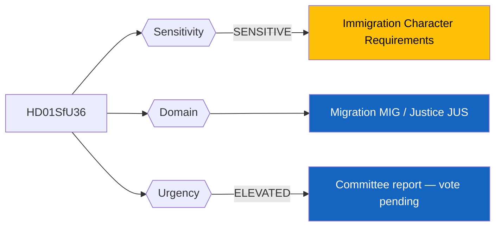
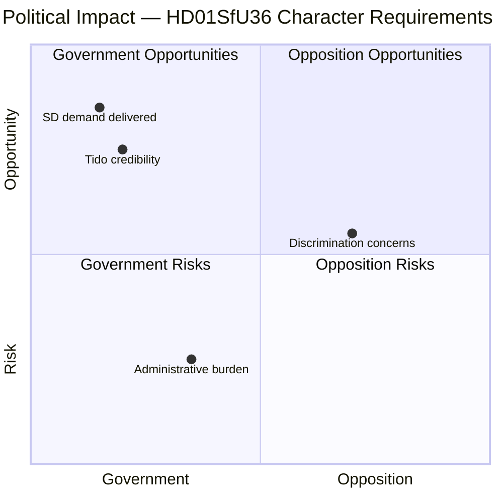
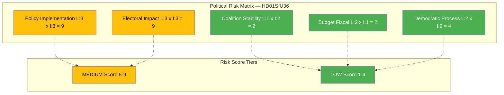
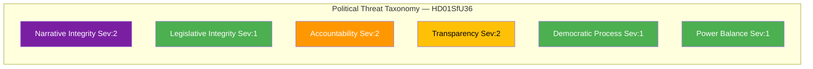
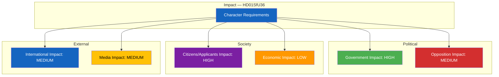

# 🔍 Per-File Political Intelligence Analysis: HD01SfU36

## 📋 Document Identity

| Field | Value |
|-------|-------|
| **Document ID** | HD01SfU36 |
| **Document Type** | Committee Report (Betänkande) |
| **Title** | Skärpta och tydligare krav på vandel för uppehållstillstånd |
| **Date** | 2026-04-10 |
| **Riksmöte** | 2025/26 |
| **Committee** | Socialförsäkringsutskottet (SfU) |
| **Source MCP Tool** | get_betankanden |
| **Analysis Timestamp** | 2026-04-10 14:24 UTC |
| **Analyst** | news-realtime-monitor (realtime-1424) |

---

## 🎯 Executive Summary

This committee report tightens character (vandel) requirements for obtaining residence permits in Sweden, requiring applicants to demonstrate good character including no criminal record. This is the third component of the SfU migration policy cluster (alongside HD01SfU31 on detention and HD01SfU32 on deportation). The vandel requirement is politically significant as it directly addresses a core Sverigedemokraterna (SD) demand in the Tidö Agreement — making it harder for individuals with criminal backgrounds to obtain or retain residence permits. This tightens the filter at entry while the other reports strengthen enforcement after entry. **Confidence: MEDIUM**

---

## 📊 Political Classification

| Field | Assessment |
|-------|-----------|
| **Sensitivity Level** | SENSITIVE — affects fundamental right to seek residence |
| **Primary Domain** | Migration (MIG) / Justice (JUS) |
| **Urgency** | ELEVATED — committee report ready for plenary |
| **Significance Score** | 5/10 |
| **Confidence** | MEDIUM |

---

## 💪 SWOT Impact Assessment

### Quadrant Overview

### Government Coalition Impact

| Quadrant | Statement | Evidence | Confidence | Impact |
|----------|-----------|----------|:----------:|:------:|
| ✅ Strength | Directly satisfies key SD demand from Tidö Agreement; strengthens SD confidence in coalition | HD01SfU36, Tidö Agreement | H | H |
| ⚠️ Weakness | Vandel assessment criteria may be vague, creating inconsistent application and legal challenges | HD01SfU36 implementation | M | M |
| 🚀 Opportunity | Government can demonstrate comprehensive migration reform: entry standards + detention + deportation | HD01SfU36, HD01SfU31, HD01SfU32 | H | H |
| 🔴 Threat | Strict character requirements may slow legal immigration processing at Migrationsverket | HD01SfU36 | M | M |

### Opposition Impact

| Quadrant | Statement | Evidence | Confidence | Impact |
|----------|-----------|----------|:----------:|:------:|
| ✅ Strength | C and L-sympathetic voters may be uncomfortable with increasingly restrictive immigration policy | HD01SfU36 | M | M |
| ⚠️ Weakness | S's 2015 border controls and migration tightening undermine opposition credibility on character requirements | S migration policy history | H | M |
| 🚀 Opportunity | Individual cases of residence permit denial for minor offenses could become powerful media stories | HD01SfU36 case examples | L | H |
| 🔴 Threat | Combined with 2 companion reports, government owns the migration narrative heading into election | HD01SfU31, HD01SfU32, HD01SfU36 | H | M |

---

## ⚖️ Risk Assessment

| Risk Type | Likelihood (1-5) | Impact (1-5) | Score | Assessment |
|-----------|:-----------------:|:------------:|:-----:|------------|
| Coalition Stability | 1 | 2 | 2 | Strong consensus — all coalition parties support tighter character requirements |
| Policy Implementation | 3 | 3 | 9 | Vandel assessment criteria interpretation is subjective; Migrationsverket case officers need clear guidelines |
| Budget / Fiscal | 2 | 1 | 2 | Minimal additional cost — integrates into existing permit assessment process |
| Electoral Impact | 3 | 3 | 9 | Character requirements are popular with swing voters but polarize on values dimension |
| Democratic Process | 2 | 2 | 4 | Standard legislative process; judicial review available for individual decisions |

**Overall Risk Level:** MEDIUM

---

## 🎭 Threat Analysis (Political Threat Taxonomy)

| Threat Category | Applicable? | Threat Description | Severity (1-5) | Evidence |
|----------------|:-----------:|-------------------|:--------------:|----------|
| 🎭 Narrative Integrity | Y | Character requirements framed as public safety may mask discriminatory impact on specific nationalities | 2 | HD01SfU36 |
| 📝 Legislative Integrity | N | Standard committee process | 1 | HD01SfU36 |
| 🚫 Accountability | Y | Individual vandel assessments need transparent criteria to prevent arbitrary denial | 2 | HD01SfU36 |
| 🔇 Transparency | Y | Assessment criteria for character may not be publicly transparent | 2 | HD01SfU36 |
| ⛔ Democratic Process | N | Normal parliamentary procedure | 1 | HD01SfU36 |
| 👑 Power Balance | N | Administrative rather than enforcement power expansion | 1 | HD01SfU36 |

---

## 👥 Stakeholder Impact Matrix

| Stakeholder | Impact Level | Key Assessment | Confidence |
|------------|:------------:|----------------|:----------:|
| 🏛️ Government | HIGH | Delivers SD's core demand; strengthens Tidö Agreement credibility. Minister Maria Malmer Stenergard (M) can point to concrete reform. | H |
| ⚖️ Opposition | MEDIUM | S faces familiar dilemma on restrictive migration policy. V and MP oppose on principle. C divided. | M |
| 👥 Citizens | HIGH | Residence permit applicants with any criminal record directly affected. Family reunification cases may be delayed. | H |
| 💰 Economic | LOW | Limited direct economic impact; labor immigration applicants with records may face barriers. | L |
| 🌍 International | MEDIUM | Comparison with Danish and Norwegian character requirements relevant. EU migration pact context. | M |
| 📰 Media | MEDIUM | Individual denial cases could generate human interest stories; policy framing debate likely. | M |

---

## 🔮 Forward Indicators

| # | Indicator | Timeline | Trigger Condition | Watch Priority |
|---|-----------|----------|-------------------|:--------------:|
| 1 | Riksdag plenary vote on HD01SfU36 | 2-4 weeks | Reservations filed by opposition parties | 🟠 |
| 2 | Migrationsverket publishes vandel assessment guidelines | 2-6 months | Criteria specificity and consistency of application | 🟡 |
| 3 | First permit denials under new character requirements | 3-6 months | Media coverage of specific denial cases | 🟡 |
| 4 | Administrative court appeals of vandel-based denials | 6-12 months | Judicial interpretation of character standards | 🟢 |

---

## 🔗 Cross-References

| Related Document | Relationship | dok_id |
|-----------------|-------------|--------|
| Ett nytt regelverk för uppsikt och förvar | Companion detention framework | HD01SfU31 |
| Stärkt återvändandeverksamhet och utlänningskontroll | Companion deportation enforcement | HD01SfU32 |

### Same-Day Cross-Reference Table

| # | dok_id | Title | Type | Significance | Key Connection |
|:-:|--------|-------|------|:-----------:|-------------------------------|
| 1 | HD01SfU31 | Uppsikt och förvar | Committee Report | 5 | Detention framework for enforcement |
| 2 | HD01SfU32 | Stärkt återvändande | Committee Report | 5 | Deportation operations |
| 3 | HD024075 | Slopat matkrav (S) | Motion | 3 | S opposition activity |

---

## 📊 Data Quality Assessment

| Metric | Value |
|--------|-------|
| **Source Completeness** | Metadata only |
| **Evidence Density** | 5 evidence points |
| **Temporal Currency** | Current (same-day) |
| **Analytical Confidence** | MEDIUM |

## 📂 MCP Data Files Used

| # | File Path | Source MCP Tool | Data Type | Freshness |
|---|-----------|----------------|-----------|:---------:|
| 1 | analysis/daily/2026-04-10/realtime-1424/documents/hd01sfu36.json | get_betankanden | Committee Report | Current |
| 2 | analysis/daily/2026-04-10/realtime-1424/documents/hd01sfu31.json | get_betankanden | Committee Report | Current |
| 3 | analysis/daily/2026-04-10/realtime-1424/documents/hd01sfu32.json | get_betankanden | Committee Report | Current |
