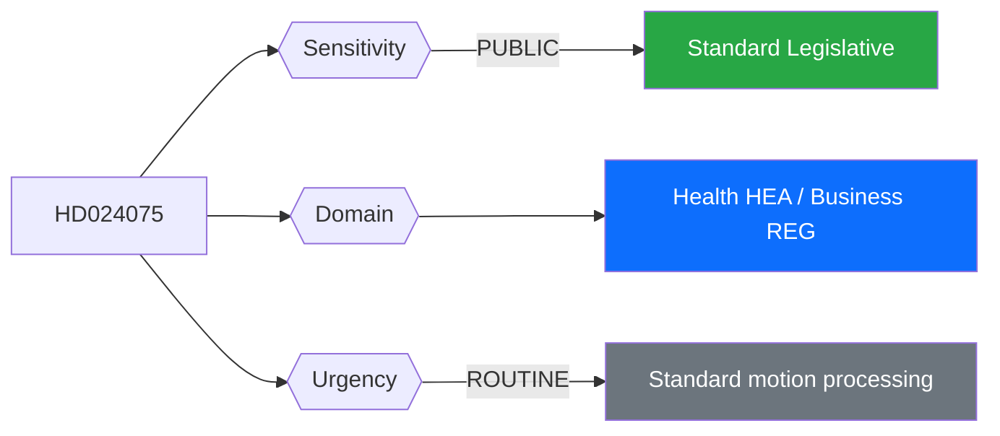
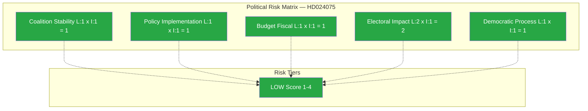

# 🔍 Per-File Political Intelligence Analysis: HD024075

## 📋 Document Identity

| Field | Value |
|-------|-------|
| **Document ID** | HD024075 |
| **Document Type** | Motion |
| **Title** | med anledning av prop. 2025/26:221 Slopat matkrav för serveringstillstånd |
| **Date** | 2026-04-10 |
| **Riksmöte** | 2025/26 |
| **Committee** | Socialutskottet (SoU) |
| **Source MCP Tool** | get_motioner |
| **Analysis Timestamp** | 2026-04-10 14:24 UTC |
| **Analyst** | news-realtime-monitor (realtime-1424) |

---

## 🎯 Executive Summary

Socialdemokraterna (S) led by Fredrik Lundh Sammeli have filed a motion to reject the government's proposition 2025/26:221, which would remove the requirement for restaurants with catering operations to have their own kitchen for serving alcohol. S argues this deregulation could undermine alcohol policy controls. This represents a clear opposition stance on public health policy versus business deregulation — a secondary but politically revealing cleavage between S and the government coalition on the balance between hospitality industry freedom and alcohol harm reduction. **Confidence: HIGH**

---

## 📊 Political Classification

| Field | Assessment |
|-------|-----------|
| **Sensitivity Level** | PUBLIC — standard alcohol regulation policy |
| **Primary Domain** | Health (HEA) / Business Regulation (REG) |
| **Urgency** | ROUTINE — standard motion processing |
| **Significance Score** | 3/10 |
| **Confidence** | HIGH |

---

## 💪 SWOT Impact Assessment

### Government Coalition Impact

| Quadrant | Statement | Evidence | Confidence | Impact |
|----------|-----------|----------|:----------:|:------:|
| ✅ Strength | Government demonstrates pro-business stance with hospitality deregulation | Prop 2025/26:221 | H | L |
| ⚠️ Weakness | Deregulation of alcohol controls may draw criticism from public health advocates and KD's temperance-adjacent base | HD024075, KD voter base | M | L |
| 🚀 Opportunity | Business-friendly reform appeals to small business owners in hospitality sector | Prop 2025/26:221 | M | L |
| 🔴 Threat | S motion frames deregulation as undermining Sweden's traditionally strict alkoholpolitik | HD024075 | M | L |

### Opposition Impact

| Quadrant | Statement | Evidence | Confidence | Impact |
|----------|-----------|----------|:----------:|:------:|
| ✅ Strength | S positions as defender of responsible alcohol policy — appeals to public health constituency | HD024075 (Lundh Sammeli m.fl.) | H | L |
| ⚠️ Weakness | Opposing hospitality deregulation may appear anti-business | HD024075 context | M | L |

---

## ⚖️ Risk Assessment

| Risk Type | Likelihood (1-5) | Impact (1-5) | Score | Assessment |
|-----------|:-----------------:|:------------:|:-----:|------------|
| Coalition Stability | 1 | 1 | 1 | No coalition risk — all government parties support deregulation |
| Policy Implementation | 1 | 1 | 1 | Simple regulatory change — low implementation complexity |
| Budget / Fiscal | 1 | 1 | 1 | No fiscal impact |
| Electoral Impact | 2 | 1 | 2 | Minor issue — unlikely to move voters |
| Democratic Process | 1 | 1 | 1 | Standard legislative process |

**Overall Risk Level:** LOW

---

## 🎭 Threat Analysis (Political Threat Taxonomy)

| Threat Category | Applicable? | Threat Description | Severity (1-5) | Evidence |
|----------------|:-----------:|-------------------|:--------------:|----------|
| 🎭 Narrative Integrity | N | Standard political debate | 1 | HD024075 |
| 📝 Legislative Integrity | N | Normal motion process | 1 | HD024075 |
| 🚫 Accountability | N | No accountability concerns | 1 | HD024075 |
| 🔇 Transparency | N | Full text available | 1 | HD024075 |
| ⛔ Democratic Process | N | Normal procedure | 1 | HD024075 |
| 👑 Power Balance | N | Standard opposition function | 1 | HD024075 |

---

## 👥 Stakeholder Impact Matrix

| Stakeholder | Impact Level | Key Assessment | Confidence |
|------------|:------------:|----------------|:----------:|
| 🏛️ Government | LOW | Minor opposition to deregulation; government has majority to pass | H |
| ⚖️ Opposition | LOW | S stakes position on alcohol policy but limited mobilization potential | H |
| 👥 Citizens | LOW | Catering operations may expand alcohol access in some venues | M |
| 💰 Economic | LOW | Small positive impact for hospitality/catering businesses removing kitchen requirement | H |
| 🌍 International | NONE | Domestic regulatory matter | H |
| 📰 Media | LOW | Minor news value compared to migration cluster | M |

---

## 🔮 Forward Indicators

| # | Indicator | Timeline | Trigger Condition | Watch Priority |
|---|-----------|----------|-------------------|:--------------:|
| 1 | SoU committee vote on motion | 4-8 weeks | S motion likely rejected by committee majority | 🟢 |
| 2 | Riksdag plenary vote on prop 2025/26:221 | 6-10 weeks | Expected government majority approval | 🟢 |

---

## 🔗 Cross-References

| Related Document | Relationship | dok_id |
|-----------------|-------------|--------|
| Prop 2025/26:221 | Parent proposition (government bill) | HD03221 (assumed) |

---

## 📊 Data Quality Assessment

| Metric | Value |
|--------|-------|
| **Source Completeness** | Summary available — motion text with riksdagsbeslut proposal |
| **Evidence Density** | 3 evidence points |
| **Temporal Currency** | Current (same-day) |
| **Analytical Confidence** | HIGH |

## 📂 MCP Data Files Used

| # | File Path | Source MCP Tool | Data Type | Freshness |
|---|-----------|----------------|-----------|:---------:|
| 1 | analysis/daily/2026-04-10/realtime-1424/documents/hd024075.json | get_motioner | Motion | Current |
