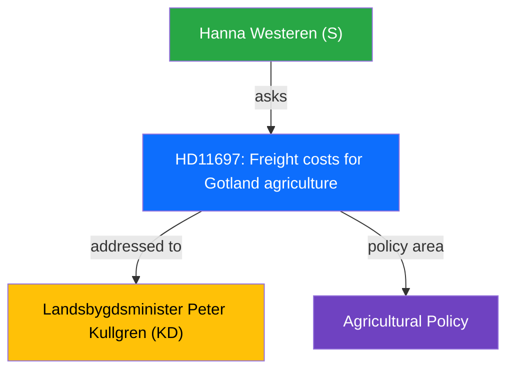

# Political Intelligence Analysis: Fraktkostnader for gotlandskt lantbruk

| Field | Value |
|-------|-------|
| **dok_id** | HD11697 |
| **Document Type** | Written Question (Skriftlig fraga) |
| **Date** | 2026-04-10 |
| **Riksmote** | 2025/26 |
| **Party** | S |
| **Author** | Hanna Westeren (S) |
| **Addressed To** | Landsbygdsminister Peter Kullgren (KD) |
| **Policy Area** | Agricultural Policy |
| **Significance** | 2/10 (LOW) |

> **AI-Driven Analysis** following `analysis/methodologies/ai-driven-analysis-guide.md` v4.2

---

## Executive Summary

S question on structural freight cost disadvantages for Gotland farming versus mainland.

---

## Political Context

The question from Hanna Westeren (S) targets Landsbygdsminister Peter Kullgren (KD) on Freight costs for Gotland agriculture. This is a routine parliamentary oversight question with limited immediate policy impact but contributes to political accountability.

---

## SWOT Analysis

| Quadrant | Assessment |
|----------|-----------|
| **Strengths** | Addresses real structural inequality in Swedish agriculture |
| **Weaknesses** | Regional scope limits national policy significance |
| **Opportunities** | Could catalyze broader island/rural infrastructure investment |
| **Threats** | Risk of being deprioritized vs larger agricultural reforms |

---

## Risk Assessment

| Risk Factor | Likelihood | Impact | Score |
|------------|-----------|--------|-------|
| Gotland agricultural competitiveness erosion | 2 | 2 | 4 |

---

## Stakeholder Impact

| Stakeholder | Impact | Assessment |
|-------------|--------|------------|
| Gotland farmers | Direct | Direct cost burden from freight |
| KD/rural policy | Indirect | Tests rural development commitments |

---

## Evidence Table

| dok_id | Source | Key Finding |
|--------|--------|------------|
| HD11697 | Riksdag written question | Freight costs for Gotland agriculture |

---

## Intelligence Assessment

**Confidence**: MEDIUM - Based on document summary and parliamentary context.
**Methodology**: Template-based analysis per `analysis/templates/per-file-political-intelligence.md` v2.2.
**Limitation**: Full document text not available; analysis based on metadata and summary excerpt.

---

*Analysis generated: 2026-04-10 | Riksdagsmonitor Political Intelligence Unit*
