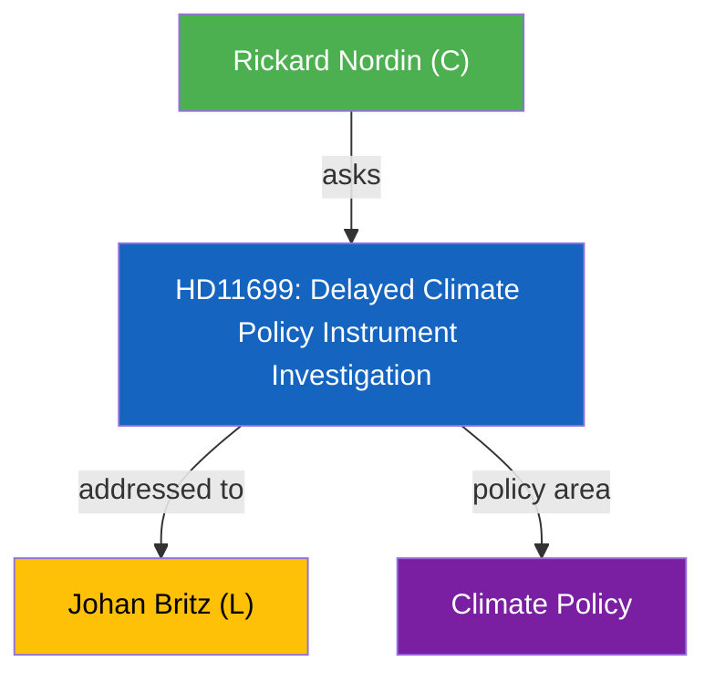

# Political Intelligence Analysis: Styrmedelsutredningens betankande

| Field | Value |
|-------|-------|
| **dok_id** | HD11699 |
| **Document Type** | Written Question (Skriftlig fraga) |
| **Date** | 2026-04-10 |
| **Riksmote** | 2025/26 |
| **Party** | C |
| **Author** | Rickard Nordin (C) |
| **Addressed To** | Johan Britz (L) |
| **Policy Area** | Climate Policy |
| **Significance** | 3/10 (LOW) |

> **AI-Driven Analysis** following `analysis/methodologies/ai-driven-analysis-guide.md` v4.2

---

## Executive Summary

C question on delayed Climate Policy Instrument Investigation. Cross-party pressure with MP (HD11702).

---

## Political Context

The question from Rickard Nordin (C) targets Johan Britz (L) on Delayed Climate Policy Instrument Investigation. This is a routine parliamentary oversight question with limited immediate policy impact but contributes to political accountability.

---

## SWOT Analysis

| Quadrant | Assessment |
|----------|-----------|
| **Strengths** | Connects to broader climate policy accountability |
| **Weaknesses** | Procedural question with limited direct policy impact |
| **Opportunities** | Cross-party climate pressure (C + MP) could accelerate investigation |
| **Threats** | Further delays undermine climate policy credibility |

---

## Risk Assessment

| Risk Factor | Likelihood | Impact | Score |
|------------|-----------|--------|-------|
| Climate target compliance risk from policy gaps | 3 | 3 | 9 |

---

## Stakeholder Impact

| Stakeholder | Impact | Assessment |
|-------------|--------|------------|
| Climate policy actors | Direct | Delayed instruments affect planning |
| Government/L | Indirect | Must explain investigation delays |

---

## Evidence Table

| dok_id | Source | Key Finding |
|--------|--------|------------|
| HD11699 | Riksdag written question | Delayed Climate Policy Instrument Investigation |

---

## Intelligence Assessment

**Confidence**: MEDIUM - Based on document summary and parliamentary context.
**Methodology**: Template-based analysis per `analysis/templates/per-file-political-intelligence.md` v2.2.
**Limitation**: Full document text not available; analysis based on metadata and summary excerpt.

---

*Analysis generated: 2026-04-10 | Riksdagsmonitor Political Intelligence Unit*
