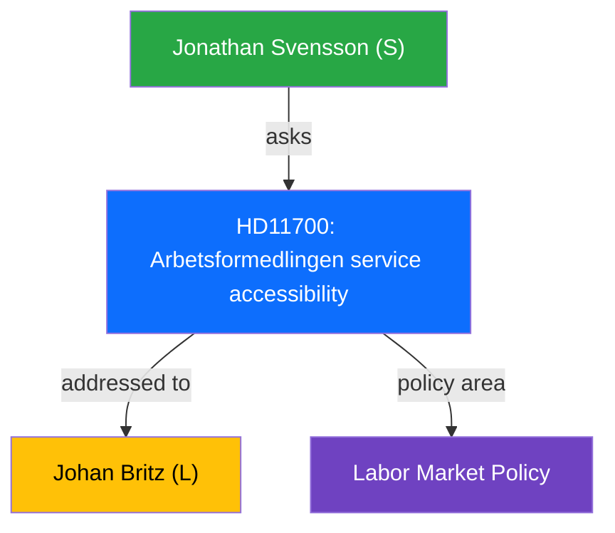

# Political Intelligence Analysis: Arbetsformedlingens tillganglighet

| Field | Value |
|-------|-------|
| **dok_id** | HD11700 |
| **Document Type** | Written Question (Skriftlig fraga) |
| **Date** | 2026-04-10 |
| **Riksmote** | 2025/26 |
| **Party** | S |
| **Author** | Jonathan Svensson (S) |
| **Addressed To** | Johan Britz (L) |
| **Policy Area** | Labor Market Policy |
| **Significance** | 2/10 (LOW) |

> **AI-Driven Analysis** following `analysis/methodologies/ai-driven-analysis-guide.md` v4.2

---

## Executive Summary

S question on Public Employment Service accessibility across service channels and digital divide.

---

## Political Context

The question from Jonathan Svensson (S) targets Johan Britz (L) on Arbetsformedlingen service accessibility. This is a routine parliamentary oversight question with limited immediate policy impact but contributes to political accountability.

---

## SWOT Analysis

| Quadrant | Assessment |
|----------|-----------|
| **Strengths** | Highlights service accessibility concerns for vulnerable groups |
| **Weaknesses** | Routine oversight question with incremental impact |
| **Opportunities** | Could drive improvements in public service accessibility |
| **Threats** | Risk of further digitalization excluding vulnerable populations |

---

## Risk Assessment

| Risk Factor | Likelihood | Impact | Score |
|------------|-----------|--------|-------|
| Service accessibility gap for non-digital job seekers | 2 | 2 | 4 |

---

## Stakeholder Impact

| Stakeholder | Impact | Assessment |
|-------------|--------|------------|
| Job seekers | Direct | Service quality affects outcomes |
| Arbetsformedlingen | Indirect | May face service improvement demands |

---

## Evidence Table

| dok_id | Source | Key Finding |
|--------|--------|------------|
| HD11700 | Riksdag written question | Arbetsformedlingen service accessibility |

---

## Intelligence Assessment

**Confidence**: MEDIUM - Based on document summary and parliamentary context.
**Methodology**: Template-based analysis per `analysis/templates/per-file-political-intelligence.md` v2.2.
**Limitation**: Full document text not available; analysis based on metadata and summary excerpt.

---

*Analysis generated: 2026-04-10 | Riksdagsmonitor Political Intelligence Unit*
