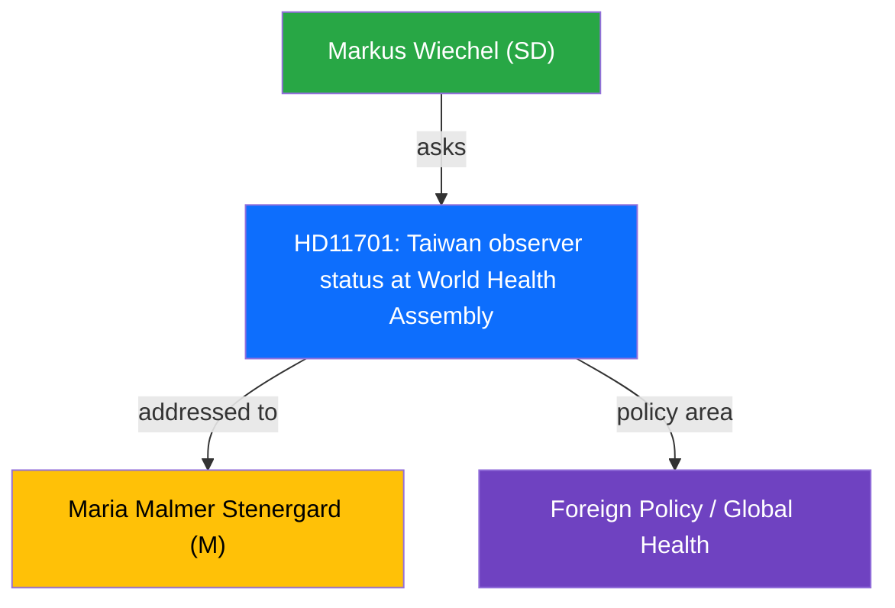

# Political Intelligence Analysis: Taiwans deltagande i WHA

| Field | Value |
|-------|-------|
| **dok_id** | HD11701 |
| **Document Type** | Written Question (Skriftlig fraga) |
| **Date** | 2026-04-10 |
| **Riksmote** | 2025/26 |
| **Party** | SD |
| **Author** | Markus Wiechel (SD) |
| **Addressed To** | Maria Malmer Stenergard (M) |
| **Policy Area** | Foreign Policy / Global Health |
| **Significance** | 2/10 (LOW) |

> **AI-Driven Analysis** following `analysis/methodologies/ai-driven-analysis-guide.md` v4.2

---

## Executive Summary

SD question on supporting Taiwans observer status at WHOs World Health Assembly.

---

## Political Context

The question from Markus Wiechel (SD) targets Maria Malmer Stenergard (M) on Taiwan observer status at World Health Assembly. This is a routine parliamentary oversight question with limited immediate policy impact but contributes to political accountability.

---

## SWOT Analysis

| Quadrant | Assessment |
|----------|-----------|
| **Strengths** | Aligns with democratic values and global health inclusivity |
| **Weaknesses** | Limited Swedish leverage on WHA membership decisions |
| **Opportunities** | Could strengthen Swedens stance on Taiwan in multilateral forums |
| **Threats** | Diplomatic friction with China over Taiwan engagement |

---

## Risk Assessment

| Risk Factor | Likelihood | Impact | Score |
|------------|-----------|--------|-------|
| Diplomatic tension with PRC | 2 | 3 | 6 |

---

## Stakeholder Impact

| Stakeholder | Impact | Assessment |
|-------------|--------|------------|
| Swedish MFA | Direct | Must balance Taiwan support vs China relations |
| WHO/global health | Indirect | Taiwan exclusion creates governance gaps |

---

## Evidence Table

| dok_id | Source | Key Finding |
|--------|--------|------------|
| HD11701 | Riksdag written question | Taiwan observer status at World Health Assembly |

---

## Intelligence Assessment

**Confidence**: MEDIUM - Based on document summary and parliamentary context.
**Methodology**: Template-based analysis per `analysis/templates/per-file-political-intelligence.md` v2.2.
**Limitation**: Full document text not available; analysis based on metadata and summary excerpt.

---

*Analysis generated: 2026-04-10 | Riksdagsmonitor Political Intelligence Unit*
