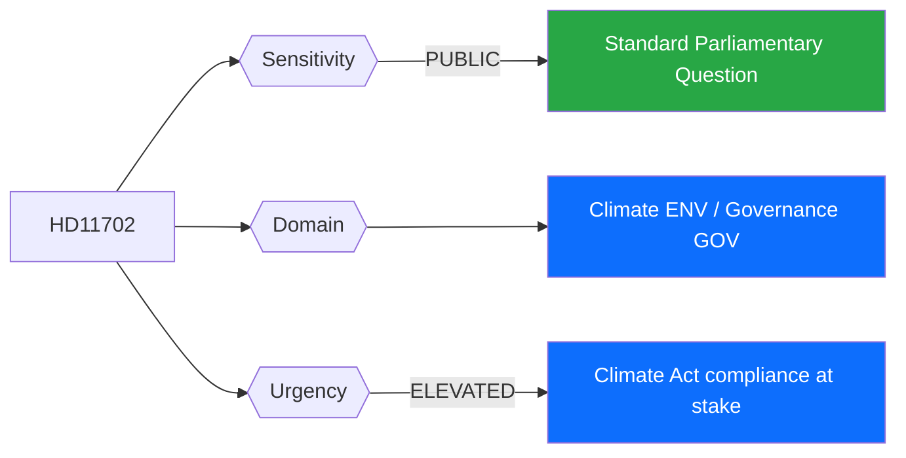
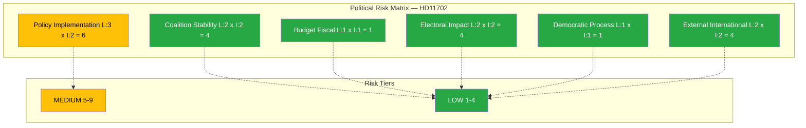

# 🔍 Per-File Political Intelligence Analysis: HD11702

## 📋 Document Identity

| Field | Value |
|-------|-------|
| **Document ID** | HD11702 |
| **Document Type** | Written Question (Skriftlig fråga) |
| **Title** | Uppskjuten styrmedelsutredning |
| **Date** | 2026-04-10 |
| **Riksmöte** | 2025/26 |
| **Party** | Miljöpartiet (MP) |
| **Author** | Katarina Luhr (MP) |
| **Source MCP Tool** | get_fragor |
| **Analysis Timestamp** | 2026-04-10 14:24 UTC |
| **Analyst** | news-realtime-monitor (realtime-1424) |

---

## 🎯 Executive Summary

MP's Katarina Luhr questions Arbetsmarknadsminister and acting climate minister Johan Britz (L) about the postponed climate policy instrument investigation (styrmedelsutredning). Under Sweden's Climate Act (klimatlagen), every government must present a climate action plan (klimathandlingsplan) during its mandate period. The postponed investigation suggests the government is deprioritizing climate policy instruments — a politically sensitive accusation given Sweden's international climate commitments and the growing domestic climate debate ahead of 2026 elections. This question targets the L minister specifically, highlighting intra-coalition tension on climate between L's green ambitions and SD's skepticism. **Confidence: HIGH**

---

## 📊 Political Classification

| Field | Assessment |
|-------|-----------|
| **Sensitivity Level** | PUBLIC |
| **Primary Domain** | Climate/Environment (ENV) |
| **Urgency** | ELEVATED — Climate Act compliance timeline |
| **Significance Score** | 4/10 |
| **Confidence** | HIGH |

---

## 💪 SWOT Impact Assessment

### Government Coalition Impact

| Quadrant | Statement | Evidence | Confidence | Impact |
|----------|-----------|----------|:----------:|:------:|
| ✅ Strength | Government can argue comprehensive review takes time; no immediate policy failure | HD11702, Climate Act context | M | L |
| ⚠️ Weakness | Postponing climate investigation exposes coalition tension between L's climate profile and SD's skepticism | HD11702, Luhr to Britz (L) | H | M |
| 🚀 Opportunity | Britz (L) can use response to demonstrate L's continued climate commitment within coalition | HD11702 | M | L |
| 🔴 Threat | If styrmedelsutredning is further delayed, government risks Climate Act non-compliance and international criticism | HD11702, klimatlagen | M | M |

### Opposition Impact

| Quadrant | Statement | Evidence | Confidence | Impact |
|----------|-----------|----------|:----------:|:------:|
| ✅ Strength | MP positions as climate watchdog; Luhr's question highlights government climate policy gaps | HD11702 (Luhr, MP) | H | M |
| ⚠️ Weakness | MP's low poll numbers limit political impact of climate questioning | Polling context | M | L |
| 🚀 Opportunity | Climate becomes election issue if government fails to deliver klimathandlingsplan | HD11702, Climate Act | M | H |
| 🔴 Threat | If government produces satisfactory plan, MP loses this critique angle | HD11702 | M | M |

---

## ⚖️ Risk Assessment

| Risk Type | Likelihood (1-5) | Impact (1-5) | Score | Assessment |
|-----------|:-----------------:|:------------:|:-----:|------------|
| Coalition Stability | 2 | 2 | 4 | L-SD tension on climate is ongoing but manageable |
| Policy Implementation | 3 | 2 | 6 | Climate Act compliance requires action; delay creates legal and political risk |
| Budget / Fiscal | 1 | 1 | 1 | No direct fiscal impact from question |
| Electoral Impact | 2 | 2 | 4 | Climate voters increasingly relevant but not decisive in current polling |
| Democratic Process | 1 | 1 | 1 | Standard parliamentary oversight |
| External / International | 2 | 2 | 4 | EU climate targets and Paris Agreement commitments create external pressure |

**Overall Risk Level:** LOW-MEDIUM

---

## 🎭 Threat Analysis (Political Threat Taxonomy)

| Threat Category | Applicable? | Threat Description | Severity (1-5) | Evidence |
|----------------|:-----------:|-------------------|:--------------:|----------|
| 🎭 Narrative Integrity | N | Standard parliamentary questioning | 1 | HD11702 |
| 📝 Legislative Integrity | N | Normal oversight | 1 | HD11702 |
| 🚫 Accountability | Y | Question holds government accountable for Climate Act compliance | 2 | HD11702 |
| 🔇 Transparency | Y | Delayed investigation reduces policy transparency on climate instruments | 2 | HD11702 |
| ⛔ Democratic Process | N | Normal procedure | 1 | HD11702 |
| 👑 Power Balance | N | Standard opposition function | 1 | HD11702 |

---

## 👥 Stakeholder Impact Matrix

| Stakeholder | Impact Level | Key Assessment | Confidence |
|------------|:------------:|----------------|:----------:|
| 🏛️ Government | MEDIUM | Britz (L) must respond to climate policy delay criticism; coalition climate credibility at stake | H |
| ⚖️ Opposition | LOW | MP maintains climate watchdog role; limited immediate impact | M |
| 👥 Citizens | LOW | No immediate citizen impact; long-term climate policy implications | M |
| 💰 Economic | LOW | Climate instruments could affect energy sector, industry — but investigation postponed | L |
| 🌍 International | LOW | EU Green Deal and Paris Agreement create context pressure | M |
| 📰 Media | LOW | Single written question has limited news value compared to migration cluster | M |

---

## 🔮 Forward Indicators

| # | Indicator | Timeline | Trigger Condition | Watch Priority |
|---|-----------|----------|-------------------|:--------------:|
| 1 | Britz (L) response to HD11702 | 1-2 weeks | Quality and specificity of timeline commitment | 🟡 |
| 2 | Government klimathandlingsplan publication | 3-12 months | Climate Act deadline compliance | 🟠 |
| 3 | Additional climate interpellations from MP, S, or V | 2-8 weeks | Escalation from written question to interpellation | 🟢 |

---

## 🔗 Cross-References

| Related Document | Relationship | dok_id |
|-----------------|-------------|--------|
| Överlämnande av Styrmedelsutredningens betänkande | Related written question on same topic | HD11699 |

### Same-Day Cross-Reference Table

| # | dok_id | Title | Type | Significance | Key Connection |
|:-:|--------|-------|------|:-----------:|-------------------------------|
| 1 | HD11699 | Styrmedelsutredningens betänkande | Written Question | 3 | Same climate policy instrument topic |
| 2 | HD01SfU31 | Uppsikt och förvar | Committee Report | 5 | Different policy; same day |

---

## 📊 Data Quality Assessment

| Metric | Value |
|--------|-------|
| **Source Completeness** | Summary available — question text with named minister |
| **Evidence Density** | 4 evidence points |
| **Temporal Currency** | Current (same-day) |
| **Analytical Confidence** | HIGH |

## 📂 MCP Data Files Used

| # | File Path | Source MCP Tool | Data Type | Freshness |
|---|-----------|----------------|-----------|:---------:|
| 1 | analysis/daily/2026-04-10/realtime-1424/documents/hd11702.json | get_fragor | Written Question | Current |
| 2 | analysis/daily/2026-04-10/realtime-1424/documents/hd11699.json | get_fragor | Written Question | Current |
