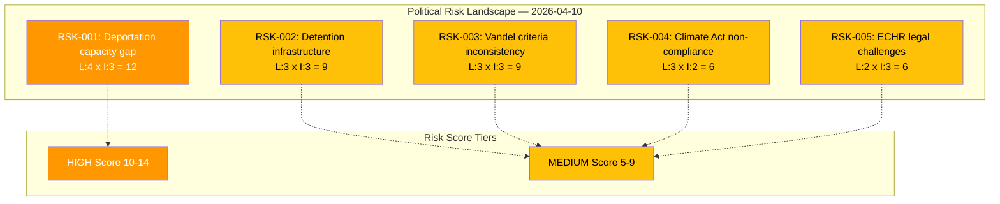
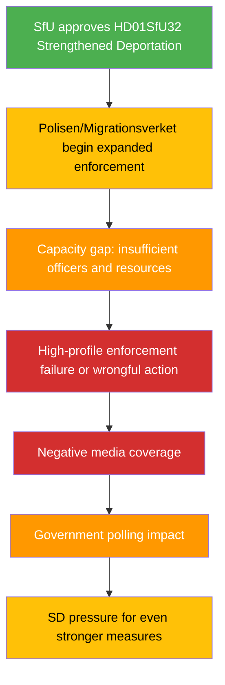

# ⚠️ Political Risk Assessment — 2026-04-10 Realtime-1424

## 📋 Risk Context

| Field | Value |
|-------|-------|
| **Risk Assessment ID** | RSK-2026-04-10-1424 |
| **Assessment Date** | 2026-04-10 14:24 UTC |
| **Assessment Period** | 2026-04-10 |
| **Produced By** | news-realtime-monitor (realtime-1424) |
| **Political Context** | Kristersson government (M+KD+L, SD support) in third year. Migration enforcement is core Tidö Agreement priority. Three SfU committee reports advance migration policy cluster. |
| **Riksmöte** | 2025/26 |
| **Overall Risk Level** | MEDIUM |

---

## 🗂️ Risk Inventory

### Risk Heat Map

### Risk Register

| Risk ID | Description | L (1-5) | I (1-5) | Score | Tier | Evidence | Mitigation |
|---------|-------------|:-------:|:-------:|:-----:|:----:|----------|------------|
| RSK-001 | Polisen and Migrationsverket lack operational capacity for expanded deportation (HD01SfU32) | 4 | 3 | 12 | HIGH | HD01SfU32, enforcement capacity context | Additional budget allocation, recruitment |
| RSK-002 | Detention facility infrastructure insufficient for new regulatory framework (HD01SfU31) | 3 | 3 | 9 | MEDIUM | HD01SfU31, Migrationsverket capacity | Phased implementation, facility expansion |
| RSK-003 | Vandel assessment criteria subjective, leading to inconsistent application (HD01SfU36) | 3 | 3 | 9 | MEDIUM | HD01SfU36, implementation context | Detailed Migrationsverket guidelines |
| RSK-004 | Government delays climate policy instrument investigation, risking Climate Act non-compliance (HD11702) | 3 | 2 | 6 | MEDIUM | HD11702, klimatlagen | Publish klimathandlingsplan on schedule |
| RSK-005 | New detention and deportation rules challenged under ECHR (HD01SfU31, HD01SfU32) | 2 | 3 | 6 | MEDIUM | HD01SfU31, HD01SfU32, ECHR context | Proportionality review, judicial oversight |

### Cascading Risk Chain — RSK-001

---

## 🔮 Risk Outlook

| # | Forecast Risk | Timeline | Trigger | Priority |
|---|--------------|----------|---------|:--------:|
| 1 | Enforcement capacity gap exposed | 3-6 months post-implementation | Migrationsverket reports resource constraints | 🟠 |
| 2 | ECHR litigation on detention rules | 6-18 months | First formal ECHR complaint filed | 🟡 |
| 3 | Climate Act compliance deadline pressure | 6-12 months | Opposition interpellations escalate | 🟡 |

---

**Document Control:**
- **Template:** analysis/templates/risk-assessment.md v2.2
- **Methodology:** analysis/methodologies/political-risk-methodology.md
