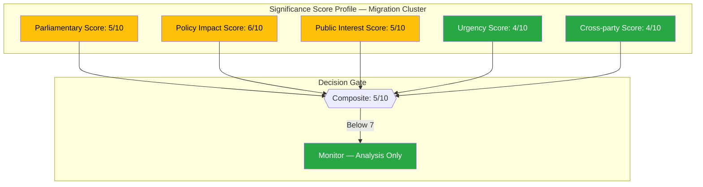

# 📈 Political Significance Scoring — 2026-04-10 Realtime-1424

## 📋 Event Context

| Field | Value |
|-------|-------|
| **Score ID** | SIG-2026-04-10-1424 |
| **Event / Document** | SfU Migration Policy Cluster + Opposition Activity |
| **Primary dok_id** | HD01SfU31, HD01SfU32, HD01SfU36 |
| **Scoring Date** | 2026-04-10 14:24 UTC |
| **Scored By** | news-realtime-monitor (realtime-1424) |

---

## 📊 Individual Event Scoring

### Scoring Profile

### Document Scores

| dok_id | Title | Parliamentary | Policy | Public | Urgency | Cross-party | Composite | Tier |
|--------|-------|:------------:|:------:|:------:|:-------:|:-----------:|:---------:|:----:|
| HD01SfU31 | Uppsikt och förvar | 5 | 6 | 5 | 5 | 4 | 5/10 | Monitor |
| HD01SfU32 | Stärkt återvändande | 5 | 6 | 5 | 5 | 4 | 5/10 | Monitor |
| HD01SfU36 | Skärpta vandel | 5 | 6 | 5 | 5 | 4 | 5/10 | Monitor |
| HD11702 | Styrmedelsutredning | 3 | 4 | 4 | 4 | 3 | 4/10 | Monitor |
| HD024075 | Slopat matkrav (S) | 3 | 2 | 2 | 2 | 3 | 3/10 | Archive |
| HD11696-11701 | Written questions | 2 | 2 | 2 | 2 | 2 | 2/10 | Archive |

### Cluster Bonus Assessment

The three SfU migration reports constitute a policy cluster. While each individually scores 5/10, the cluster effect adds significance:

| Metric | Individual | Cluster |
|--------|:---------:|:-------:|
| Political Temperature | 5 | 6 |
| Narrative coherence | Medium | High |
| Editorial interest | Monitor | Monitor+ |
| Article recommendation | No | Analysis-Only PR |

**Cluster composite score: 6/10** — below HIGH threshold (7) but above routine archive. Recommend analysis-only PR.

---

**Document Control:**
- **Template:** analysis/templates/significance-scoring.md v2.2
