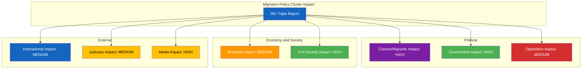

# 👥 Stakeholder Impact Assessment — 2026-04-10 Realtime-1424

## 📋 Assessment Context

| Field | Value |
|-------|-------|
| **Assessment ID** | STA-2026-04-10-1424 |
| **Assessment Date** | 2026-04-10 14:24 UTC |
| **Policy/Event Subject** | SfU Migration Enforcement Cluster (3 committee reports) |
| **Primary dok_id** | HD01SfU31, HD01SfU32, HD01SfU36 |
| **Stage of Process** | Committee reports approved — awaiting Riksdag plenary vote |
| **Produced By** | news-realtime-monitor (realtime-1424) |
| **Overall Impact Level** | HIGH |

---

## 👥 Stakeholder Group Assessments

### Stakeholder Impact Overview

### Detailed Assessments

| Group | Impact | Assessment | Evidence | Confidence |
|-------|:------:|-----------|----------|:----------:|
| 👥 Citizens | HIGH | Foreign nationals face expanded detention, stricter character requirements, and stronger deportation. Immigrant communities experience increased enforcement contact. Swedish citizens with immigrant family members indirectly affected. | HD01SfU31, HD01SfU32, HD01SfU36 | H |
| 🏛️ Government | HIGH | Coalition demonstrates Tidö Agreement delivery. M, KD benefit from migration enforcement narrative. L exposed on climate (HD11702) but benefits from migration unity. SD's core demands met. PM Kristersson can claim legislative productivity. | HD01SfU31-36 cluster | H |
| ⚖️ Opposition | MEDIUM | S constrained by own 2015-2016 restrictive migration record. V and MP lead human rights critique but have limited parliamentary leverage. C torn between liberal values and tough-on-migration sentiment. | HD01SfU31-36, HD024075 | M |
| 💰 Business/Industry | MEDIUM | Sectors relying on immigrant labor (agriculture, hospitality, cleaning) face indirect workforce effects from tighter entry requirements. Hospitality also affected by alcohol deregulation debate (HD024075). | HD01SfU36, HD024075 | M |
| 🏘️ Civil Society | HIGH | Migration law NGOs (Asylrättscentrum, Amnesty Sweden, FARR) will mobilize against expanded detention and deportation. Expected advocacy campaigns and legal challenges. | HD01SfU31, HD01SfU32 | H |
| 🌍 International/EU | MEDIUM | EU Returns Directive and Pact on Migration compliance relevant. UNHCR monitoring. Nordic comparison with Denmark and Norway. Council of Europe may scrutinize detention conditions. | HD01SfU31, HD01SfU32, EU context | M |
| ⚖️ Judiciary | MEDIUM | Administrative courts will process increased detention and vandel appeal cases. JO (Parliamentary Ombudsman) may investigate detention conditions. | HD01SfU31, HD01SfU36 | M |
| 📰 Media | HIGH | Three SfU reports on same day is highly newsworthy. Human interest stories from detention/deportation cases likely. Government frames as security; opposition frames as rights. | HD01SfU31-36 cluster | H |

---

**Document Control:**
- **Template:** analysis/templates/stakeholder-impact.md v2.2
