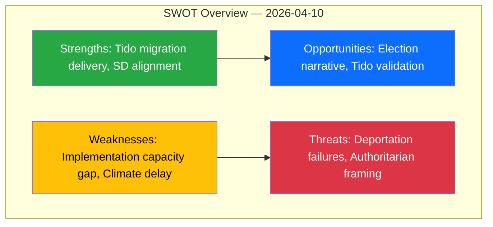
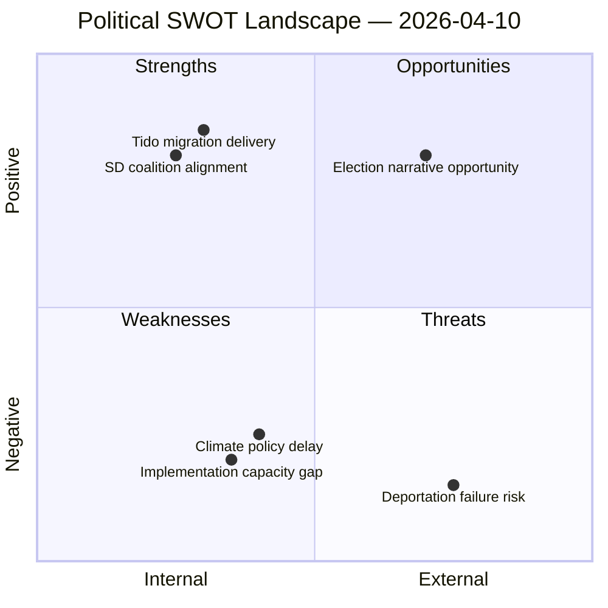

# 💼 Political SWOT Analysis — 2026-04-10 Realtime-1424

## 📋 SWOT Context

| Field | Value |
|-------|-------|
| **SWOT ID** | SWT-2026-04-10-1424 |
| **Analysis Date** | 2026-04-10 14:24 UTC |
| **Analysis Scope** | Government coalition migration policy cluster + opposition responses |
| **Reference Period** | 2026-04-10 |
| **Produced By** | news-realtime-monitor (realtime-1424) |
| **Primary MCP Sources** | get_betankanden, get_motioner, get_fragor |
| **Validity Window** | Valid until 2026-04-24 |
| **Temporal Window** | 2026-04-10 |

---

## 🏛️ Section 1: Government Coalition SWOT

### ✅ Strengths — Government Coalition

| # | Strength Statement | Evidence (dok_id) | Confidence | Impact | Entry Date |
|---|-------------------|-------------------|:----------:|:------:|:----------:|
| S1 | Coordinated delivery of three SfU migration reports demonstrates Tidö Agreement execution capability | HD01SfU31, HD01SfU32, HD01SfU36 | H | H | 2026-04-10 |
| S2 | SD support secured across all three migration enforcement measures — coalition alignment on core issue | HD01SfU31, HD01SfU32, HD01SfU36 (SfU approved) | H | H | 2026-04-10 |
| S3 | Migration policy covers full enforcement chain: entry standards, detention, deportation | HD01SfU36, HD01SfU31, HD01SfU32 | H | M | 2026-04-10 |

**Coalition Strength Summary:** Government demonstrates strong coordination and SD alignment on migration — its signature issue. Three simultaneous committee reports create a narrative of decisive action.

---

### ⚠️ Weaknesses — Government Coalition

| # | Weakness Statement | Evidence (dok_id) | Confidence | Impact | Entry Date |
|---|-------------------|-------------------|:----------:|:------:|:----------:|
| W1 | Deportation enforcement capacity risk — Polisen and Migrationsverket may lack resources for expanded operations (L:4 x I:3 = 12) | HD01SfU32, RSK-001 | M | H | 2026-04-10 |
| W2 | Climate policy delay exposes L's compromised environmental profile within coalition | HD11702, Luhr to Britz (L) | H | M | 2026-04-10 |
| W3 | Detention framework may face ECHR legal challenges on proportionality | HD01SfU31, ECHR Art. 5 | M | M | 2026-04-10 |

**Coalition Weakness Summary:** Implementation capacity is the Achilles' heel — legislative ambition outpaces operational readiness, especially for deportation.

---

### 🚀 Opportunities — Government Coalition

| # | Opportunity Statement | Evidence (dok_id) | Confidence | Impact | Entry Date |
|---|----------------------|-------------------|:----------:|:------:|:----------:|
| O1 | Migration cluster provides strong election narrative: government delivers where S failed | HD01SfU31, HD01SfU32, HD01SfU36 | H | H | 2026-04-10 |
| O2 | Successful implementation would validate Tidö Agreement model for future policy areas | HD01SfU32 | M | M | 2026-04-10 |

---

### 🔴 Threats — Government Coalition

| # | Threat Statement | Evidence (dok_id) | Confidence | Impact | Entry Date |
|---|-----------------|-------------------|:----------:|:------:|:----------:|
| T1 | High-profile deportation failures or wrongful detentions could become media scandals | HD01SfU32, RSK-001 cascading | M | H | 2026-04-10 |
| T2 | Opposition frames migration cluster as authoritarian overreach — potential voter concern among liberal-conservative segment | HD01SfU31, HD01SfU32, HD01SfU36 | L | M | 2026-04-10 |

---

## ⚖️ Section 2: Opposition SWOT

### ✅ Strengths — Opposition

| # | Strength Statement | Evidence (dok_id) | Confidence | Impact | Entry Date |
|---|-------------------|-------------------|:----------:|:------:|:----------:|
| S1 | MP maintains active climate oversight role (Luhr questioning Britz on Climate Act) | HD11702 | H | M | 2026-04-10 |
| S2 | V and MP can mobilize human rights narrative against migration enforcement expansion | HD01SfU31, HD01SfU32 | M | M | 2026-04-10 |

### ⚠️ Weaknesses — Opposition

| # | Weakness Statement | Evidence (dok_id) | Confidence | Impact | Entry Date |
|---|-------------------|-------------------|:----------:|:------:|:----------:|
| W1 | S's own 2015-2016 migration tightening record limits credibility when opposing enforcement | Historical policy context | H | H | 2026-04-10 |
| W2 | Opposition reactive to government's agenda-setting with three simultaneous reports | HD01SfU31, HD01SfU32, HD01SfU36 | H | M | 2026-04-10 |

---

## 🔄 SWOT Quadrant Mapping

---

## 🎯 TOWS Strategic Options

| Strategy | Description | Derived From |
|----------|-------------|--------------|
| **SO: Leverage migration cluster for election positioning** | Government should frame three SfU reports as proof of Tidö Agreement delivery in 2026 campaign | S1+S2 x O1 |
| **WT: Opposition targets implementation gap** | S/V should focus on Migrationsverket capacity rather than opposing policy in principle | W1(opp) x T1(gov) |

---

**Document Control:**
- **Template:** analysis/templates/swot-analysis.md v2.2
- **Methodology:** analysis/methodologies/political-swot-framework.md
