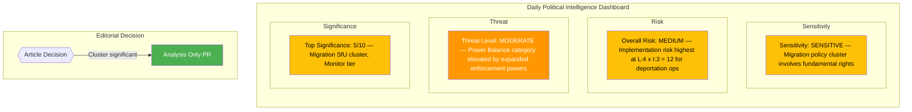
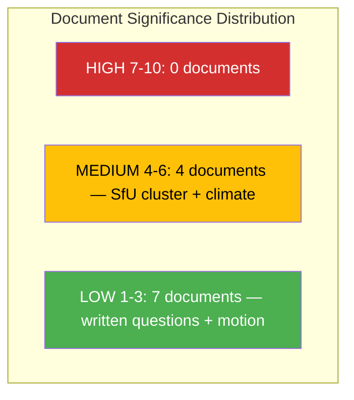

# 🧩 Political Intelligence Synthesis — 2026-04-10 Realtime-1424

## 📋 Synthesis Context

| Field | Value |
|-------|-------|
| **Synthesis ID** | SYN-2026-04-10-1424 |
| **Analysis Date** | 2026-04-10 14:24 UTC |
| **Documents Analyzed** | 11 (5 new, 6 previously covered written questions) |
| **Analysis Period** | 2026-04-10 00:00-14:24 UTC |
| **Produced By** | news-realtime-monitor (realtime-1424) |
| **Overall Confidence** | MEDIUM |

---

## 📊 Intelligence Dashboard

### Daily Political Landscape

---

## 🔑 Key Findings

### Finding 1: Migration Enforcement Policy Cluster (SfU Triple Report)

Three SfU committee reports published on the same day form a coordinated migration enforcement package:

| Component | dok_id | Focus | Significance |
|-----------|--------|-------|:-----------:|
| Detention Framework | HD01SfU31 | New rules for supervision and detention of foreign nationals | 5/10 |
| Deportation Enforcement | HD01SfU32 | Strengthened return operations and alien control | 5/10 |
| Character Requirements | HD01SfU36 | Stricter vandel requirements for residence permits | 5/10 |

**Pattern**: This cluster represents a deliberate government strategy to advance multiple migration enforcement measures simultaneously through SfU, demonstrating coordinated Tidö Agreement delivery by M, KD, L, and SD. The three reports cover the full enforcement chain: entry standards (HD01SfU36), detention during process (HD01SfU31), and deportation execution (HD01SfU32).

### Finding 2: Opposition S Active on Deregulation Front

S filed motion HD024075 opposing government proposition 2025/26:221 on removing food requirements for catering alcohol permits. While low-significance individually, this shows S maintaining an active opposition stance across policy areas.

### Finding 3: Climate Policy Accountability Pressure

MP's Katarina Luhr (HD11702) targets acting climate minister Johan Britz (L) on delayed climate policy instrument investigation, exposing L-SD tension within the coalition on environmental policy. Related to HD11699 on the same topic.

---

## 📈 Aggregate Significance

| Tier | Count | Documents |
|------|:-----:|-----------|
| HIGH (7-10) | 0 | — |
| MEDIUM (4-6) | 4 | HD01SfU31 (5), HD01SfU32 (5), HD01SfU36 (5), HD11702 (4) |
| LOW (1-3) | 7 | HD024075 (3), HD11696-HD11701 (1-2 each) |

---

## 🔗 Cross-Document Patterns

The dominant pattern is the **SfU migration cluster** — three committee reports from the same committee on the same day, covering complementary aspects of migration enforcement. This is not coincidental; it reflects deliberate committee scheduling to present a comprehensive reform package.

**Secondary pattern**: MP climate questioning (HD11702 + HD11699) represents ongoing opposition pressure on government climate policy delivery, targeting the L minister specifically to exploit intra-coalition tensions.

---

## 🔮 Forward Outlook

| # | Forecast | Timeline | Probability | Watch Priority |
|---|----------|----------|:-----------:|:--------------:|
| 1 | SfU migration cluster proceeds to Riksdag plenary vote | 2-4 weeks | High | 🟠 |
| 2 | Opposition files reservations on all three SfU reports | 1-2 weeks | High | 🟡 |
| 3 | Migrationsverket capacity assessment for new enforcement powers | 1-3 months | Medium | 🟡 |
| 4 | Britz (L) responds to climate policy delay question | 1-2 weeks | High | 🟢 |

---

## 📊 Editorial Decision

**Recommendation: ANALYSIS-ONLY PR** — No individual document reaches HIGH threshold (>=7). The migration cluster is collectively significant but each individual report scores 5/10 (MEDIUM). Analysis artifacts contain valuable intelligence for future reference. Commit analysis and data.

---

**Document Control:**
- **Template:** analysis/templates/synthesis-summary.md v2.2
- **Methodology:** analysis/methodologies/ai-driven-analysis-guide.md v4.2
