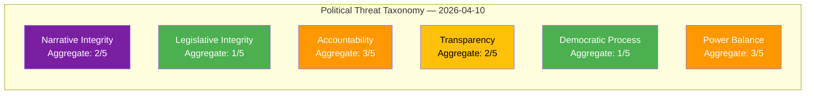
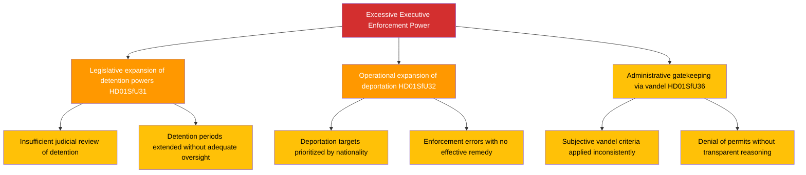

# 🎭 Political Threat Analysis — 2026-04-10 Realtime-1424

## 📋 Threat Analysis Context

| Field | Value |
|-------|-------|
| **Threat Analysis ID** | THR-2026-04-10-1424 |
| **Analysis Date** | 2026-04-10 14:24 UTC |
| **Analysis Period** | 2026-04-10 |
| **Produced By** | news-realtime-monitor (realtime-1424) |
| **Political Context** | Kristersson government advances migration enforcement cluster through SfU. Three committee reports expand state powers over non-citizens. |
| **Overall Threat Level** | MODERATE |

---

## 🏷️ Political Threat Taxonomy Assessment

### Political Threat Landscape

### Threat Register

| # | Category | Threat | Severity | Evidence | Actor |
|---|----------|--------|:--------:|----------|-------|
| THR-001 | 👑 Power Balance | Migration enforcement cluster expands executive powers over non-citizens (detention + deportation + character requirements) | 3 | HD01SfU31, HD01SfU32, HD01SfU36 | Government coalition |
| THR-002 | 🚫 Accountability | Expanded deportation operations require accountability mechanisms to prevent profiling and errors | 3 | HD01SfU32 | Polisen, Migrationsverket |
| THR-003 | 🔇 Transparency | Vandel assessment criteria may lack public transparency; detention oversight unclear | 2 | HD01SfU36, HD01SfU31 | Migrationsverket |
| THR-004 | 🎭 Narrative Integrity | Migration enforcement framed as modernization may obscure impact on fundamental rights | 2 | HD01SfU31, HD01SfU32 | Government communications |

### Attack Tree — Primary Threat (THR-001: Power Balance)

---

## 🔮 Threat Forward Indicators

| # | Signal | Source | Timeline | Escalation Trigger |
|---|--------|--------|----------|-------------------|
| 1 | Detention conditions complaints | JO (Parliamentary Ombudsman) | 6-12 months | JO investigation initiated |
| 2 | Deportation judicial challenges | Administrative courts | 3-6 months | Pattern of successful appeals |
| 3 | ECHR complaint on detention | ECHR | 12-24 months | Formal complaint filed |

---

**Document Control:**
- **Template:** analysis/templates/threat-analysis.md v3.2
- **Methodology:** analysis/methodologies/political-threat-framework.md
