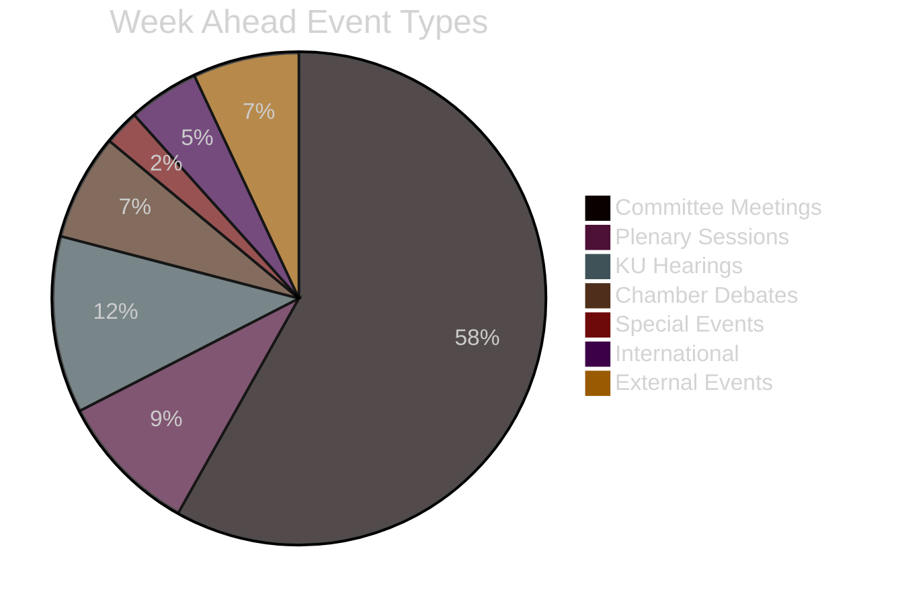

# Document Classification — Week Ahead 2026-04-10

**Generated**: 2026-04-10 16:48 UTC

## Event Type Distribution (April 13-17)

| Category | Count | Examples |
|----------|:-----:|---------|
| Committee Meetings (utskottsmöte) | 25+ | All 16 standing committees across Tue+Thu |
| Plenary Sessions (kam-ap/vo) | 4 | Arbetsplenum + Voting Wed+Thu |
| KU Hearings (sam-ou) | 5 | Strömmer, Forssell, Lindhagen, Andersson, Dousa |
| Chamber Debates (kam-dv/ip) | 3 | Vårpropositionen + Interpellations |
| Special Events (kam-va) | 1 | JO Election Wed |
| International (sam-ss) | 2 | IPU Istanbul + Nordic Council |
| External Events (kal-zz) | 3 | Democracy exhibitions |

## Recent Documents Published (April 10)

| dok_id | Type | Committee | Title |
|--------|------|-----------|-------|
| HD01SfU31 | bet | SfU | Ett nytt regelverk för uppsikt och förvar |
| HD01SfU32 | bet | SfU | Stärkt återvändandeverksamhet och utlänningskontroll |
| HD01SfU36 | bet | SfU | Skärpta och tydligare krav på vandel för uppehållstillstånd |
| HD11696-HD11702 | fr | Various | 7 written questions on diverse topics |
| HD024075 | mot | SoU | Motion on alcohol serving requirements |
| HDA1dnr1705 | ku-anm | KU | Review of government emissions statements |

