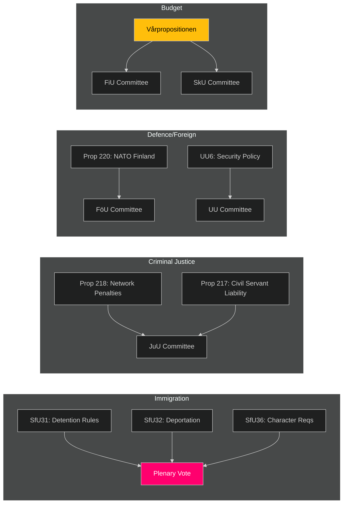

# Cross-Reference Map — Week Ahead 2026-04-10

**Generated**: 2026-04-10 16:48 UTC

## Legislative Pipeline Cross-References

## Key Linkages

| Source | Related To | Relationship |
|--------|-----------|-------------|
| SfU31+32+36 | Prop 2025/26:229 (Reception Act) | Immigration reform package |
| Prop 218 (Criminal networks) | JuU15 (Prison issues) | Criminal justice expansion |
| Prop 220 (NATO Finland) | FöU12 (Civil protection) | Defence integration suite |
| KU hearings | KU-anmälan dnr1705 (emissions) | Government accountability cluster |
| Vårpropositionen | All committee budgets | Cross-cutting fiscal framework |
