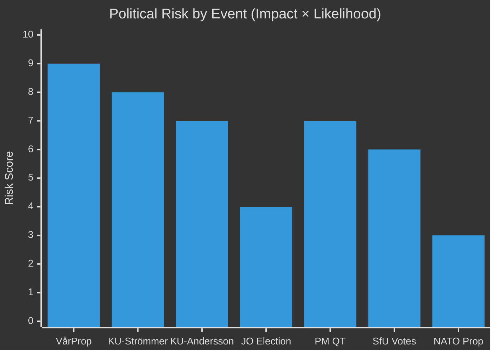

# Risk Assessment — Week Ahead 2026-04-13 → 2026-04-17

**Generated**: 2026-04-10 16:48 UTC | **Overall Risk Level**: MEDIUM-HIGH

## Risk Heat Map

## Risk Register

| Risk ID | Event | Impact | Likelihood | Score | Mitigation |
|---------|-------|:------:|:----------:|:-----:|-----------|
| R1 | Budget debate reveals fiscal gap | 🟩HIGH | 🟧MEDIUM | 8/10 | Pre-brief fiscal data, frame narrative |
| R2 | KU hearing exposes policy failure | 🟩HIGH | 🟧MEDIUM | 7/10 | Legal preparation, limit scope |
| R3 | Coalition split on spending priorities | 🟧MEDIUM | 🟧MEDIUM | 6/10 | Pre-negotiation with SD |
| R4 | JO election delayed/contested | 🟥LOW | 🟥LOW | 2/10 | Cross-party pre-agreement |
| R5 | PM QT gaffe/unforced error | 🟧MEDIUM | 🟧MEDIUM | 5/10 | Briefing preparation |
| R6 | Immigration bill opposition surge | 🟧MEDIUM | 🟥LOW | 4/10 | Whip enforcement |
| R7 | Media narrative loss from KU | 🟩HIGH | 🟧MEDIUM | 7/10 | Proactive communication strategy |

## Key Risk Narrative

The convergence of the vårpropositionen debate and KU constitutional review hearings within the same week creates compounding political risk. If the budget debate reveals fiscal weaknesses on Monday, opposition parties gain ammunition for KU questioning on Tuesday. The most dangerous scenario combines a weak budget defense with aggressive KU cross-examination of Strömmer on judicial independence, creating a 48-hour negative news cycle that frames the week's narrative before the PM's Thursday question time.
