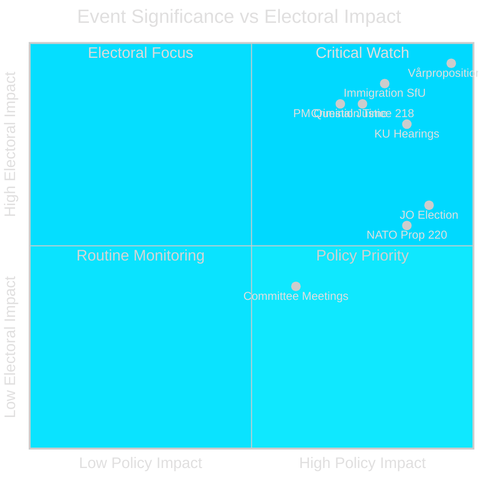

# Significance Scoring — Week Ahead 2026-04-10 → 2026-04-17

**Generated**: 2026-04-10 16:48 UTC | **Methodology**: Multi-factor scoring (Policy Impact × Institutional Significance × Electoral Relevance)

## Scoring Matrix

## Event Significance Scores

| Event | Policy Impact | Institutional | Electoral | Overall | Confidence |
|-------|:---:|:---:|:---:|:---:|:---:|
| Vårpropositionen debate | 10 | 10 | 10 | **10.0** | 🟦VERY HIGH |
| KU constitutional review | 9 | 10 | 8 | **9.0** | 🟩HIGH |
| JO election | 9 | 10 | 6 | **8.3** | 🟩HIGH |
| SfU immigration reports | 8 | 7 | 9 | **8.0** | 🟩HIGH |
| PM Question Time | 7 | 8 | 9 | **8.0** | 🟩HIGH |
| Criminal networks prop | 8 | 7 | 8 | **7.7** | 🟩HIGH |
| NATO Finland prop | 9 | 8 | 5 | **7.3** | 🟩HIGH |
| Plenary voting | 7 | 8 | 7 | **7.3** | 🟧MEDIUM |
| 25+ committee meetings | 6 | 7 | 5 | **6.0** | 🟧MEDIUM |
| EU-nämnden | 6 | 7 | 4 | **5.7** | 🟧MEDIUM |
| Nordic Council session | 5 | 6 | 3 | **4.7** | 🟧MEDIUM |

## Methodology

Scores use three dimensions (1-10 scale):
- **Policy Impact**: Legislative/regulatory consequence
- **Institutional Significance**: Constitutional/procedural importance
- **Electoral Relevance**: Impact on 2026 election dynamics

Overall = weighted average (Policy 0.35, Institutional 0.30, Electoral 0.35).
Confidence follows the 5-level scale: ⬛VERY LOW → 🟥LOW → 🟧MEDIUM → 🟩HIGH → 🟦VERY HIGH.
