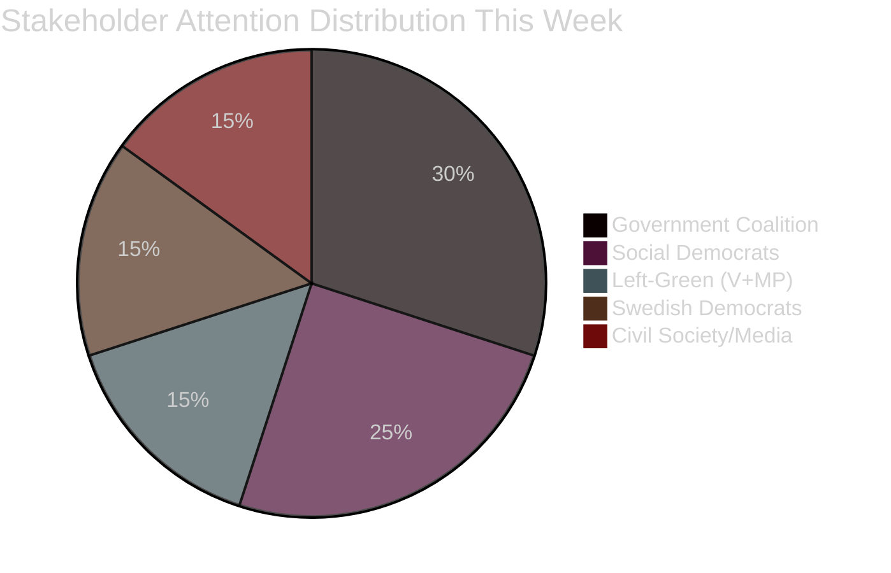

# Stakeholder Perspectives — Week Ahead 2026-04-13 → 2026-04-17

**Generated**: 2026-04-10 16:48 UTC | **Stakeholders Analyzed**: 5

## Perspective Matrix

| Stakeholder | Primary Interest | Key Event | Posture | Risk Level |
|------------|-----------------|-----------|---------|:---:|
| Government Coalition (M+KD+L+SD) | Fiscal credibility via vårpropositionen | Mon budget debate | Offensive | 🟧MEDIUM |
| Social Democrats (S) | Accountability via KU + fiscal critique | KU hearings + budget | Offensive | 🟥LOW |
| Left-Green bloc (V+MP) | Environmental/social spending challenge | Budget + immigration | Oppositional | 🟧MEDIUM |
| Swedish Democrats (SD) | Immigration policy delivery validation | SfU reports | Supportive | 🟥LOW |
| Civil society / Media | Transparency via KU + JO election | KU hearings + JO vote | Watchdog | 🟥LOW |

## Detailed Perspectives

### 1. Government Coalition (M+KD+L backed by SD)
The coalition enters the week needing to demonstrate fiscal discipline through the vårpropositionen while defending its record in KU hearings. Justice Minister Strömmer and Minister Forssell will face pointed questions. The coalition's best defense is highlighting legislative output: three immigration bills advancing through SfU plus the criminal networks bill.

### 2. Social Democrats (S)
Former Finance Minister Andersson's Thursday KU hearing creates a double-edged dynamic: while S faces scrutiny of its own governance record, Andersson's media profile energizes the party base. S will use the budget debate to challenge spending cuts and present its 2026 election platform contrast.

### 3. Left-Green Opposition (V+MP)
V and MP will focus budget debate attacks on environmental spending cuts and social welfare erosion. MP's Åsa Lindhagen faces KU scrutiny Tuesday, creating internal tension between defending a former minister and distancing from past coalition compromises.

### 4. Swedish Democrats (SD)
SD enters the week in a strengthened position as three immigration committee reports (SfU31/32/36) validate their core policy agenda. The party will use the budget debate to press for accelerated immigration enforcement spending.

### 5. Civil Society and Media
The KU hearings represent the week's primary transparency event. Media will focus on Strömmer's responses regarding judicial independence concerns and Forssell's handling of migration policy implementation. The JO election Wednesday provides a rare window into cross-party consensus on democratic oversight.

