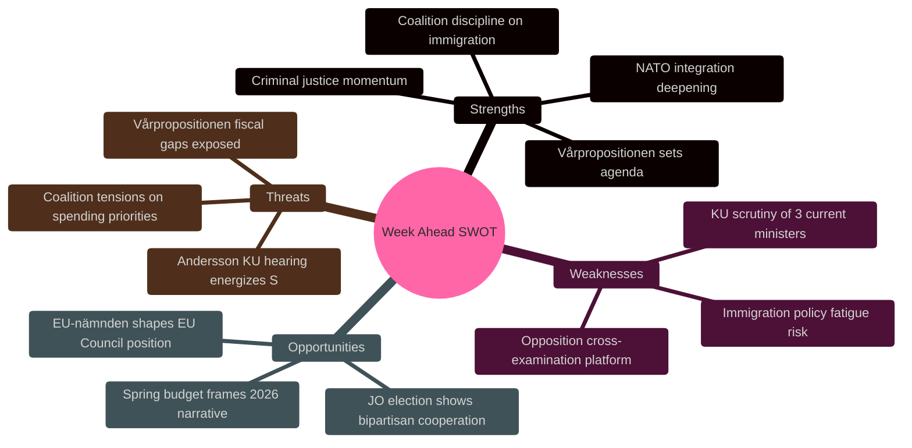

# SWOT Analysis — Week Ahead 2026-04-13 → 2026-04-17

**Generated**: 2026-04-10 16:48 UTC | **Scope**: Government coalition position entering peak parliamentary week

## Quick SWOT Overview

The governing coalition enters this consequential week from a position of legislative strength — three immigration committee reports (SfU31/32/36) advancing simultaneously alongside tough criminal justice reform (Prop 218) and NATO integration (Prop 220). However, the KU constitutional review hearings on Tuesday and Thursday represent the week's primary risk vector, with Justice Minister Strömmer and Minister Forssell facing direct opposition scrutiny. The vårpropositionen debate Monday is both the coalition's greatest opportunity to set the fiscal narrative for 2026 and its largest vulnerability if projected revenue shortfalls materialize. The election of a new Justitieombudsman Wednesday offers a rare bipartisan moment in an otherwise adversarial week.
