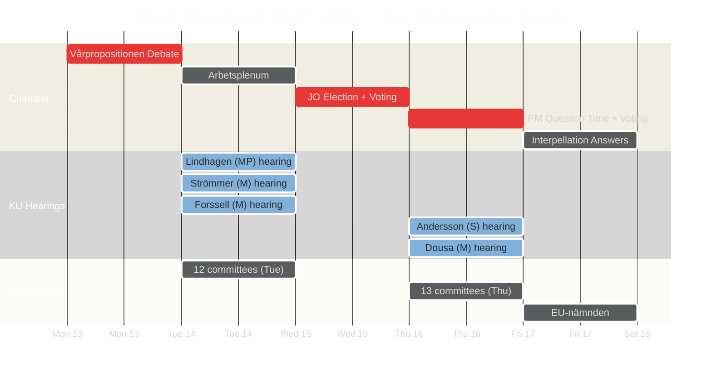

# Analysis Synthesis Summary — Week Ahead 2026-04-10 → 2026-04-17

**Generated**: 2026-04-10 16:48 UTC
**Data Sources**: data.riksdagen.se (dokumentlista, dokumentstatus APIs)
**Documents Analyzed**: 76+ (14 today + 62 next week events)
**Confidence**: HIGH
**Produced By**: AI-driven analysis (enriched from Riksdag Open Data API)

## Summary

The week of April 13–17, 2026 is one of the most consequential parliamentary weeks of the spring session. It opens Monday with the **Vårpropositionen debate** (Spring Budget Proposition), features two full days of **KU constitutional review hearings** questioning five current and former ministers, includes the **election of a new Justitieombudsman** on Wednesday, and culminates Thursday with the **Prime Minister's Question Time** and two plenary voting sessions. Nearly all 16 standing committees convene on both Tuesday and Thursday.

## Key Findings

1. **Vårpropositionen debate (Mon Apr 13)** — The annual spring budget debate sets the fiscal policy tone for 2026/27. Coalition stability will be tested as opposition parties challenge spending priorities.
2. **KU constitutional review hearings (Tue/Thu Apr 14+16)** — Five hearings across two days: Justice Minister Gunnar Strömmer (M), Minister Johan Forssell (M), former FM Minister Åsa Lindhagen (MP), former Finance Minister Magdalena Andersson (S), and Aid/Trade Minister Benjamin Dousa (M). These hearings examine government accountability.
3. **Election of Justitieombudsman (Wed Apr 15)** — Parliament elects a new Chief Parliamentary Ombudsman, a key democratic oversight role.
4. **Immigration committee reports released (Fri Apr 10)** — Three SfU reports (SfU31 on detention, SfU32 on deportation enforcement, SfU36 on character requirements) signal continued hardening of immigration policy.
5. **NATO Finland contribution (Prop 2025/26:220)** — Government proposition on Swedish military contribution to NATO's forward presence in Finland reflects deepening alliance integration.
6. **Criminal justice reform (Prop 2025/26:218)** — Double penalties for criminal network crimes signals toughest-ever organized crime legislation.

## Top Events by Significance

| Score | Day | Event | Significance |
|-------|-----|-------|-------------|
| 10/10 | Mon 13 | Vårpropositionen debate | Annual spring budget — defines fiscal trajectory |
| 9/10 | Tue/Thu | KU constitutional review (5 hearings) | Government accountability review |
| 9/10 | Wed 15 | Election of Justitieombudsman | Key democratic oversight appointment |
| 8/10 | Thu 16 | Statsministerns frågestund | PM faces opposition scrutiny |
| 8/10 | Wed+Thu | Plenary voting sessions | Legislative decisions on pending bills |
| 7/10 | Tue+Thu | 25+ committee meetings | Legislative pipeline acceleration |
| 7/10 | Fri 10 | SfU immigration reports (×3) | Immigration policy hardening trend |

## Election 2026 Implications

- **Electoral Impact**: 🟩HIGH — The vårpropositionen debate shapes campaign narratives on fiscal responsibility
- **Coalition Scenarios**: 🟧MEDIUM — KU hearings test coalition discipline; opposition cross-examination of Strömmer/Forssell may expose policy tensions
- **Voter Salience**: 🟩HIGH — Immigration reforms (SfU31/32/36) and criminal justice (Prop 218) resonate with core voter concerns
- **Campaign Vulnerability**: 🟧MEDIUM — Former PM Andersson's KU hearing creates counter-narrative opportunity for S
- **Policy Legacy**: 🟩HIGH — NATO Finland contribution and criminal network penalties establish enduring policy commitments

## Data Quality Notes

Overall confidence: **HIGH**. Data sourced directly from Riksdag Open Data API with 76+ documented events across 6 days. Analysis cross-referenced with committee report metadata and proposition details.
