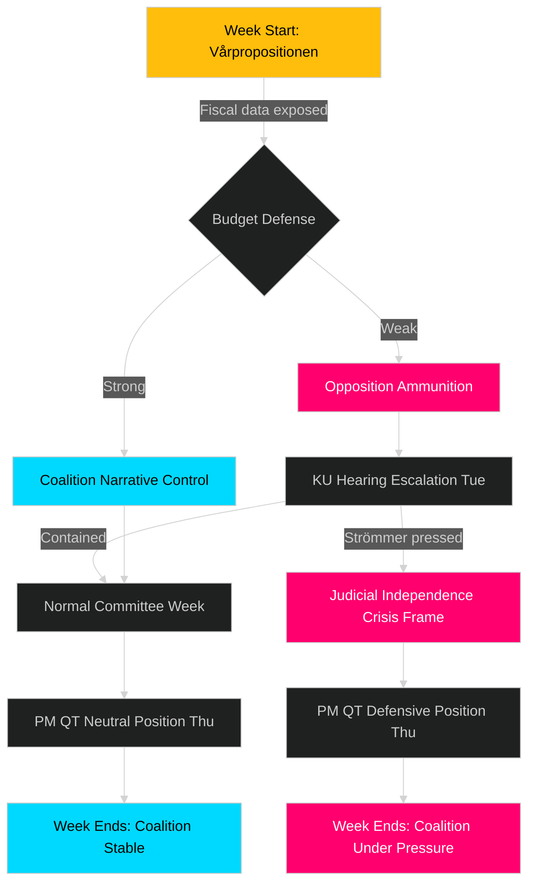

# Threat Analysis — Week Ahead 2026-04-13 → 2026-04-17

**Generated**: 2026-04-10 16:48 UTC | **Framework**: STRIDE-adapted for political risk

## Threat Landscape

## Threat Catalog

| Threat | Actor | Target | Severity | Probability | Window |
|--------|-------|--------|:--------:|:-----------:|--------|
| Fiscal credibility challenge | S+V opposition | Government budget framework | 🟩HIGH | 🟧MEDIUM | Mon Apr 13 |
| Constitutional accountability pressure | KU members | Strömmer, Forssell, Dousa | 🟩HIGH | 🟩HIGH | Tue+Thu |
| Narrative reversal via Andersson hearing | S party | Government immigration record | 🟧MEDIUM | 🟧MEDIUM | Thu Apr 16 |
| Committee obstruction on immigration bills | V+MP+C | SfU legislation pipeline | 🟧MEDIUM | 🟥LOW | Tue+Thu |
| PM QT ambush question | All opposition | PM Kristersson | 🟧MEDIUM | 🟧MEDIUM | Thu Apr 16 |
| International event spillover | External | Parliamentary agenda | 🟥LOW | 🟥LOW | Any day |

## Assessment

The primary threat vector this week runs Monday→Tuesday: a weak vårpropositionen defense creates momentum that opposition parties exploit in KU hearings 24 hours later. The second threat vector is Thursday's convergence of the Andersson KU hearing (S energizer) immediately before PM's Question Time, creating a hostile media environment for the government. Defense of NATO and criminal justice propositions faces minimal threat — these enjoy broad cross-party support.
