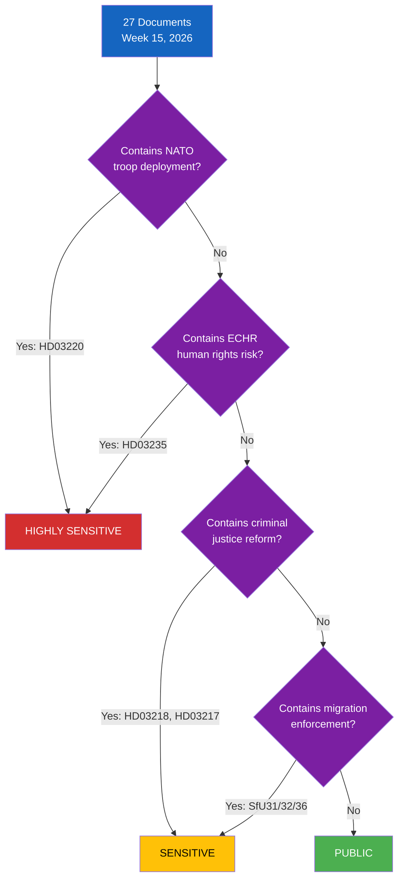

# Classification Results — Evening Analysis — 2026-04-11

| **Field** | **Value** |
|-----------|-----------|
| **Classification ID** | CLS-2026-04-11-EVE-001 |
| **Analysis Date** | 2026-04-11 16:30 UTC |
| **Period Covered** | 2026-04-04 — 2026-04-10 |
| **Documents Classified** | 27 |
| **Produced By** | news-evening-analysis workflow (AI-enriched) |
| **Overall Sensitivity** | HIGHLY SENSITIVE |
| **Confidence** | MEDIUM-HIGH |

---

## Sensitivity Decision Tree

## Per-Document Classification

| dok_id | Type | Sensitivity | Domain | Urgency | Significance |
|--------|------|:-----------:|--------|:-------:|:----------:|
| HD03235 | Prop | HIGHLY SENSITIVE | Migration/Human Rights | URGENT | 9/10 |
| HD03220 | Prop | HIGHLY SENSITIVE | NATO/Defence | URGENT | 8/10 |
| HD03218 | Prop | SENSITIVE | Criminal Justice | URGENT | 8/10 |
| HD03217 | Prop | SENSITIVE | Governance | HIGH | 7/10 |
| HD03214 | Prop | SENSITIVE | Cybersecurity/Defence | HIGH | 7/10 |
| HD03228 | Prop | SENSITIVE | Defence/Arms Export | HIGH | 6/10 |
| HD01FoU12 | Bet | SENSITIVE | Civil Defence | HIGH | 8/10 |
| HD01UU6 | Bet | HIGHLY SENSITIVE | Security Policy | URGENT | 8/10 |
| HD01SfU31 | Bet | SENSITIVE | Migration Enforcement | HIGH | 8/10 |
| HD01SfU32 | Bet | SENSITIVE | Migration Enforcement | HIGH | 8/10 |
| HD01SfU36 | Bet | SENSITIVE | Migration Enforcement | HIGH | 8/10 |
| HD01SfU16 | Bet | SENSITIVE | Migration Policy | MEDIUM | 6/10 |
| HD01MJU30 | Bet | SENSITIVE | Climate Policy | HIGH | 7/10 |
| HD01JuU15 | Bet | SENSITIVE | Criminal Justice | MEDIUM | 7/10 |
| HD01SoU17 | Bet | PUBLIC | Healthcare | MEDIUM | 7/10 |
| HD01SoU16 | Bet | PUBLIC | Healthcare | MEDIUM | 7/10 |
| HD03216 | Prop | PUBLIC | Healthcare | MEDIUM | 5/10 |
| HD03230 | Prop | PUBLIC | Environment | LOW | 5/10 |
| HD03219 | Prop | PUBLIC | Healthcare | LOW | 4/10 |
| HD01FoU8 | Bet | SENSITIVE | Defence Personnel | MEDIUM | 6/10 |
| HD01TU15 | Bet | PUBLIC | Transport | LOW | 4/10 |
| HD01NU18 | Bet | PUBLIC | Energy | MEDIUM | 5/10 |
| HD01CU23 | Bet | PUBLIC | Rural Policy | LOW | 5/10 |
| HD01UbU31 | Bet | PUBLIC | Education | LOW | 4/10 |
| HD01SfU18 | Bet | PUBLIC | Social Insurance | LOW | 4/10 |
| HD03229 | Prop | PUBLIC | Migration (technical) | LOW | 3/10 |
| HD03114 | Prop | SENSITIVE | Export Control | MEDIUM | 6/10 |

## Domain Distribution

| Domain | Count | Avg Significance |
|--------|:-----:|:---------------:|
| Migration/Human Rights | 6 | 7.2/10 |
| NATO/Defence/Security | 6 | 7.5/10 |
| Criminal Justice | 3 | 7.3/10 |
| Healthcare | 4 | 5.5/10 |
| Climate/Environment | 2 | 6.0/10 |
| Other (transport, education, rural) | 6 | 4.3/10 |

## Urgency Assessment

| Level | Count | Key Documents |
|-------|:-----:|-------------|
| URGENT | 4 | HD03235, HD03220, HD03218, HD01UU6 |
| HIGH | 7 | HD03217, HD03214, HD01FoU12, HD01SfU31/32/36, HD01MJU30 |
| MEDIUM | 9 | HD01SfU16, HD01JuU15, HD01SoU17/16, HD01FoU8, HD01NU18, HD03228, HD03114, HD03216 |
| LOW | 7 | HD03230, HD03219, HD01TU15, HD01CU23, HD01UbU31, HD01SfU18, HD03229 |

## Data Quality Notes

Confidence: **MEDIUM-HIGH**. Classification based on document content analysis, domain expertise, and cross-referencing with weekly-review sibling analysis. Sensitivity levels follow political-classification-guide.md methodology. Domain taxonomy from political-classification-guide.md. Urgency calibrated against parliamentary calendar (pending votes, committee deadlines).
