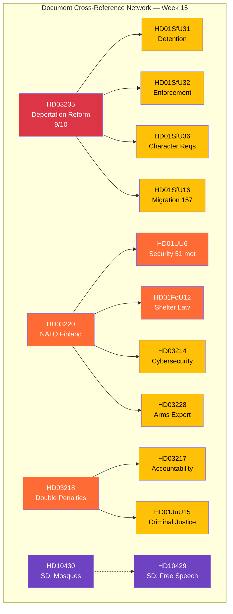

# Cross-Reference Map — Evening Analysis — 2026-04-11

| **Field** | **Value** |
|-----------|-----------|
| **Map ID** | XREF-2026-04-11-EVE-001 |
| **Analysis Date** | 2026-04-11 16:30 UTC |
| **Period** | 2026-04-04 — 2026-04-10 |
| **Documents Mapped** | 27 |
| **Produced By** | news-evening-analysis workflow |
| **Confidence** | MEDIUM-HIGH |

---

## Cross-Reference Network

## Thematic Clusters

| Cluster | Documents | Avg Score | Theme |
|---------|-----------|:---------:|-------|
| **Security/Defence** | HD03220, HD01FoU12, HD01UU6, HD01FoU8, HD03214, HD03228, HD03114 | 7.5/10 | Post-NATO legislative overhaul |
| **Criminal Justice** | HD03235, HD03218, HD03217, HD01JuU15 | 7.8/10 | Pre-election tough-on-crime offensive |
| **Migration Enforcement** | HD01SfU31, HD01SfU32, HD01SfU36, HD01SfU16 | 6.3/10 | Tido Agreement migration delivery |
| **Healthcare** | HD01SoU17, HD01SoU16, HD03216 | 6.0/10 | Opposition domain — 348 denied motions |
| **Coalition Dynamics** | HD10430, HD10429 | 7.0/10 | SD probing Tido boundaries |

## Cross-Document Patterns

1. **Convergence**: HD03235 (deportation) feeds into SfU31/32/36 (enforcement mechanisms) — single policy pipeline from proposition to committee implementation
2. **Reinforcement**: HD03220 (NATO troops) + HD01FoU12 (shelter law) + HD03214 (cyber) + HD03228 (arms) = comprehensive security posture upgrade
3. **Tension**: HD10430/HD10429 (SD probing) vs S6 (99 percent cohesion) — interpellations as pressure without breaking point
4. **Counter-narrative**: HD01SoU16/17 (348 denied healthcare motions) vs government narrative of "delivering for Sweden"

## Data Quality Notes

Confidence: **MEDIUM-HIGH**. Cross-references identified through committee assignment analysis, co-signatory analysis, and thematic domain mapping. dok_id verified against Riksdag open data API.
