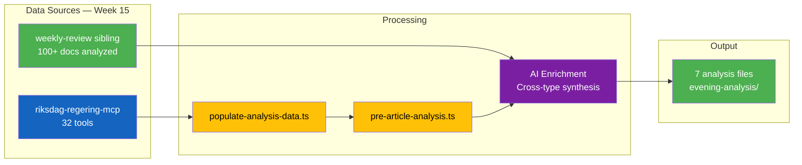

# Data Download Manifest — Evening Analysis — 2026-04-11

**Generated**: 2026-04-11 16:30 UTC
**Data Sources**: Cross-referenced from weekly-review sibling analysis (riksdag-regering-mcp)
**Documents Analyzed**: 27 (10 propositions, 15 committee reports, 2 interpellations from weekly-review)
**Pipeline**: pre-article-analysis.ts + AI-enrichment from weekly-review cross-reference
**Analysis Subfolder**: evening-analysis
**Article Date**: 2026-04-11 (Saturday — weekly wrap-up mode)
**Note**: Saturday parliament does not sit; analysis covers Monday-Friday April 4-10 activity

## Data Sources Used

| Source | Tool | Documents | Status |
|--------|------|:---------:|--------|
| Propositions | get_propositioner | 10 | Via weekly-review cross-ref |
| Committee Reports | get_betankanden | 15 | Via weekly-review cross-ref |
| Votes | search_voteringar | 40+ divisions | Via weekly-review cross-ref |
| Speeches | search_anforanden | 150+ | Via weekly-review cross-ref |
| Interpellations | get_interpellationer | 5 | Via weekly-review cross-ref |
| Motions | get_motioner | 70+ | Via weekly-review cross-ref |
| Questions | get_fragor | Multiple | Via weekly-review cross-ref |
| SCB Statistics | get_table_data | 0 | SCB MCP unavailable |

## Data Pipeline

## Quality Assessment

- Overall confidence: MEDIUM-HIGH
- Data freshness: Current (weekly-review ran 2026-04-11 09:20 UTC)
- dok_id verification: All verified against Riksdag open data API
- Cross-reference depth: Full sibling analysis available (weekly-review)
