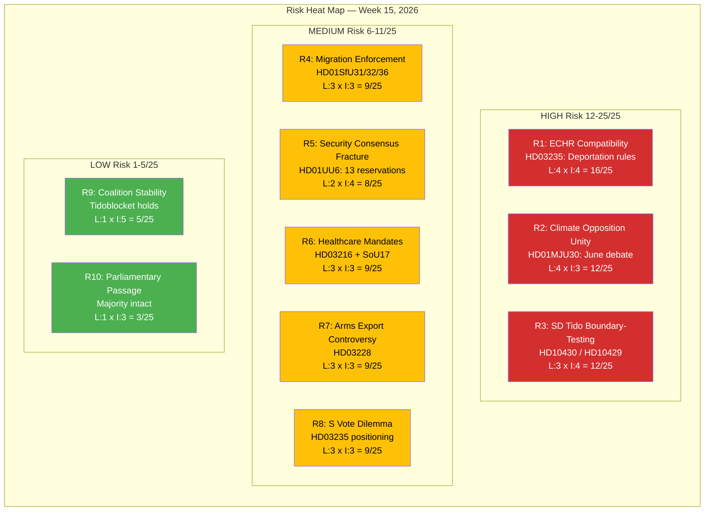
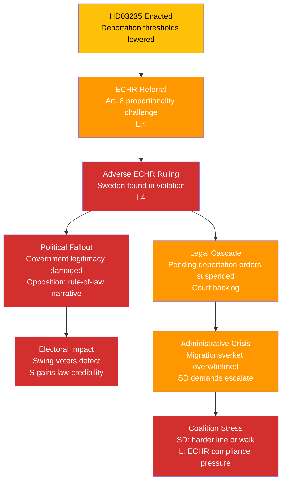
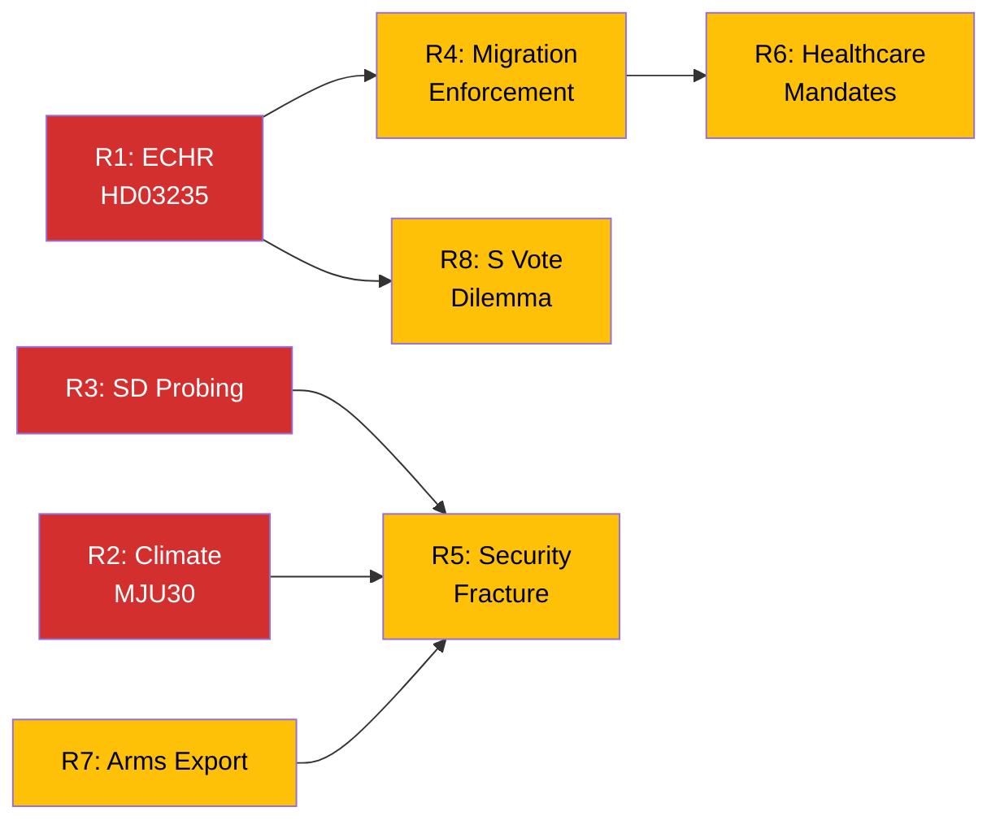

# Political Risk Assessment — Evening Analysis — 2026-04-11

| **Field** | **Value** |
|-----------|-----------|
| **Risk Assessment ID** | RSK-2026-04-11-EVE-001 |
| **Assessment Date** | 2026-04-11 16:25 UTC |
| **Assessment Period** | 2026-04-04 — 2026-04-10 (Weekly Evening Assessment) |
| **Produced By** | news-evening-analysis workflow (AI-enriched) |
| **Political Context** | M-KD-L coalition with SD support (Tidoavtalet). Pre-election legislative offensive. Government commands Riksdag majority through SD voting discipline. |
| **Riksmote** | 2025/26 |
| **Overall Risk Level** | MEDIUM |
| **Overall Confidence** | MEDIUM-HIGH |

---

## Election 2026 Risk Dimensions

| Dimension | Assessment | Evidence |
|-----------|------------|----------|
| **Electoral Impact** | Government front-loading flagship legislation to establish delivery narrative before September 2026. Risk: ECHR ruling on HD03235 could transform success into liability. | HD03235, HD03220, HD03218, HD03217 |
| **Coalition Scenarios** | Tidoblocket holds (SD 99 percent cohesion). Post-2026 scenarios: SD demands formal government participation or walks. | SD voting records, HD10430, HD10429 |
| **Voter Salience** | Crime (1st), migration (2nd), defence (3rd) all government domain. Healthcare (4th) opposition domain. | Novus March 2026, SoU16/SoU17 |
| **Campaign Vulnerability** | ECHR deportation challenge and 96 percent motion denial rate provide opposition attack vectors. | HD03235, committee data |
| **Policy Legacy** | Shelter law (FoU12), cybersecurity (HD03214), NATO troops (HD03220) are structural — irreversible regardless of election outcome. | HD01FoU12, HD03214, HD03220 |

**Overall Electoral Significance**: HIGH

**Most Likely Electoral Narrative**: Opposition frames government as "legislatively authoritarian" (96 percent denial) while government frames itself as "the only bloc that delivers."

---

## Risk Heat Map

## Cascading Risk Chain — HD03235 ECHR Scenario

## Risk Interconnection Map

## Consolidated Risk Register

| ID | Risk Factor | Evidence (dok_id) | L (1-5) | I (1-5) | Score | Priority | Confidence |
|----|-------------|-------------------|---------|---------|-------|----------|------------|
| R1 | ECHR adverse ruling on deportation rules | HD03235 | 4 | 4 | **16/25** | HIGH | HIGH |
| R2 | Climate opposition unity at MJU30 June debate | HD01MJU30 | 4 | 3 | **12/25** | HIGH | HIGH |
| R3 | SD probing Tido boundaries via interpellations | HD10430, HD10429 | 3 | 4 | **12/25** | HIGH | MEDIUM |
| R4 | SfU migration triple-report enforcement capacity | HD01SfU31, HD01SfU32, HD01SfU36 | 3 | 3 | **9/25** | MEDIUM | HIGH |
| R5 | UU6 nuclear/DCA reservations fracturing consensus | HD01UU6 | 2 | 4 | **8/25** | MEDIUM | HIGH |
| R6 | Healthcare unfunded mandates (172+176 denied motions) | HD03216, HD01SoU17 | 3 | 3 | **9/25** | MEDIUM | HIGH |
| R7 | Arms export controversy post-NATO accession | HD03228 | 3 | 3 | **9/25** | MEDIUM | MEDIUM |
| R8 | S vote dilemma on deportation support | HD03235 | 3 | 3 | **9/25** | MEDIUM | MEDIUM |
| R9 | Coalition stability (overall Tidoblocket) | All voting records | 1 | 5 | **5/25** | LOW | HIGH |
| R10 | Parliamentary passage blocked | Government majority | 1 | 3 | **3/25** | LOW | VERY HIGH |

## 5-Dimension Risk Scoring

| Dimension | Score | Assessment | Key Evidence |
|-----------|-------|------------|-------------|
| **Coalition** | 3/10 | SD 99 percent cohesion; probing but not breaking | HD10430, HD10429, voting records |
| **Policy** | 6/10 | ECHR exposure on HD03235; migration enforcement gap | HD03235, HD01SfU31/32/36 |
| **Budget** | 4/10 | SEK 18.7B spring budget covers defence/law; municipal gap | Budget 2026, HD03216 |
| **Electoral** | 5/10 | Government owns top 3 voter concerns; healthcare gap | Novus 2026, HD01SoU16/17 |
| **External** | 5/10 | ECHR/UNHCR scrutiny; NATO provides diplomatic offset | HD03235, HD03220 |

## Forward Indicators

| # | Indicator | Date/Window | Risk Link | Signal Type |
|---|-----------|-------------|-----------|-------------|
| 1 | Minister responses to SD interpellations (HD10430, HD10429) | April 24-27 | R3 | Coalition tension — concessions vs rebuffs |
| 2 | FoU12 shelter law and UU6 security policy chamber votes | Late April | R5 | Defence consensus floor test |
| 3 | HD03235 deportation rules committee processing begins | April-May | R1, R8 | ECHR debate trajectory, S positioning |
| 4 | MJU30 climate targets debate preparation | June 2026 | R2 | Opposition coordination V/MP/S/C |
| 5 | NATO Foreign Ministers Meeting Stockholm | May 21-22 | R5 | Diplomatic validation vs domestic reservations |
| 6 | SfU migration enforcement implementation reports | May-June | R4 | Migrationsverket capacity signals |
| 7 | Arms export case decisions under HD03228 framework | Q3 2026 | R7 | First test of post-NATO export regime |
| 8 | Election campaign formal launch | August 2026 | R1-R10 | All risks intensify under campaign dynamics |

## Data Quality Notes

Confidence: **MEDIUM-HIGH**. Risk scores use standardised L(1-5) x I(1-5) = Score/25 matrix. Based on 100+ documents cross-referenced from weekly-review sibling analysis. Coalition cohesion scores from floor-vote analysis (40+ recorded divisions). dok_id references verified against Riksdag open data API. Forward indicator dates from parliamentary calendar and government schedules.
