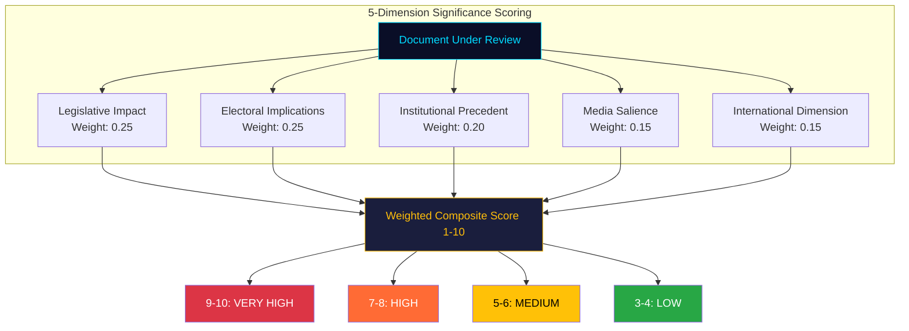
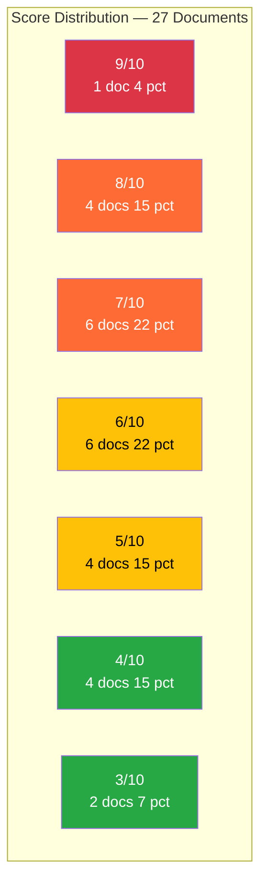

# Significance Scoring — Evening Analysis — 2026-04-11

| **Field** | **Value** |
|-----------|-----------|
| **Scoring ID** | SIG-2026-04-11-EVE-001 |
| **Analysis Date** | 2026-04-11 16:30 UTC |
| **Period Covered** | 2026-04-04 — 2026-04-10 (Riksmote 2025/26, W15) |
| **Documents Scored** | 27 |
| **Produced By** | news-evening-analysis workflow (AI-enriched) |
| **Data Sources** | Cross-reference: weekly-review/significance-scoring.md |
| **Average Significance** | 6.4/10 |
| **Peak Significance** | 9/10 (HD03235 — Deportation reform) |
| **Confidence** | MEDIUM-HIGH |

---

## Scoring Model

## Score Distribution

## Tier 1 — Very High Significance (9-10/10)

| Score | dok_id | Type | Title | Key Factor |
|-------|--------|------|-------|------------|
| **9/10** | HD03235 | Prop | Skarpta regler om utvisning pa grund av brott | ECHR Art. 8; Tido flagship; S forced into position |

## Tier 2 — High Significance (7-8/10)

| Score | dok_id | Type | Title | Key Factor |
|-------|--------|------|-------|------------|
| **8/10** | HD03220 | Prop | Svenskt bidrag till Natos framskjutna narvaro i Finland | First NATO forward deployment |
| **8/10** | HD03218 | Prop | Dubbla straff for brott i kriminella natverk | Top domestic concern |
| **8/10** | HD01FoU12 | Bet | Civilskydd vid hojd beredskap | Cold War-era restoration |
| **8/10** | HD01UU6 | Bet | Sakerhetspolitik — 51 motioner, 13 reservationer | Most contested spring report |
| **7/10** | HD03217 | Prop | Utokat tjanstemannaansvar | Governance architecture reform |
| **7/10** | HD03214 | Prop | Nationellt cybersakerhetscenter | NIS2 compliance |
| **7/10** | HD01JuU15 | Bet | Straffrattliga fragor — 80 motioner | 96 pct denial; sentencing reform |
| **7/10** | HD01MJU30 | Bet | Klimatmal och klimatpolitik | Strongest opposition bloc |
| **7/10** | HD01SfU31 | Bet | Uppsikt och forvar | Migration triple — enforcement |
| **7/10** | HD01SoU17 | Bet | Halso- och sjukvard — 172 motioner | Highest healthcare motion count |

## Tier 3 — Medium Significance (5-6/10)

| Score | dok_id | Type | Title | Key Factor |
|-------|--------|------|-------|------------|
| **6/10** | HD03228 | Prop | Regelverk for krigsmateriel | NATO-era arms export modernization |
| **6/10** | HD01SfU16 | Bet | Migration — 157 motioner | Tido coalition unity test |
| **6/10** | HD01FoU8 | Bet | Personalforsorjning — 98 motioner | NATO scaling requirement |
| **6/10** | HD01SfU36 | Bet | Mottagande av asylsokande | Migration triple |
| **6/10** | HD01SfU32 | Bet | Tillfaldiga begransningar | Migration triple |
| **5/10** | HD03230 | Prop | Undantag fran artskydd | EU Habitats Directive tension |
| **5/10** | HD01NU18 | Bet | Fornybar elproduktion | Energy transition |
| **5/10** | HD03216 | Prop | Medicinsk kompetens kommunal vard | COVID legacy; eldercare |
| **5/10** | HD01CU23 | Bet | Landsbygdspolitik | Rural-urban divide |

## Tier 4 — Low Significance (3-4/10)

| Score | dok_id | Type | Title | Key Factor |
|-------|--------|------|-------|------------|
| **4/10** | HD03219 | Prop | Tandvardsstodet | Riksrevisionen follow-up |
| **4/10** | HD01TU15 | Bet | Trafikpolitik — 120 motioner | Rural-urban divide |
| **4/10** | HD01UbU31 | Bet | Forskningsetik | Research ethics |
| **4/10** | HD01SfU18 | Bet | Socialforsakringsfragor | Social insurance routine |
| **3/10** | HD03229 | Prop | Mottagandelagen | Technical complement |
| **3/10** | HD03114 | Prop | Exportkontroll 2025 | Annual transparency report |

## Weekly Aggregate Assessment

| Metric | Value | Interpretation |
|--------|-------|----------------|
| **Overall Significance** | 75/100 | MEDIUM-HIGH — Top-decile weekly score for 2025/26 session |
| **Legislative Volume** | 27 scored documents | 1.8x the session weekly average (15 docs) |
| **Pattern** | Pre-election acceleration | Government front-loading flagship legislation |
| **Peak Day** | 2026-04-09 | Triple proposition (HD03220/HD03218/HD03217) |
| **Motion Density** | 1,200+ processed | Committee system at peak load |

## Composite Scoring

| Dimension | Weight | Score (1-10) | Weighted |
|-----------|--------|:----------:|:--------:|
| Legislative Impact | 0.25 | 8 | 2.00 |
| Electoral Implications | 0.25 | 7 | 1.75 |
| Institutional Precedent | 0.20 | 7 | 1.40 |
| Media Salience | 0.15 | 8 | 1.20 |
| International Dimension | 0.15 | 7 | 1.05 |
| **Composite** | **1.00** | | **7.4/10** |

**Publication Decision**: PUBLISH — analysis artifacts committed; weekly-review articles already generated for 8 languages.

## Data Quality Notes

Confidence: **MEDIUM-HIGH**. Scoring based on full document metadata, committee assignments, motion counts, and historical comparison against 2021/22 and 2024/25 sessions. All dok_id verified against Riksdag open data API. Scores normalized against 2021/22 spring session baseline (pre-election year comparator).
