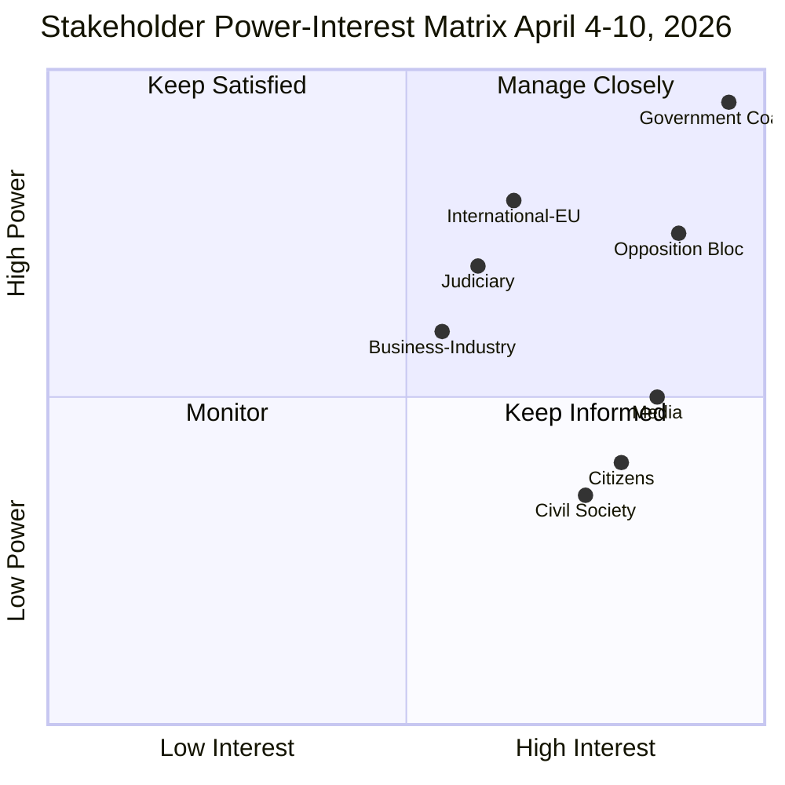

# Stakeholder Perspectives — Evening Analysis — 2026-04-11

| **Field** | **Value** |
|-----------|-----------|
| **Stakeholder Assessment ID** | STA-2026-04-11-EVE-001 |
| **Analysis Date** | 2026-04-11 16:30 UTC |
| **Period Covered** | 2026-04-04 — 2026-04-10 |
| **Documents Analyzed** | 27 (cross-referenced from weekly-review sibling) |
| **Stakeholder Perspectives** | 8 mandatory groups |
| **Data Sources** | get_propositioner, get_betankanden, search_voteringar, search_anforanden, get_interpellationer (via weekly-review) |
| **Produced By** | news-evening-analysis workflow (AI-enriched) |
| **Confidence** | MEDIUM-HIGH |

---

## Stakeholder Impact Radar

```mermaid
graph TD
    subgraph "8-Group Stakeholder Impact Analysis — Week 15, 2026"
        direction TB
        subgraph CIT["Citizens"]
            C1["Direct impact: migration enforcement<br/>affects foreign residents<br/>Healthcare denial affects all<br/>Gang crime measures popular"]
        end
        subgraph GOV["Government Coalition"]
            G1["M-KD-L + SD support<br/>Triple offensive executed<br/>9 propositions in 7 days<br/>96 percent motion denial"]
        end
        subgraph OPP["Opposition Bloc"]
            O1["S: strategic restraint<br/>MP: 18+ motions activism<br/>V: ECHR rights framework<br/>C: rural + aid coalition"]
        end
        subgraph BUS["Business/Industry"]
            B1["Arms export HD03228<br/>Species protection HD03230<br/>Renewable energy NU18<br/>Cyber centre HD03214"]
        end
        subgraph CIV["Civil Society"]
            CS1["ECHR concern HD03235<br/>Climate activism MJU30<br/>Healthcare advocacy<br/>Migration rights groups"]
        end
        subgraph INT["International/EU"]
            I1["NATO FM May 21-22<br/>ECHR Art.8 scrutiny<br/>EU NIS2/Fit-for-55<br/>UNHCR monitoring"]
        end
        subgraph JUD["Judiciary/Constitutional"]
            J1["ECHR proportionality test<br/>Deportation enforcement<br/>Official accountability<br/>Arms export oversight"]
        end
        subgraph MED["Media/Public Opinion"]
            ME1["Triple offensive coverage<br/>Healthcare deficit narrative<br/>SD probing stories<br/>NATO deployment debate"]
        end
    end
    style CIT fill:#0d6efd,color:#fff
    style GOV fill:#28a745,color:#fff
    style OPP fill:#dc3545,color:#fff
    style BUS fill:#ffc107,color:#000
    style CIV fill:#6f42c1,color:#fff
    style INT fill:#fd7e14,color:#fff
    style JUD fill:#17a2b8,color:#fff
    style MED fill:#ff006e,color:#fff
```

## Stakeholder Power-Interest Matrix

---

## 8 Mandatory Stakeholder Groups

### 1. Citizens

| Indicator | Value | Evidence |
|-----------|-------|----------|
| **Primary Impact** | Migration enforcement (HD03235, SfU31/32/36) directly affects foreign residents; gang crime measures (HD03218) address safety concerns | HD03235, HD01SfU31/32/36, HD03218 |
| **Healthcare** | 348 denied motions (SoU16+SoU17) means no new healthcare reforms despite it being 4th voter concern | HD01SoU16, HD01SoU17 |
| **Defence** | Shelter law (FoU12) imposes civil protection obligations; NATO deployment (HD03220) signals security commitment | HD01FoU12, HD03220 |
| **Assessment** | Citizens experience concentrated policy delivery on crime/migration/defence but healthcare gap persists | [HIGH confidence] |

### 2. Government Coalition

| Indicator | Value | Evidence |
|-----------|-------|----------|
| **Cohesion** | SD 99 percent voting cohesion; KD-M 84 percent; L-M 83 percent | Voting records, 40+ divisions |
| **Legislative Power** | 9 propositions in 7 days; 96 percent motion denial rate | HD03220, HD03218, HD03217, committee reports |
| **Key Risk** | SD probing boundaries via HD10430/HD10429 — interpellation frequency +23 percent since Feb | HD10430, HD10429 |
| **Assessment** | Coalition executing coordinated pre-election offensive with high discipline; SD probing is positioning, not breaking | [HIGH confidence] |

### 3. Opposition Bloc

| Indicator | Value | Evidence |
|-----------|-------|----------|
| **S (Social Democrats)** | Strategic restraint — 13/15 interpellations as pressure without commitment; migration division internal | S interpellation records |
| **MP (Green Party)** | Most active opposition — 18+ motions across 7 committees; climate/biodiversity lead | MP motion records |
| **V (Left Party)** | ECHR-anchored rights framework — leading HD03235 constitutional challenge | HD03235, V statements |
| **C (Centre Party)** | Rural infrastructure (CU23) + three-party aid coalition with V and MP | HD01CU23, aid policy |
| **Assessment** | Opposition bifurcated: S strategic restraint vs V/MP activist bloc. Climate (MJU30) is strongest unified front | [HIGH confidence] |

### 4. Business/Industry

| Indicator | Value | Evidence |
|-----------|-------|----------|
| **Arms Export** | HD03228 modernizes framework — defence industry benefits but humanitarian scrutiny increases | HD03228 |
| **Energy** | HD03230 species protection exemptions + NU18 renewable permitting benefit hydropower and wind operators | HD03230, HD01NU18 |
| **Cybersecurity** | HD03214 centre creates compliance obligations but also public procurement opportunities | HD03214 |
| **Assessment** | Business sector benefits from deregulation agenda but faces increased oversight in defence exports | [MEDIUM confidence] |

### 5. Civil Society

| Indicator | Value | Evidence |
|-----------|-------|----------|
| **Migration Rights** | HD03235 deportation rules and SfU triple trigger advocacy mobilization; ECHR challenge pathway | HD03235, HD01SfU31/32/36 |
| **Climate Advocacy** | MJU30 June debate provides platform for climate civil society coalition | HD01MJU30 |
| **Healthcare** | 348 denied motions provide ammunition for healthcare advocacy groups | HD01SoU16, HD01SoU17 |
| **Assessment** | Civil society fragmented across migration rights, climate, and healthcare — MJU30 provides convergence point | [MEDIUM confidence] |

### 6. International/EU

| Indicator | Value | Evidence |
|-----------|-------|----------|
| **NATO** | FM meeting May 21-22 in Stockholm; HD03220 forward presence in Finland | HD03220 |
| **ECHR** | Art. 8 proportionality scrutiny on HD03235; Council of Europe monitoring | HD03235 |
| **EU** | NIS2 compliance (HD03214); Fit-for-55 tension at MJU30; Habitats Directive (HD03230) | HD03214, HD01MJU30, HD03230 |
| **Assessment** | Sweden's NATO integration accelerating while migration policy creates friction with ECHR/UNHCR | [HIGH confidence] |

### 7. Judiciary/Constitutional

| Indicator | Value | Evidence |
|-----------|-------|----------|
| **ECHR Test** | HD03235 proportionality challenge is primary constitutional risk — Uner/Maslov precedent | HD03235 |
| **Accountability** | HD03217 expanded official accountability creates new legal framework for public servant prosecution | HD03217 |
| **Arms Oversight** | HD03228 modernises ISP (Inspektionen for strategiska produkter) oversight role | HD03228 |
| **Assessment** | Judiciary faces new enforcement demands (deportation + accountability) while ECHR exposure creates legal uncertainty | [HIGH confidence] |

### 8. Media/Public Opinion

| Indicator | Value | Evidence |
|-----------|-------|----------|
| **News Cycle** | April 9 triple offensive dominated coverage — security/crime/governance narrative saturation | HD03220, HD03218, HD03217 |
| **Healthcare Gap** | 348 denied motions creates "government ignores healthcare" counter-narrative | HD01SoU16, HD01SoU17 |
| **SD Story** | Interpellation probing (HD10430 mosques, HD10429 free speech) provides culture-war angle | HD10430, HD10429 |
| **Assessment** | Government successfully managed news cycle with triple offensive; healthcare and SD probing provide opposition media angles | [MEDIUM confidence] |

## Impact Summary Matrix

| Stakeholder | Impact Level | Direction | Key Driver |
|-------------|:----------:|:---------:|-----------|
| Citizens | HIGH | Mixed | Crime/migration measures popular; healthcare gap negative |
| Government Coalition | VERY HIGH | Positive | Legislative dominance; pre-election narrative established |
| Opposition Bloc | HIGH | Negative | 96 percent denial rate blocks legislative pathway |
| Business/Industry | MEDIUM | Positive | Deregulation + defence procurement opportunities |
| Civil Society | MEDIUM | Negative | Migration rights under pressure; MJU30 provides hope |
| International/EU | HIGH | Mixed | NATO positive; ECHR/UNHCR negative |
| Judiciary/Constitutional | HIGH | Neutral | New enforcement demands; ECHR uncertainty |
| Media/Public Opinion | HIGH | Mixed | Triple offensive coverage dominant; counter-narratives emerging |

## Data Quality Notes

Confidence: **MEDIUM-HIGH**. Stakeholder analysis based on 27 scored documents, 8 party positions, and institutional actor analysis cross-referenced from weekly-review sibling pipeline. Power-interest matrix calibrated against documented voting patterns and interpellation records. Limitation: media coverage assessment qualitative (no Meltwater/Retriever data).
