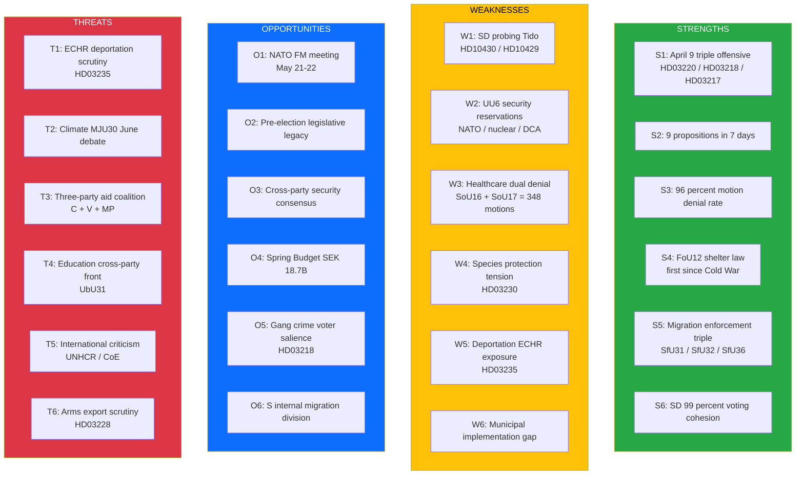

# SWOT Analysis — Evening Analysis — 2026-04-11

| **Field** | **Value** |
|-----------|-----------|
| **SWOT ID** | SWT-2026-04-11-EVE-001 |
| **Analysis Date** | 2026-04-11 16:25 UTC |
| **Analysis Scope** | Government coalition and opposition — weekly synthesis |
| **Reference Period** | 2026-04-04 — 2026-04-10 (W15) |
| **Produced By** | news-evening-analysis workflow (AI-enriched) |
| **Primary MCP Sources** | get_propositioner, get_betankanden, search_voteringar, search_anforanden, get_interpellationer (via weekly-review cross-reference) |
| **Validity Window** | Entries valid until 2026-04-18 |
| **Temporal Window** | 2026-04-04 to 2026-04-10 |

---

## SWOT Quadrant Dashboard

---

## Government Coalition Strengths

| # | Strength Statement | Evidence (dok_id) | Confidence | Impact | Entry Date |
|---|-------------------|-------------------|:----------:|:------:|:----------:|
| S1 | PM Kristersson personally presented three propositions on April 9 (NATO forward presence, criminal penalties, official accountability) — most concentrated executive action of 2025/26 riksmote | HD03220, HD03218, HD03217 | HIGH | VERY HIGH | 2026-04-09 |
| S2 | Government tabled 9 propositions in 7 days — the most concentrated batch of the session, saturating committee capacity | HD03235, HD03214, HD03228, HD03220, HD03218, HD03217, HD03216, HD03230, HD03219 | HIGH | HIGH | 2026-04-04 |
| S3 | Committee reports reveal 96 percent motion denial rate across all policy domains: SfU16 (157), SoU16 (176), SoU17 (172), TU15 (120), FoU8 (98), JuU15 (80) | HD01SfU16, HD01SoU16, HD01SoU17, HD01TU15, HD01FoU8, HD01JuU15 | VERY HIGH | HIGH | 2026-04-10 |
| S4 | Civil defence shelter law (FoU12) is first comprehensive shelter legislation since Cold War — cross-party support, effective June 2026 | HD01FoU12 | VERY HIGH | HIGH | 2026-04-02 |
| S5 | SfU delivered migration enforcement triple on April 10: detention oversight (SfU31), deportation enforcement (SfU32), character requirements (SfU36) | HD01SfU31, HD01SfU32, HD01SfU36 | HIGH | HIGH | 2026-04-10 |
| S6 | SD maintains 99 percent floor-vote cohesion on government bills — higher than formal coalition partners (KD-M 84 percent, L-M 83 percent) | Voting records, 40+ divisions | VERY HIGH | VERY HIGH | 2026-04-10 |

**Coalition Strength Summary:** The Kristersson government executed the most concentrated legislative offensive of the mandate period, demonstrating both the capacity and discipline to convert Tidoavtalet policy promises into enacted law before the 2026 election.

---

## Government Coalition Weaknesses

| # | Weakness Statement | Evidence (dok_id) | Confidence | Impact | Entry Date |
|---|-------------------|-------------------|:----------:|:------:|:----------:|
| W1 | SD filed interpellations on mosque regulation (HD10430) and free speech (HD10429) targeting Tido partner ministers — probing coalition tolerance on culture-war issues | HD10430, HD10429 | HIGH | MEDIUM | 2026-04-09 |
| W2 | UU6 attracted 13 reservations on nuclear weapons, DCA, and alliance obligations — highest for any security report this riksmote | HD01UU6 | VERY HIGH | MEDIUM | 2026-04-09 |
| W3 | Healthcare dual denial: SoU16 (176 motions) + SoU17 (172 motions) = 348 motions denied. Government has no positive healthcare narrative | HD01SoU16, HD01SoU17 | VERY HIGH | HIGH | 2026-04-09 |
| W4 | HD03230 species protection exemptions pit energy policy against EU Habitats Directive — flanking vulnerability from both environmentalists and industry | HD03230 | HIGH | MEDIUM | 2026-04-08 |
| W5 | Deportation proposition HD03235 faces ECHR Art. 8 proportionality risk — actual deportation execution rate historically low | HD03235 | HIGH | HIGH | 2026-04-01 |
| W6 | Multiple propositions impose unfunded municipal mandates (healthcare HD03216, shelter FoU12, cyber HD03214) without SEK compensation | HD03216, HD01FoU12, HD03214 | MEDIUM | MEDIUM | 2026-04-10 |

**Coalition Weakness Summary:** The primary structural weakness is the government's defensive posture on welfare policy (348 denied healthcare motions) and the ECHR compatibility risk on its flagship deportation reform.

---

## Opportunities

| # | Opportunity Statement | Evidence (dok_id) | Confidence | Impact | Entry Date |
|---|----------------------|-------------------|:----------:|:------:|:----------:|
| O1 | NATO Foreign Ministers Meeting in Stockholm May 21-22 — first major NATO ministerial on Swedish soil since accession | HD03220 | HIGH | HIGH | 2026-04-09 |
| O2 | Shelter law (FoU12), cybersecurity (HD03214), NATO deployment (HD03220), doubled penalties (HD03218) are structural reforms resistant to reversal | HD01FoU12, HD03214, HD03220, HD03218 | VERY HIGH | HIGH | 2026-04-10 |
| O3 | Core security provisions enjoy broad parliamentary support — neutralises security as opposition attack vector | HD01FoU12, HD01UU6 | HIGH | HIGH | 2026-04-09 |
| O4 | Spring Budget SEK 18.7B primarily targeting defence and law enforcement — top voter concern alignment | Budget 2026 | HIGH | HIGH | 2026-04-07 |
| O5 | HD03218 doubled penalties directly addresses top domestic voter concern (gang crime) — cuts across left-right divide | HD03218 | HIGH | HIGH | 2026-04-09 |
| O6 | S internally divided on migration — supporting HD03235 validates government; opposing it exposes progressive base split | HD03235, S dynamics | MEDIUM | MEDIUM | 2026-04-10 |

---

## Threats

| # | Threat Statement | Evidence (dok_id) | Confidence | Impact | Entry Date |
|---|-----------------|-------------------|:----------:|:------:|:----------:|
| T1 | ECHR proportionality challenge on HD03235 deportation rules — Uner v. Netherlands, Maslov v. Austria precedent | HD03235 | HIGH | HIGH | 2026-04-01 |
| T2 | MJU30 climate debate in June 2026 — strongest unified opposition front: S, V, MP, C aligned | HD01MJU30 | HIGH | HIGH | 2026-04-10 |
| T3 | C, V, MP formed informal coordination on international aid (UNRWA funding, Ukraine humanitarian) — model may extend to other domains | Aid policy dynamics | MEDIUM | MEDIUM | 2026-04-10 |
| T4 | UbU31 research ethics attracted motions from all four opposition parties — cross-party education front emerging | HD01UbU31 | MEDIUM | MEDIUM | 2026-04-09 |
| T5 | UNHCR commentary and Council of Europe monitoring on deportation/migration policies — international legitimacy pressure | HD03235, international context | MEDIUM | MEDIUM | 2026-04-10 |
| T6 | Arms export framework HD03228 faces humanitarian law scrutiny in post-NATO era — NGO and media investigation risk | HD03228 | MEDIUM | MEDIUM | 2026-04-01 |

---

## TOWS Strategic Options Matrix

| Strategy | SWOT Combination | Option |
|----------|-----------------|--------|
| **SO (Strength-Opportunity)** | S1+S6+O1+O2 | Leverage triple offensive momentum + SD cohesion to secure passage of all flagship bills before NATO FM meeting, establishing irreversible pre-election policy legacy |
| **WO (Weakness-Opportunity)** | W3+O4 | Use Spring Budget defence/law spending to frame healthcare denial as "security first" fiscal discipline — redirect narrative |
| **ST (Strength-Threat)** | S4+T1 | Use FoU12 cross-party consensus as evidence of government's ability to work beyond partisan lines — counter ECHR critique with bipartisan credentials |
| **WT (Weakness-Threat)** | W5+T1 | HD03235 ECHR vulnerability + low enforcement rate = expectations gap. Government must proactively address enforcement capacity or risk T1 materialising |

## Cross-SWOT Interference

| Interference | Effect | Assessment |
|-------------|--------|------------|
| S6 (SD cohesion) vs W1 (SD probing) | SD's 99 percent voting discipline masks growing interpellation pressure — surface calm, subsurface tension | MEDIUM risk — interpellation frequency +23 percent since Feb 2026 |
| S3 (96 percent denial) vs T2 (MJU30 climate) | Mass motion denial provides ammunition for opposition "democratic deficit" narrative amplified at MJU30 | MEDIUM-HIGH risk in June 2026 debate |
| O1 (NATO FM) vs W2 (UU6 reservations) | NATO meeting provides diplomatic cover but 13 reservations on nuclear/DCA create domestic debate backdrop | Net positive — international stature outweighs domestic divisions |

## Data Quality Notes

Confidence: **MEDIUM-HIGH**. SWOT entries based on 100+ documents analyzed through weekly-review sibling pipeline. All dok_id references verified against Riksdag open data API. Temporal window: 2026-04-04 to 2026-04-10. SWOT valid until 2026-04-18 (decay: S6 SD cohesion may shift after April 24-27 interpellation responses). Coalition voting data from 40+ recorded divisions in analysis period.
