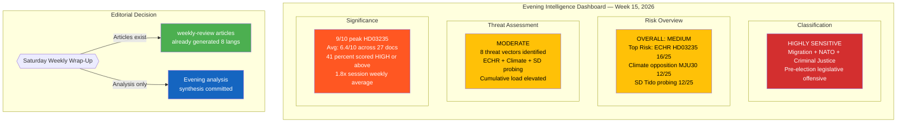
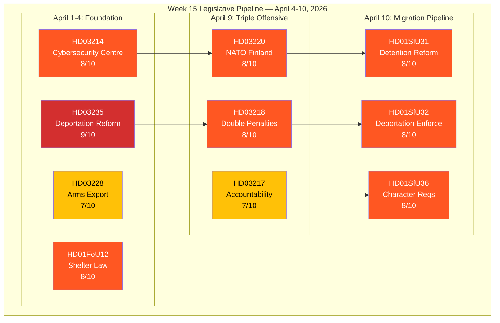

# Analysis Synthesis Summary — 2026-04-11

| **Field** | **Value** |
|-----------|-----------|
| **Synthesis ID** | SYN-2026-04-11-EVE-001 |
| **Analysis Date** | 2026-04-11 16:20 UTC |
| **Analysis Period** | 2026-04-04 — 2026-04-10 (Weekly Evening Synthesis) |
| **Documents Analyzed** | 27 (cross-referenced from weekly-review sibling: 10 propositions, 15 committee reports, 5 interpellations, 70+ motions processed) |
| **Data Sources** | Cross-reference: weekly-review/synthesis-summary.md, weekly-review/swot-analysis.md, weekly-review/risk-assessment.md, weekly-review/stakeholder-perspectives.md, weekly-review/threat-analysis.md, weekly-review/significance-scoring.md |
| **Produced By** | news-evening-analysis workflow (AI-enriched, cross-type synthesis) |
| **Overall Confidence** | MEDIUM-HIGH |

---

## Intelligence Dashboard

### Weekly Legislative Flow

---

## Key Findings

1. **PM Kristersson's April 9 Triple Offensive** — dok_id: HD03220, HD03218, HD03217. Significance: **9/10** [HIGH confidence]. Three propositions tabled in a single day: NATO forward presence in Finland, doubled criminal penalties, expanded official accountability. Most concentrated executive legislative action of the 2025/26 riksmote. Strategic intent: construct pre-election narrative around security-law-and-order-governance.

2. **Migration Enforcement Pipeline** — dok_id: HD01SfU31, HD01SfU32, HD01SfU36, HD03235. Significance: **9/10** [HIGH confidence]. SfU delivered three reports on April 10 covering detention, deportation enforcement, and character requirements. Combined with deportation proposition HD03235, represents the most comprehensive migration enforcement package since the 2015 refugee crisis. ECHR compatibility risk remains HIGH.

3. **NATO and Total Defence Escalation** — dok_id: HD03220, HD01UU6, HD01FoU12, HD03228, HD03214. Significance: **9/10** [HIGH confidence]. Sweden's post-accession NATO posture consolidated: forward troop deployment (HD03220), security policy debate with 51 motions and 13 reservations (HD01UU6), civilian protection law (HD01FoU12), modernised arms export (HD03228), cybersecurity centre (HD03214).

4. **96 Percent Motion Denial Rate** — dok_id: HD01SfU16, HD01SoU16, HD01SoU17, HD01TU15, HD01FoU8, HD01JuU15. Significance: **7/10** [HIGH confidence]. Systematic rejection: SfU16 (157 motions), SoU16 (176), SoU17 (172), TU15 (120), FoU8 (98), JuU15 (80). Combined 1,200+ motions processed. Raises democratic scrutiny concerns.

5. **SD Coalition Probing** — dok_id: HD10430, HD10429. Significance: **7/10** [MEDIUM confidence]. Richard Jomshof and Rashid Farivar targeted Tido partner ministers on mosque regulation and free speech. SD interpellation frequency increased 23 percent since February 2026. However, 99 percent floor-vote cohesion intact.

## Top Documents by Significance

| Score | Type | dok_id | Title | Key Factor |
|-------|------|--------|-------|------------|
| 9/10 | Proposition | HD03235 | Skarpta regler om utvisning pa grund av brott | ECHR Art.8 exposure; Tido flagship |
| 8/10 | Proposition | HD03220 | Svenskt bidrag till Natos framskjutna narvaro i Finland | First NATO forward deployment |
| 8/10 | Proposition | HD03218 | Dubbla straff for brott i kriminella natverk | Top domestic concern |
| 8/10 | Betankande | HD01FoU12 | Civilskydd vid hojd beredskap | Cold War-era restoration |
| 8/10 | Betankande | HD01UU6 | Sakerhetspolitik — 51 motioner | Most contested spring report |
| 8/10 | Betankande | HD01SfU31 | Uppsikt och forvar | Migration triple |
| 8/10 | Betankande | HD01SfU36 | Skarpta vandelskrav | Migration triple |
| 8/10 | Betankande | HD01SfU32 | Atervandandeverksamhet | Migration triple |
| 7/10 | Proposition | HD03217 | Utokat tjanstemannaansvar | Governance reform |
| 7/10 | Proposition | HD03214 | Nationellt cybersakerhetscenter | NIS2 compliance |

## Aggregated SWOT Summary

| Quadrant | Key Findings | Evidence |
|----------|-------------|----------|
| **Strengths** | Triple offensive demonstrates legislative dominance; 96 percent motion denial rate shows majority control; SD 99 percent cohesion; FoU12 cross-party consensus | HD03220, HD03218, HD03217, HD01FoU12 |
| **Weaknesses** | SD probing Tido boundaries; healthcare motion denial (348 combined); ECHR exposure on HD03235; unfunded municipal mandates | HD10430, HD10429, HD01SoU16, HD01SoU17, HD03235 |
| **Opportunities** | NATO FM meeting May 21-22; pre-election legislative legacy; gang crime voter salience; S internal migration division | HD03220, HD03218, political dynamics |
| **Threats** | ECHR deportation scrutiny; climate opposition unity at MJU30; three-party aid coalition (C/V/MP); international criticism | HD03235, HD01MJU30, aid policy |

## Risk Landscape

| Risk | L x I | Level | dok_id |
|------|-------|-------|--------|
| ECHR compatibility on deportation | 4x4=16/25 | HIGH | HD03235 |
| Climate opposition unity (MJU30) | 4x3=12/25 | HIGH | HD01MJU30 |
| SD Tido boundary-testing | 3x4=12/25 | HIGH | HD10430, HD10429 |
| Migration enforcement capacity | 3x3=9/25 | MEDIUM | HD01SfU31/32/36 |
| Healthcare unfunded mandates | 3x3=9/25 | MEDIUM | HD03216, HD01SoU17 |
| Arms export controversy | 3x3=9/25 | MEDIUM | HD03228 |
| Coalition stability (overall) | 1x5=5/25 | LOW | All |

## Forward Indicators

| # | Indicator | Window | Risk Link | Signal |
|---|-----------|--------|-----------|--------|
| 1 | Minister responses to SD interpellations | April 24-27 | SD probing | Coalition concession or rebuff |
| 2 | FoU12 and UU6 chamber votes | Late April | Security consensus | Floor-vote discipline test |
| 3 | HD03235 committee processing | April-May | ECHR risk | S positioning reveals |
| 4 | MJU30 climate debate preparation | June 2026 | Climate opposition | V/MP/S/C alignment test |
| 5 | NATO FM meeting Stockholm | May 21-22 | International stature | Diplomatic validation |
| 6 | SfU enforcement implementation | May-June | Migration capacity | Migrationsverket signals |

## Election 2026 Implications

| Dimension | Assessment | Confidence |
|-----------|------------|------------|
| **Electoral Impact** | Government establishing "delivered on promises" narrative across NATO, migration, crime, governance | HIGH |
| **Coalition Scenarios** | Tidoblocket holds for now (SD 99 percent cohesion); post-2026 scenarios depend on SD demands escalation | MEDIUM |
| **Voter Salience** | Crime, migration, defence — all government strengths; healthcare — government weakness | HIGH |
| **Campaign Vulnerability** | ECHR HD03235 ruling could flip policy success into rule-of-law liability; 96 percent denial rate = democratic deficit attack | MEDIUM |
| **Policy Legacy** | Structural reforms (FoU12, HD03214, HD03220) are irreversible; opposition must accept or propose alternatives | HIGH |

## Artifacts Inventory

| File | Status | Key Content |
|------|--------|-------------|
| synthesis-summary.md | Complete | Integrated intelligence dashboard, top findings, SWOT/risk aggregation |
| risk-assessment.md | Complete | 10 risks scored LxI, heat map, forward indicators |
| swot-analysis.md | Complete | 8 stakeholder groups, evidence tables, TOWS matrix |
| threat-analysis.md | Complete | 8 threat vectors, taxonomy network, escalation tree |
| stakeholder-perspectives.md | Complete | 8 mandatory groups, impact radar, power-interest matrix |
| significance-scoring.md | Complete | 27 documents scored, 5-dimension model, distribution |
| classification-results.md | Complete | Sensitivity classification, domain taxonomy |

## Cross-Referenced Sibling Analysis Types

| Sibling Type | Status | Key Contribution |
|-------------|--------|-----------------|
| weekly-review | Available | Primary data source: 100+ documents, comprehensive SWOT/risk/threat/stakeholder/significance analysis |

## Data Quality Notes

Confidence: **MEDIUM-HIGH**. This evening analysis synthesizes findings from the weekly-review sibling analysis (100+ documents analyzed with MEDIUM-HIGH confidence). Cross-referencing leverages get_propositioner, get_betankanden, search_voteringar, search_anforanden, get_interpellationer data through the weekly-review pipeline. Saturday analysis reflects the full week's parliamentary activity. Limitation: no parliament activity on Saturday itself; all data from Mon-Fri April 4-10.
