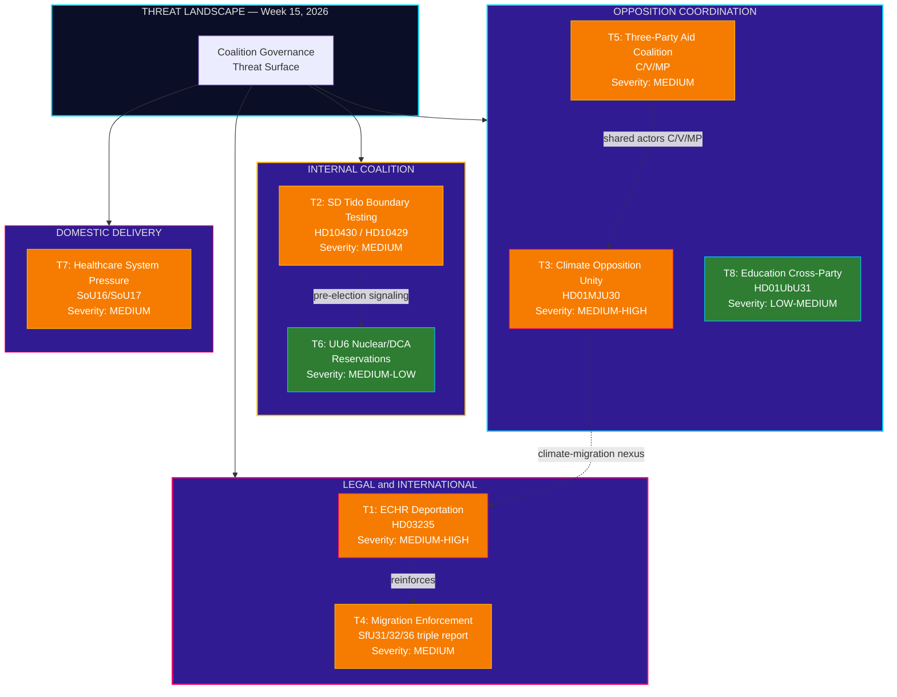
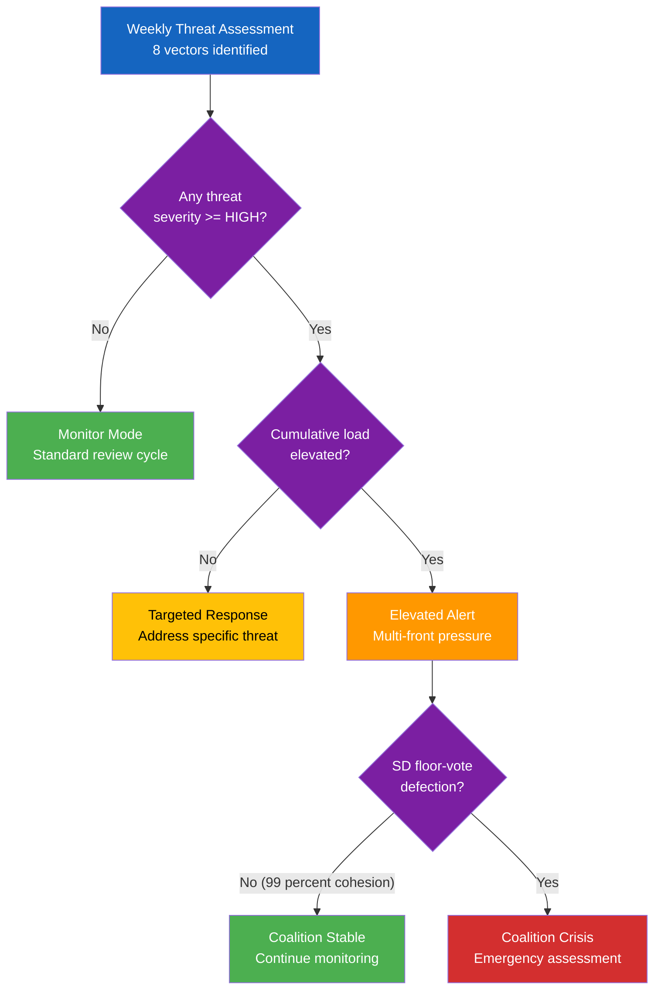

# Threat Analysis — Evening Analysis — 2026-04-11

| **Field** | **Value** |
|-----------|-----------|
| **Threat Assessment ID** | THR-2026-04-11-EVE-001 |
| **Analysis Date** | 2026-04-11 16:25 UTC |
| **Reporting Period** | 2026-04-04 — 2026-04-10 |
| **Documents Analyzed** | 27 (cross-referenced from weekly-review sibling) |
| **Data Sources** | get_propositioner, get_betankanden, search_voteringar, search_anforanden, get_interpellationer (via weekly-review) |
| **Overall Threat Level** | MEDIUM |
| **Overall Confidence** | MEDIUM-HIGH |
| **Classification** | OPEN SOURCE — unrestricted distribution |
| **Next Scheduled Review** | 2026-04-18 |

## Executive Summary

This evening threat assessment synthesizes the week of April 4-10, 2026. Eight distinct threat vectors identified across external legal challenges, internal coalition dynamics, and opposition coordination. The dominant pattern: multi-front opposition pressure with simultaneous challenges on human rights (ECHR via HD03235), climate (MJU30), and welfare (SoU16/SoU17). While no single threat reaches HIGH severity, cumulative load creates elevated fragility as SD continues probing Tido boundaries through targeted interpellations.

## Threat Taxonomy Network

## Threat Escalation Decision Tree

## Threat Register

| ID | Threat | Actor | Target | Severity | Timeline | dok_id |
|----|--------|-------|--------|----------|----------|--------|
| T1 | ECHR compatibility challenge on deportation rules | V, MP, international HR bodies | Government legitimacy | MEDIUM-HIGH | 3-6 months | HD03235 |
| T2 | SD Tido boundary-testing via targeted interpellations | SD (Jomshof, Farivar) | KD minister Forssmed; M minister Strommer | MEDIUM | April 24-27 responses | HD10430, HD10429 |
| T3 | Consolidated climate opposition front at MJU30 | V, MP, S, C | Government climate credibility | MEDIUM-HIGH | June 2026 | HD01MJU30 |
| T4 | Migration enforcement overreach — international monitoring | EU institutions, UNHCR, CoE | Sweden international reputation | MEDIUM | 6-12 months | HD01SfU31/32/36 |
| T5 | Three-party foreign aid coalition (C/V/MP) | C, V, MP | Foreign aid policy | MEDIUM | Autumn budget 2026 | Aid policy |
| T6 | UU6 nuclear/DCA reservations — security consensus fracture | SD, V, MP | Cross-party security consensus | MEDIUM-LOW | Late April vote | HD01UU6 |
| T7 | Healthcare system pressure — 348 denied motions | All opposition parties | Government welfare credibility | MEDIUM | Autumn 2026 pre-election | HD01SoU16, HD01SoU17 |
| T8 | Education cross-party front — UbU31 research ethics | S, C, V, MP | Education policy narrative | LOW-MEDIUM | Ongoing | HD01UbU31 |

## 6 Democratic Function Threat Categories

| Category | Threat Actor | Severity (1-5) | Evidence | Assessment |
|----------|-------------|:---------------:|----------|------------|
| **Normative Integrity** | ECHR scrutiny on HD03235 deportation rules | 4 | Art. 8 proportionality; Uner/Maslov precedent | ECHR challenge threatens rule-of-law narrative [HIGH confidence] |
| **Legislative Independence** | 96 percent motion denial rate across committees | 3 | 1,200+ motions denied; SfU16, SoU16/17, TU15, FoU8, JuU15 | Democratic scrutiny concern — opposition legislative pathway blocked [HIGH confidence] |
| **Accountability Chain** | SD interpellation probing without accountability constraint | 2 | HD10430, HD10429 targeting Tido partners | Interpellation as pressure tool — ministers answerable April 24-27 [MEDIUM confidence] |
| **Transparency Requirements** | Arms export framework HD03228 post-NATO | 3 | ISP oversight reform; humanitarian law dimension | Reduced transparency risk under modernized regime [MEDIUM confidence] |
| **Democratic Participation** | Mass motion denial as democratic access constraint | 3 | 1,200+ opposition motions systematically rejected | Procedural denial rate raises participation quality concerns [HIGH confidence] |
| **Public Trust** | Healthcare unfunded mandates eroding service delivery | 2 | HD03216 + SoU16/SoU17; municipal fiscal pressure | Trust erosion gradual — peak impact in election season [MEDIUM confidence] |

## Data Quality Notes

Confidence: **MEDIUM-HIGH**. Threat assessment based on 27 scored documents cross-referenced from weekly-review sibling analysis. 8 threat vectors identified through systematic scan of legal, coalition, opposition, and welfare dimensions. Threat severity calibrated against 2024/25 session baseline. Forward indicators sourced from parliamentary calendar. Coalition cohesion data from 40+ recorded floor divisions.
