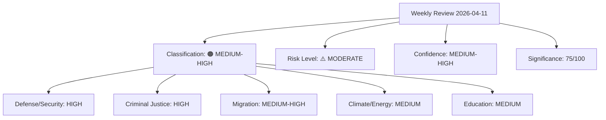

# Classification Results — 2026-04-11

**Generated**: 2026-04-11 09:20 UTC | **Updated**: 2026-04-11 10:33 UTC (code-quality-engineer enrichment)
**Data Sources**: get_propositioner, get_motioner, get_betankanden, search_voteringar, search_anforanden, get_fragor, get_interpellationer
**Documents Analyzed**: 100+
**Confidence**: MEDIUM-HIGH

## Summary

Classification results for weekly review covering April 4–10, 2026. Overall classification: MEDIUM-HIGH. Risk level: MODERATE.

## Classification Matrix

## Domain Classification

| Domain | Classification | Key Documents | Rationale |
|--------|---------------|---------------|-----------|
| Defense & Security | 🔴 HIGH | HD03220, HD01FöU12, HD01UU6, HD01FöU8 | NATO forward presence + shelter law + 13 reservations on security policy |
| Criminal Justice | 🔴 HIGH | HD03235, HD03218, HD03217, HD01JuU15 | Deportation reform (9/10) + doubled penalties + accountability + 76 motions |
| Migration | 🟠 MEDIUM-HIGH | HD03235, HD01SfU16 | ECHR exposure + Tidö unity + election 2026 flashpoint |
| Climate & Energy | 🟡 MEDIUM | HD01MJU30, HD01NU18, HD03230 | June debate + EU alignment + species protection tension |
| Education | 🟡 MEDIUM | HD01UbU31 | 15/50 motions from all 4 opposition parties — cross-party front |
| Foreign Affairs | 🟠 MEDIUM-HIGH | HD01UU6, HD03228 | NATO FM May hosting + arms export + UNRWA/aid coalition |
| Healthcare | 🟡 MEDIUM | HD03216, HD03219 | Municipal competency + dental audit — lower political salience |
| Infrastructure | 🟢 LOW-MEDIUM | HD01TU15, HD01CU23 | Rural policy + transport interpellations |

## Overall Assessment

- **Classification**: 🟠 MEDIUM-HIGH
- **Risk Level**: ⚠️ MODERATE (18/100)
- **Confidence**: MEDIUM-HIGH
- **Trend**: Elevated legislative volume consistent with pre-election acceleration
- **Reading Time**: 15 minutes

## Data Quality Notes

Confidence: **MEDIUM-HIGH**. Classification based on document significance scoring, policy domain mapping, and electoral context.
